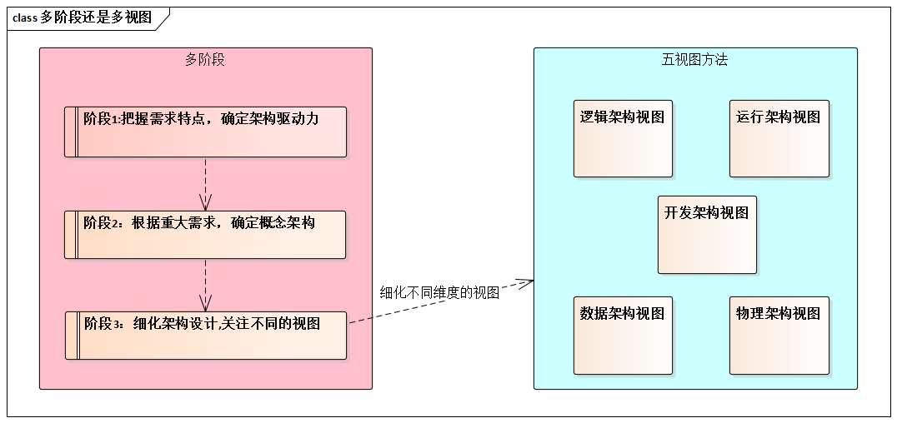

# 1.2.3. 多阶段还是多视图？

架构设计的多视图方法很重要，但是，架构设计方法首先当时多阶段的，其次才是多视图的。

一句话，先做后做--这叫阶段（`Phase`）,齐头并进--这叫视图(`View`)。

> 任何好的方法（不局限于软件领域），都必须以时间为轴来组织，因为这样才最利于指导实践。

架构设计只需要多视图方法，看上去很美，其实并不足够。实际上，大量一线架构师早已感觉到多视图方法的“不足够”。例如，想想投标：

- 一方面，投标时，需要提供和讲解《方案建议书》，其中涉及架构的内容。
- 另一方面，团队并行开发是，需要《架构设计文档》提供多方涉众使用。
- 但是，投标时将的“架构”和并行开发时做为基础的“架构”在同一个抽象层次上吗？绝不可能。前者叫“**概念架构**”，后者叫“**细化架构**”。
- 如果投标失败，细化架构根本没有必要做了。
- 结论，概念架构设计和细化架构设计，是两个架构阶段，不是两个架构视图。
