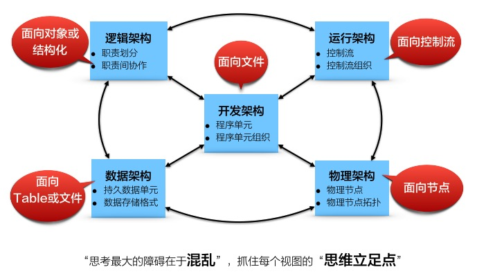

# 1.3.3. Refined Architecture阶段:落地的5视图方法

细化架构是相对于概念架构而言的。

细化架构阶段的总体方法为5视图方法。

许多家故事，言架构必谈`OO`。在他们的思想里面，认为`OO`方法已经完整覆盖了架构设计的所有方法和技巧。这种看法，是相当片面的。

弱OO方法已涵盖架构设计的全部，那么5视图方法所涉及的逻辑架构、物理架构、开发架构、运行架构、数据架构，都应受到`OO`方法的指导，然而并不是这样。