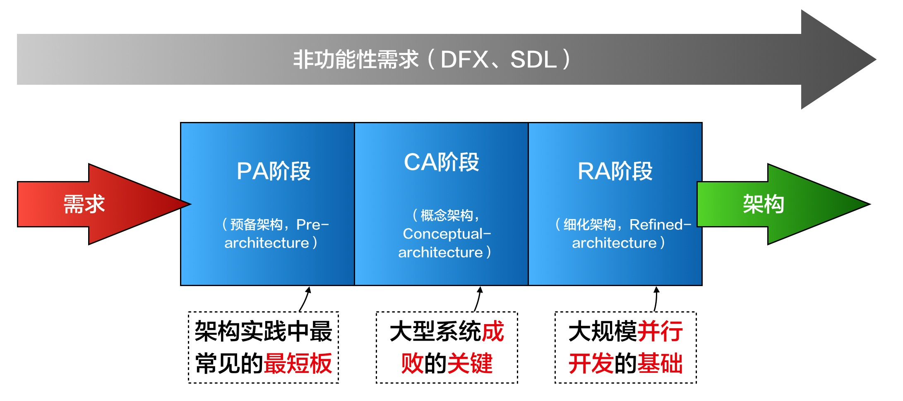

# 1.3. ADMEMS方法体系:3个阶段，一个贯穿

作为方法体系，`ADMEMS`方法通过3个阶段和一个贯穿，来覆盖“**需求进，架构出**”的架构设计完整工作内容。

上面的图基本上说明“**3个阶段**”在整个方法体系中的位置。

具体而言：

- 预备架构（`Pre-architecture`）阶段（简称`PA`阶段）
  - 最大误区：架构师是技术人员不必懂需求
  - 实践要点：摒弃“需求列表”方式，简历二维需求观
  - 思维工具：`ADMEMS`矩阵等

- 概念架构（`Conceptual Architecture`）阶段（简称`CA`阶段）
  - 最大误区：概念架构 = 理想架构
  - 实践要点：重大需求塑造概念架构
  - 思维工具：鲁棒图、目标-场景-决策表等

- 细化架构（`Refined Architecture`）阶段（简称`RA`阶段）
  - 最大误区：架构 = 模块 + 接口
  - 实践要点：贴近实践的5视图法
  - 思维工具：包图、包-接口图、灰盒包图、时序图、目标-场景-决策表等

3个阶段之间的先后顺序是有极大实际意义，否则就不能称其为“阶段”了。

- 试想，在PA阶段对需求理解不全面（例如遗漏了需求）、不深入（例如没有发现“高性能”和“可扩展”是两个存在矛盾的质量属性），后续设计怎会合理？
- 试想，CA阶段的概念架构设计成果没有反应系统的特点就“冲”去做RA设计，是不是比如会造成更多的设计返工？

“**1个贯穿**”，指的是对非功能目标的考虑。
