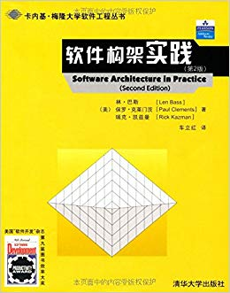
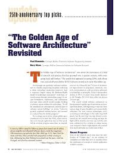

# 第1章 手册简介

架构设计能力，因为掌握起来而显得珍贵。

期望用这本手册来概括一线架构师经常面对的实践困惑，并给出`ADMEMS`方法的应对之策。

## 扩展阅读

- **软件架构在不断发展，但它依然是一个尚不成熟的学科。** --[Len Bass 《软件架构实践（第2版）》](https://www.amazon.cn/dp/B0011ALSK4)

- **推动软件工程研究不断发展的，常是实际生产或使用软件时遇到的。**  -- [Mary Shaw, 《The Golden Age of Software Architecture》](https://www.researchgate.net/publication/224506601_The_Golden_Age_of_Software_Architecture_Revisited)

