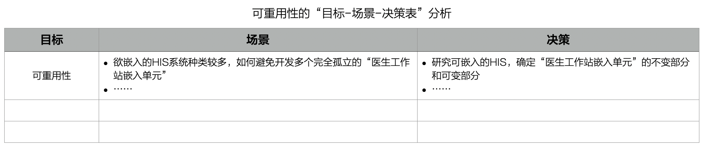
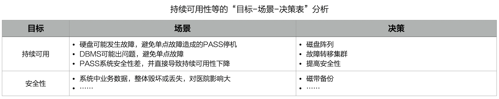
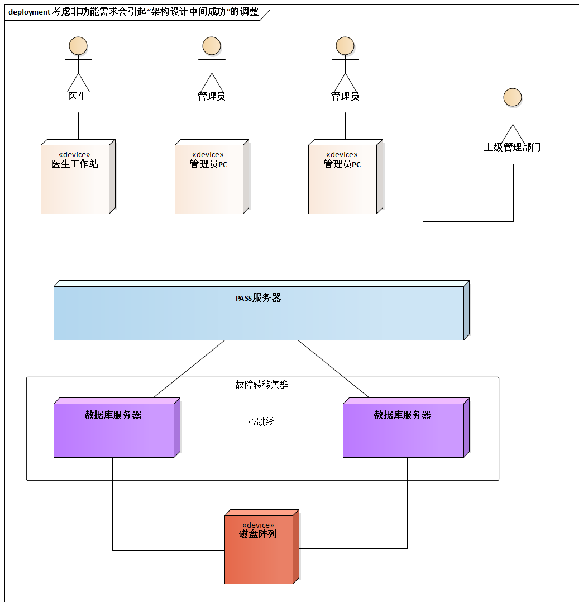

# 10.2. 贯穿案例

非功能需求往往非常笼统，而场景是一种明确性很强的技术。**目标-场景-决策表**可以让架构师理性应对非功能需求。

通过场景，我们质疑ile可重用性的做法。为了避免开发多个孤立的“医生工作站嵌入单元”，引入的设计决策是 **“分离出不变部分”**，将“PASS系统医生模块通用SDK”提炼出来（见[9.4.4. 引入通用性分层](/ch9/9.4.md#944-引入通用性分层)）

不要忘记了**架构设计是质疑驱动的**--概念加过也经常经过多次循环的设计结果(如[7.4. 实践要领](/ch7/7.4.md)提到概念架构实践要领)。现在我们来质疑PASS系统的持续可用性，它毕竟是用于辅助医院运营的系统。

根据上述基于目标-场景-决策表的思考，我们调整系统的原有架构图，经验告诉我们，考虑非功能需求会引起“架构中间设计成功”的调整！

