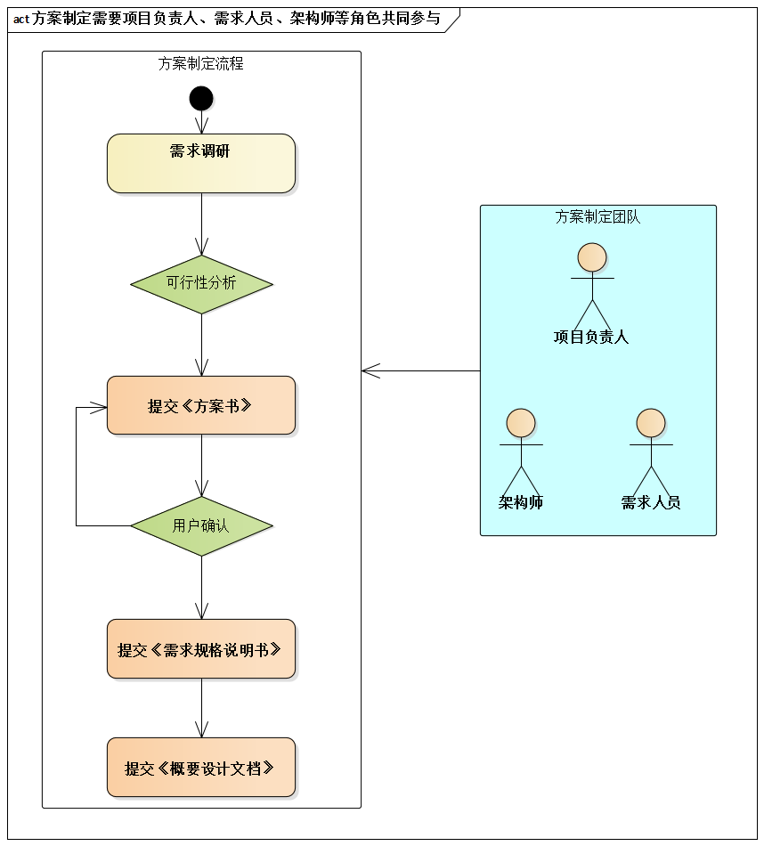

# 11.1. 骄傲的架构师，郁闷的程序员

## 11.1.1. 故事：《方案书》确定之后

公司在谈一个项目，但还没有得到客户的认可。后来，除了老李这个项目经理之外，小张作为架构师、小王作为需求分析师也都参与了进来。他们几个在和客户沟通的基础上，通力合作，最后成功提交了《方案书》，并获得客户的认可。《方案书》是老李、小张、小王各负责一部分来写的，其中架构师小张负责总体设计部分。

小张认为：《方案书》被认可说明架构已经很明确，无须“再”架构设计了。

最后，苦了程序员，因为他们在实际开发过程中没有得到足够的指导和限制。

## 11.1.2. 探究：“方案”与“架构”的关系

究其原因，这是因为概念架构难以支持并行开发。要支持开发组相对独立进行工作，需要提供指导和限制作用更明确的“规约”一级的设计。

具体而言，细化架构和概念架构之间存在如下典型差异：

- **接口**：在细化架构中接口占据非常核心的地位，而概念架构并不明确接口定义（只有抽象的组件和抽象的交互机制）。
- **子系统**：细化架构重视通过子系统和模块来分割整个系统，并且子系统往往有明确的接口；而概念架构中只有抽象的组件，这些组件没有接口，只有职责，一般是处理组件、数据组件胡哦哦连接组件中的一种。当然，概念架构中也有“大组件分解成小组件”的设计决策，但并非子系统的含义。
- **交互机制**：细化架构中的交互机制应是“实在”的，如基于接口编程、消息机制或远程方法调用等；而概念架构中的交互机制是“概念化”的。例如“A层使用B层的服务”就是典型的例子，这里的“使用”到了细化架构中可能基于接口编程、消息机制或远程方法调用等其中的一种。

当然，概念架构和细化架构都满足软件架构的定义--无论是“架构 = 组件 + 交互”，还是“架构 = 重要决策”。

方案的设定，为什么需要项目负责人、需求人员、架构师等功能参与呢？因为方案涉及的工作内容不仅仅是架构，还涉及项目管理和需求工作。“方案”和“架构”的联系与区别如下：

- 方案包含一定的架构内容
- 方案涉及的架构基本在概念架构一级
- 架构设计的工作还远未完成

所以，架构师应记住：

> 方案 = “项目 + 需求 + 架构”的总览
>  
> 方案 ≠ 架构的全部
