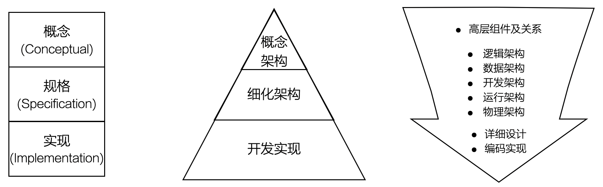
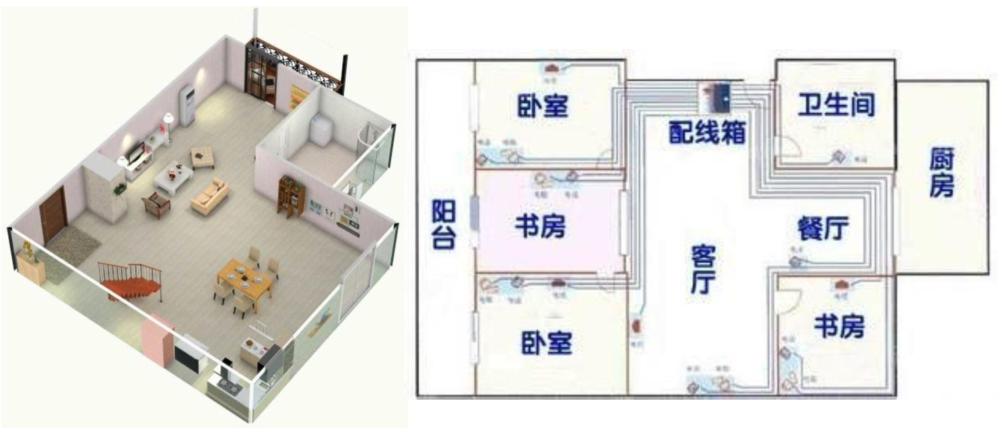

# 12.1. 什么是细化架构

细化架构是相对于概念架构而言的，它们是架构设计的两个层次，分别对应于“概念级”解决方案和“规约级”解决方案。需要注意的是，系统架构属于架构设计，不能和`Detailed Design`(详细设计)相混淆。

架构领域最喜欢将建筑设计的多视图方法与软件架构设计的多视图方法做类比，在此就不在进行赘述，而是举一个更贴近生活的例子：装修的多视图方法

- 功能视图
- 布线视图

通过运用装修的两视图法，你的装修设计摆脱在一个图里画来画去（想来想去）的困境。其中，装修设计的功能视图比较多的考虑：

- 家具
- 家电
- 灯
- 窗帘

而布线视图则集中考虑：

- 插座
- 网线
- 电话线
- 有线电视线

我们还发现，功能视图和布线视图是相互影响的，例如插座不能设计在大衣柜的后面，否则无法使用。这与软件架构设计的多视图方法中“兼顾多个视图设计之间的一致性”的要求是神似的，例如架构设计要考虑职责、程序单元、部署节点等要素之间的相互影响。
