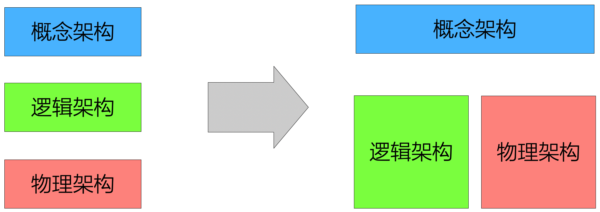

# 12.3. 业界现状

## 12.3.1. 误认为多视图是`OO`方法分支

提问：`Framework`技术是`OO`的分支吗？不是，`Framework`本质上和面向对象无关，用C语言也可以编写`Framework`。更切切近本质的`Framework`的定义是：可以通过某种回调机制进行扩展的软件系统或子系统的半成品。

的确，`OO`方法太流行了，以至于很多技术都“变成”了`OO`的分支。

有同行也常常将多视图方法误认为是`OO`方法的分支。其实，无论是`OO`方法，还是结构化方法，都远未涵盖架构设计的全部。所以，只具有`OO`技能对架构师而言是不够的。

## 12.3.2. 误将“视图”当成“阶段”

**对架构设计方法而言，区分阶段和视图的概念是非常重要和必要的**。

> “左边”的观点--概念架构、逻辑架构、物理架构是3个不同的层次。其实这种观点不完全正确，**因为逻辑架构和物理架构是架构设计同一阶段中须要同时考虑的两个方面--即二者是两个视图，而非两个阶段**。

## 12.3.3. RUP 4+1视图

在软件架构发展史上，4+1视图方法具有重大贡献。

1995年，[Philippe Kruchten](https://en.wikipedia.org/wiki/Philippe_Kruchten)发表了题为《[The4+1 View Model of Architecture](http://www.cs.ubc.ca/~gregor/teaching/papers/4+1view-architecture.pdf)》的论文，标志着`4+1`视图方法的诞生。后来，[Philippe Kruchten](https://en.wikipedia.org/wiki/Philippe_Kruchten)加入`Rational`公司，`4+1`视图演化为下图所示的模样。

`RUP4+1`视图方法有几个重要特点：

- 重视`OO`方法
- `Use Case`驱动
- 强调模型的重要性

对应于上述3个特点，架构师在实践中应注意：

- `OO`可以指导逻辑架构视图的设计，但是`OO`方法对物理视图等的设计指导很弱。另一方面，即使逻辑架构的设计，也未必都是以`OO`方法为指导的。例如，大量嵌入式软件系统和系统软件仍以`C`语言为主要开发语言，其逻辑架构设计还会以结构化方法为指导。
- 用例不是架构设计本身工作。`4+1`视图中的“4”是架构设计，“+1”是驱动因素。
- 建模切忌穷兵黩武。如果一个模型建立中没有启发思维，首次建立后从不修改，那么就要慎重考虑是不是“过度建模”了。

## 12.3.4. SEI 3视图

`SEI`的Len Bass等专家在《软件架构实践（第2版）》中阐述了“3视图”的观点，他们认为架构设计的工作应该包含3类视图：

- **模块视图**：此处的元素是模块，它们是实现单元。模块表示一种考虑系统的基于代码的方法。模块被分配功能职责区域。这不怎么强调所开发出来的软件如何在运行时表现自己。模块结构能够回答诸如此类的问题：分配给每个模块的主要功能职责是什么？允许模块使用的其他元素是什么？它实际使用的其他软件是什么？什么模块通弄个泛化或特化（继承）关系与其他模块相关？
- **组件-连接器视图**：此处的元素为运行时组件（它们是计算的主要单元）和连接器（它们是组件间通信的工具）。组件-连接器结构回答了诸如此类的问题：we和你们是主要执行组件？它们如何交互？什么是主要的共享数据存储？复制系统的那些不法？数据在系统中经过了哪些地方？系统的哪些部分可以并行运行？在系统执行时，其结构可能会发生怎样的变化？
- **分配视图**：分配结构展示了软件元素和创建并执行软件的一个或多个外部环境中的元素之间的关系。它们回答了诸如此类的问题：每个软件元素在什么处理器上执行？在开发、测试和系统构建期间，每个元素都存储在什么文件中？分配给开发小组的软件元素是什么？

> 来源：《[Software Architecture in Practice](https://sites.google.com/site/softwarearchitectureinpractice/2-what-is-software-architecture/2-5-architectural-structures-and-views)》

总的来说，`SEI 3视图`方法没有`RUP 4+1视图`方法影响大，但也值得架构师研究和体会的。

例如：

- 映射视图对实践很有启发。以源码为核心的开发单元要分配给开发人员；而目标单元要和吴磊节点有映射关系，通过安装、部署、烧写等时候藕断完成。
- “架构 = 组件 + 交互”是业界的基本认识，应该在架构的每个视图都有自己关心的“组件”。
