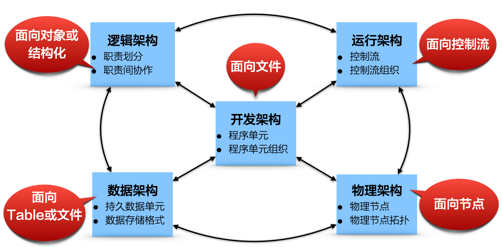
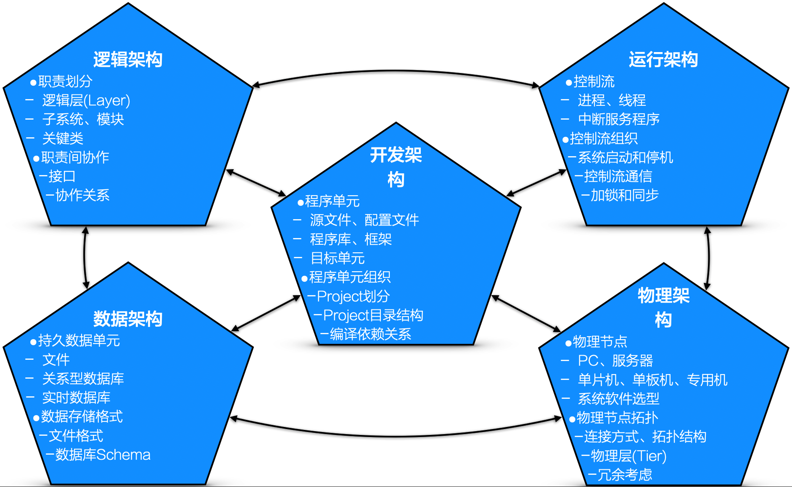

# 12.4. 实践要领

一种优秀的多视图方法，应该能够比较完善的覆盖架构设计的各项哦工作内容，且将每项工作内容明确的、有理有据的、一目了然的规划到不同架构视图中去。

我们来介绍一下5视图方法的怨气，并用两幅画来说明5视图方法的主要思想：落错有致的将众多技术关键点划分成“群落”，“群落”高内聚，“群落”之间松耦合。所以，应用5视图方法，有利于架构师设计思维的“有序”展开。

## 12.4.1. 缘起：5视图方法的提出

多视图方法是业界广泛认同的一种架构设计思路，具体的多视图方法繁多：

- `SEI`的3视图方法。涉及视图为：**模块视图**、**组件-连接器视图**、**分配视图**。
- 西门子的4视图方法。涉及视图为：**概念视图**、**模块视图**、**代码视图**、**执行视图**。
- `RUP`的4+1视图法。涉及视图为：**用例视图**、**逻辑视图**、**开发视图**、**进程视图**、**物理视图**。
- 联邦企业架构框架（`Federal Enterpriese Architecture Framework`）。涉及视图为：**技术架构视图**、**信息架构视图**、**应用架构视图**、**业务架构视图**。
- 其他......

其中，无疑是由[Philippe Kruchten](https://en.wikipedia.org/wiki/Philippe_Kruchten)于1995年首次提出的4+1视图方法的影响最大。

## 12.4.2. 总图：每个视图，一个思维角度

《第一财经》栏目有句广告语“有角度就有空间”，想想都觉得颇有道理--作为电视节目，选准了评论的“角度”，也就有了建立观点的“空间”。

而多视图方法背后的核心思想就与此有些类似：

> 从不同角度，规划“分割”与“交互”。

5视图方法包含如下几个视图：

- 逻辑视图
- 开发视图
- 运行视图
- 物理视图
- 数据视图

5个视图各有其“思维立足点”，分别是：

- 职责划分（逻辑视图）
- 程序单元组织（开发视图）
- 控制流组织（运行视图）
- 物理节点安排（物理视图）
- 持久化设计（数据视图）

“思考最大的障碍在于混乱”。抓住每个视图的“思维立足点”。5视图方法就显得“相当清楚”了。

## 12.4.3. 详图：每个视图，一组技术关键点

接下来，看看架构师最关注的众多技术关注点，如何被5视图梳理的清楚。

例如，`Layer`是一种大粒度的“职责划分”单位，`Layer`的定义属于逻辑架构视图；而`Tier`则属于物理架构视图的考虑范围，它关注与硬件部署。

再例如，对于嵌入式系统而言，有经验的架构师能够从上图中“发现”自己的习惯做法：

- 控制流不仅仅包含进程和线程，中断服务程序也是一种重要的控制流机器（运行架构视图）
- 嵌入式应用数据的持久化常常基于文件（而不是数据库）的概念，最终常写入`Flash`（而不是硬盘）中（数据架构视图）
- ......

如果说每个视图都是一个“语言”的话，那么视图内的那些技术关注点就是语言的“词汇”，正是这些不同的技术关注点支撑起不同的思维空间。

最后，看似复杂的5视图方法其实很简单，因为其**每个视图都是从特定角度规划系统的分割与交互**，都是（架构的定义）“组件 + 交互”的一种体现。--原来如此，提炼出了“繁”中之“简”，离成功运用这种方法就不远了！
