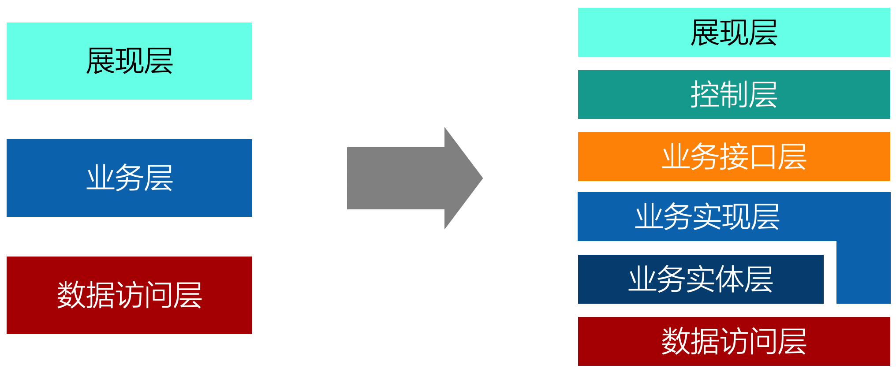
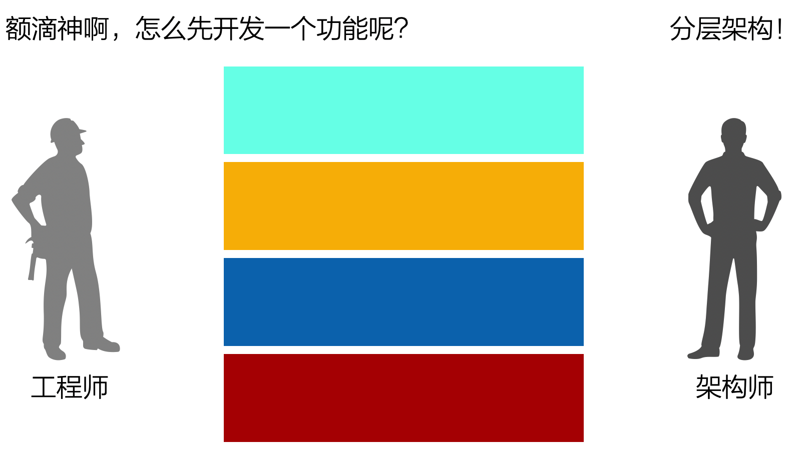
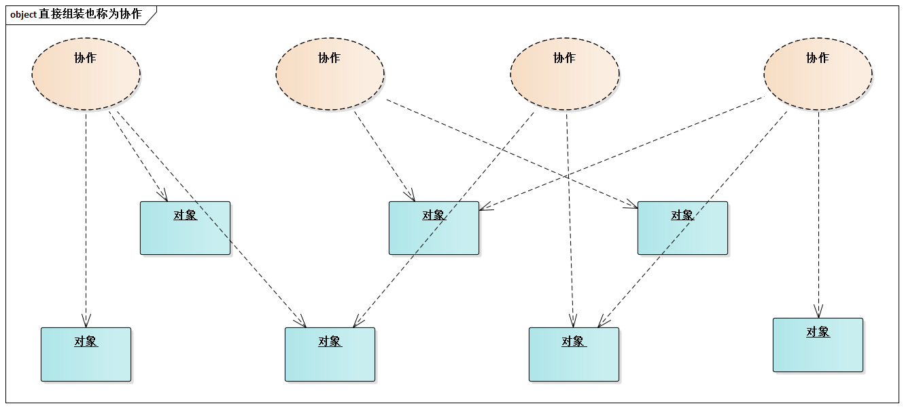
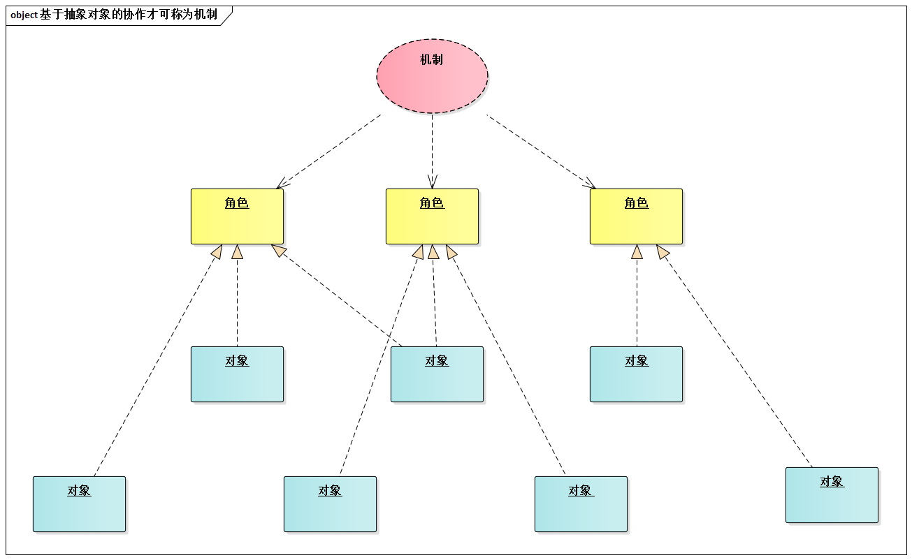

# 13.1. 划分子系统的3种必用策略

架构师最缺的不是理论，也不是技术，而是位于理论和技术之间的“实践策略”和“实践套路”。

就划分子系统这个架构师必须做的工作而言，其实实践策略可以归纳为3种：

- 分层的细化
- 分区的引入
- 机制的提取

## 13.1.1. 分层(`Layer`)的细化

分层是最常用的架构模式：在架构设计初期，100%的系统都可以用分层架构，就算随着设计的深入而采用了其他架构模式也未必和分层架构矛盾。

于是，架构师在划分子系统时常受到初期分层方式的影响--实际上，很多架构师最熟悉、最自然的划分子系统的方式就是：分层的细化。

3层架构或4层架构的“倩影”经常出现在投标时，或者市场彩页中，于是有人戏称之为“市场架构”。的确，直接用3层架构或4层架构来支持团队的并行开发是远远不够的。所以，“分层的细化”是划分子系统的必用策略之一，架构师们不要忘记。

## 13.1.2. 分区(`Partition`)的引入

序幕才刚刚拉开，划分子系统的工作还远远没有结束。

迭代式开发挺盛行，但所有真正意义上的迭代开发，都必须解决这样一个“困扰”：如果架构设计中只有“层”的概念，以“深度优先”的方式完成一个个具体功能就不可能的！

所以，工程师们就经常遇到这样的烦恼

例如《[代码之道](https://book.douban.com/subject/3259433/)》一书中就论及了这一点：

> 为了得到客户经常性的反馈，快速迭代有个基本前提：开发应该是“深度优先”，而不是“广度优先”。
>  
> 广度优先极端情况下意味着每一个功能进行定义，然后对每个功能进行设计，接着对每个功能进行编码，最后才能对所有功能一起测试。而深度优先极端情况下意味着每个功能完整的进行定义、设计、编码和测试，而只有当这个功能完成之后，你才能做下一个功能。当然，两个极端都是不好的，但深度优先要好的多。对于大部分团队来说，应该做一个高级广度设计，然后马上转到深度优先的底层设计和实现上去。

为了支持迭代开发，逻辑架构设计中必须（注意是必须）引入分区。分区是一种单元，它位于某个层的内部，其粒度比层 要小。一旦架构师针对每个层进行了分区设计，“深度优先”式的迭代开发就非常自然。

，支持迭代开发.png)

架构是迭代开发的基础。架构师若要在“支持迭代”方面不辱使命，必须注重“分区的引入”--这也是划分子系统的必用策略之一。

## 13.1.3. 机制的提取

[Grady Booch](https://en.wikipedia.org/wiki/Grady_Booc)在他的著作中指出：

> 机制才是设计的灵魂所在......否则我们就不得不面对一群无法相互协作的对象，它们相互推搡着做自己的事情而不关心其他对象。

机制之于设计是如此的重要。那么，什么是机制呢？

那“机制”的定义是：**软件系统中的机制，是指预先定义好的、能够完成预期目标的、基于抽象角色的协作方式。机制不仅仅包含协作关系，同时也包含了协作流程。**

对于面向对象方法而言，“协作”可以定义为“多个对象为完成某种目标而进行的交互”，而“协作”和“机制”的区别可以概况为：

> 基于接口（和抽象类）的协作是机制，基于具体类的协作则算不上机制。

对于编程实现而言，在没有提取机制的情况下，机制是一种隐式的重复代码--虽然语句直接比较并不相同，但是很多语句只是引用的变量不同，更重要的是大段的语句块结构完全相同。如果提取了机制，它在编程层面体现为“基于抽象角色（OO中就是接口）编程的那部分程序”。