# 13.3. 逻辑架构设计的整体思维套路

## 13.3.1. 整体思路：质疑驱动的逻辑架构设计

要点如下：

- 质疑驱动
- 结构设计和行为设计相分离

模板不是一天建成的。需求对架构设计的“驱动”作用，是伴随着架构师“**不断设计中间成果 -> 不断质疑中间成果 -> 不断调整完善细化中间成果**”的过程渐进展开的。打个比方，需求就像“缓释胶囊”，功能、质量、约束这3类“药物成分”的药力并不是一股脑释放的，而是缓缓释放的--“缓释”的控制者必然是人，是架构师

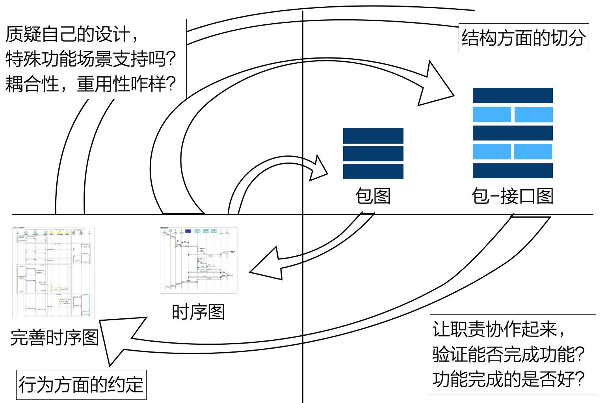

> “药力释放机理” -- 逻辑架构设计的整体思维套路

先考虑结构方面的切分。手段是上面所讲的分层的细分、分区的引入、机制的提取。

然后，让切分出的职责协作起来，验证能否完成功能。这个工作，可以借助时序图进行。

此时，结构和行为方面各进行了一定的设计，就应开始质疑自己的设计。架构师要从两个角度质疑：

- 功能方面，特殊的功能支持吗？
- 质量方面，耦合性、重用性、性能等怎么样？

如此循环思维，不断将设计推向深入......其间，会涉及接口的定义，建议用“包-接口图”作为从结构到行为过度的桥梁，从而识别接口。至于接口的明确定义（接口包含的方法为何），则要进一步考虑基于职责的具体交互过程。

## 13.3.2. 过程串联：给初学者

第1步，根据当前理解切分。质疑驱动的逻辑架构设计整体思路，是从运用分层的细化、分区的引入、机制的提取进行子系统划分开始。

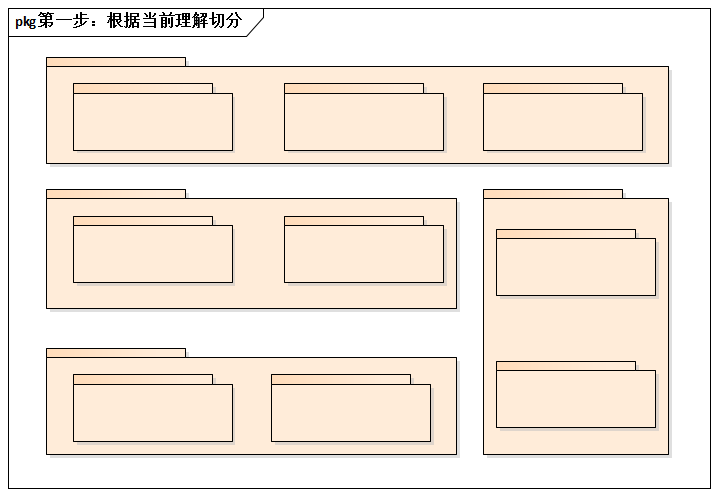

第2步，找到某功能的参与单元。弱找不到明显缺单元，就可以直接返回到第1步，以补充遗漏的职责单元。

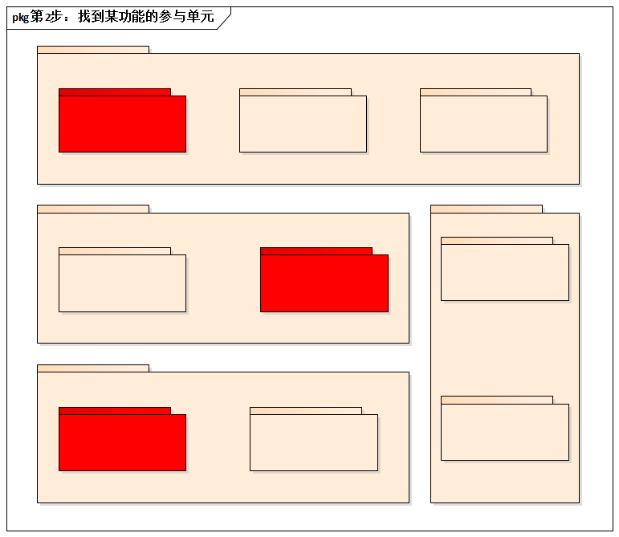

第3步，让它们协作完成功能。研究第2步找到的参与单元之间的协作关系，看看能否完成预期功能，完成的怎么样？

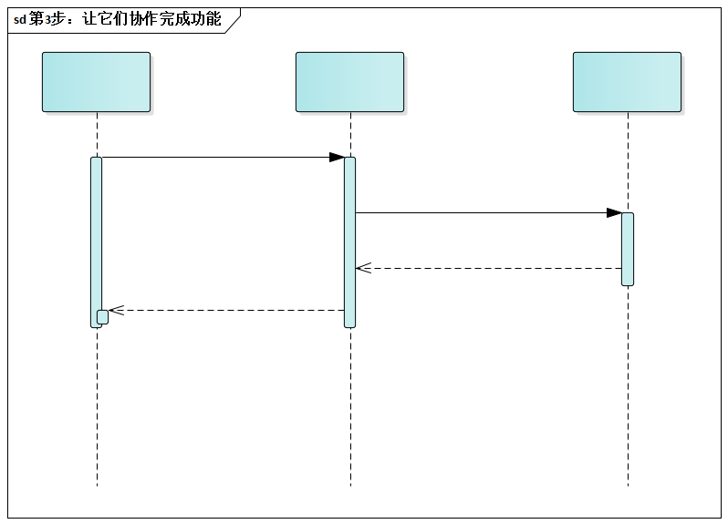

第4步，质疑并推进设计的深入。通过质疑“对不对”和“好不好”，可以发现新职责，或者调整协作方式。这意味着，第1步的子系统切分方案被调整、被优化......如此循环。

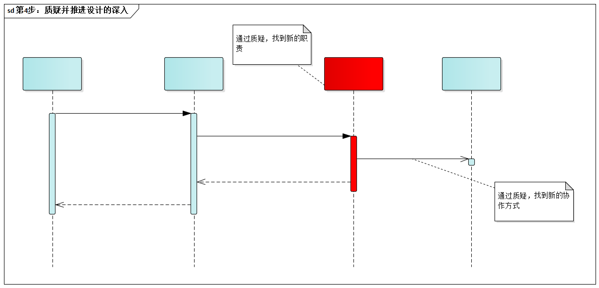

## 13.3.3. 案例示范：自己设计`MyZip`

`MyZip`的概念架构设计，它将和需求一起，影响`MyZip`的细化架构设计。

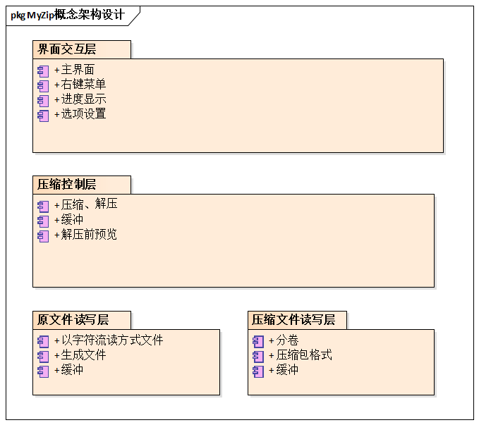

下面主要是演示如何以质疑驱动的思路，设计`MyZip`的逻辑架构视图。

首先，考虑结构方面的切分，3种划分子系统的手段都运用上。

- 分层的细分。压缩实现层从原来的压缩控制层中分离出来。回忆一下之前的“[子系统划分策略背后的4大原则](13.1.md#1315-探究划分子系统的4个重要原则)”。无论是从职责不同的角度，还是从所需技能的角度考虑，两者都应该分离成为单独的“子系统”。
- 分区的引入。界面交互层必须进一步分区，例如：支持右键菜单的“Windows外壳扩展”部分被独立。
- 机制的提取。例子是智能缓冲机制，它应该成为一个通用性的基础子系统。同时，为了使它可重用，缓冲区不负责“缓冲区已满”时的具体处理而是毁掉外部单元进行。再者，为了提高使用友好性，缓冲区具有一定“智能”，它会自动保存溢出的部分，从而简化使用缓冲区的接口。

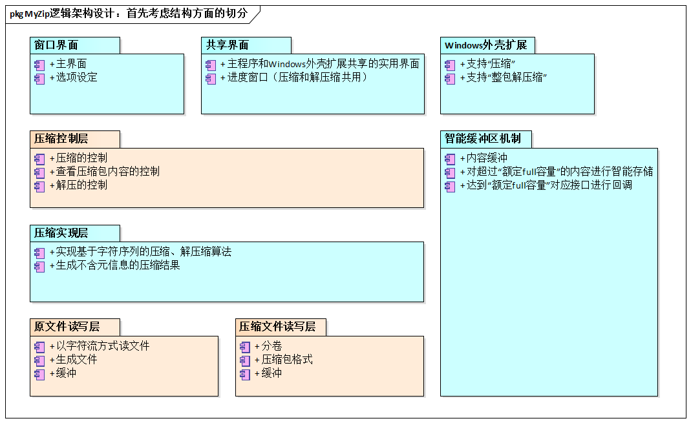

然后，让切分出来的职责协作起来，验证能否完成功能。我们来回答“切分之后的结构能支持压缩的协作吗？”的问题。回忆一下之前提到的[增量建模](../ch8/8.3.md#834-增量建模)技巧--不要急于“一口吃个胖子”。

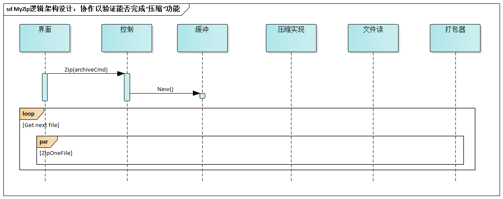

如此循环，早晚要定义子系统的接口。下面是**包-接口图**，帮助架构师明确需要哪些接口（还没有到接口内方法定义一级）。

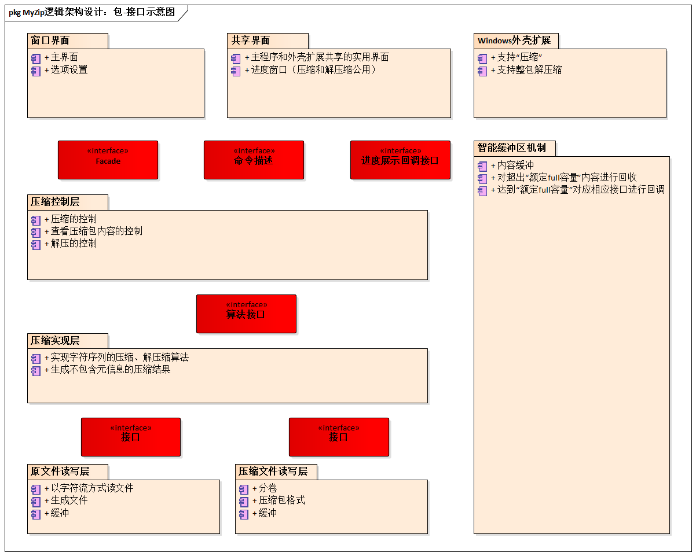

再次从结构设计跳到行为设计。现在在该更明确考虑压缩了。接下来，我们要演示`ZipOneFile`的设计。同样，遵循“先大局，后局部”的设计原则。具体设计决策是，让“控制”担当`ZipOneFile`的职责，而不是让“压缩实现”来担负--原因是希望“压缩实现”不须感知`File`的概念而能够更大程度上的被重用(例如对数据包而非文件进行压缩)。

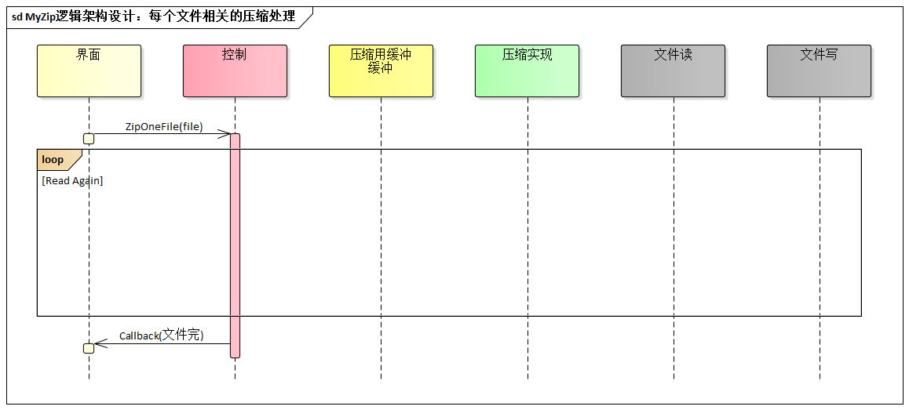

我们来进一步的明确接口的方法定义......

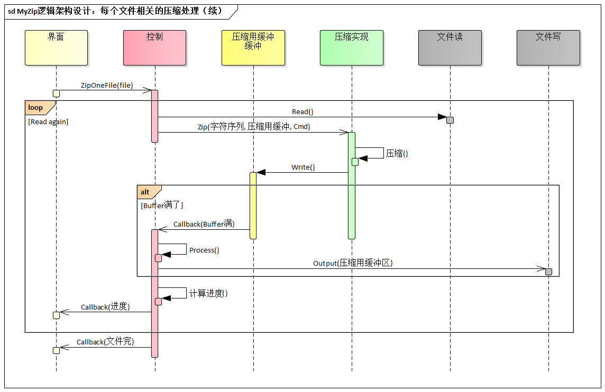
