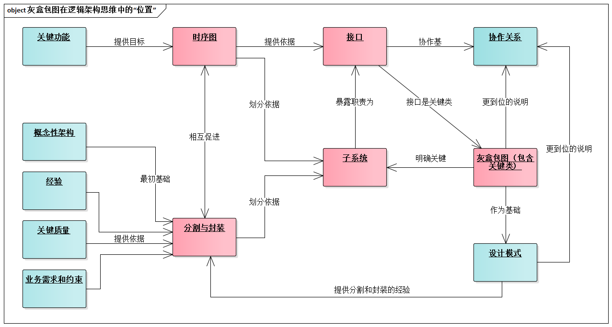
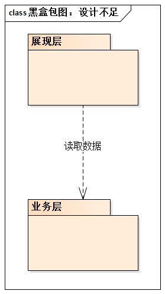
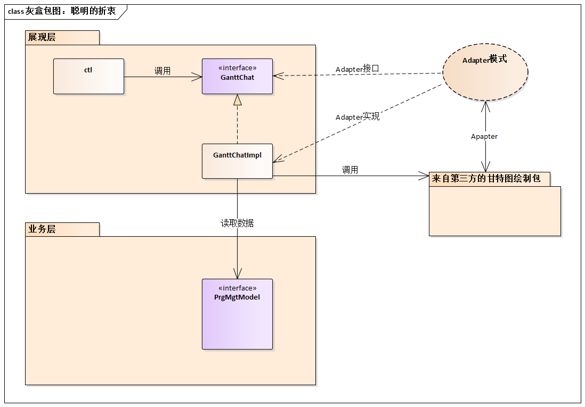
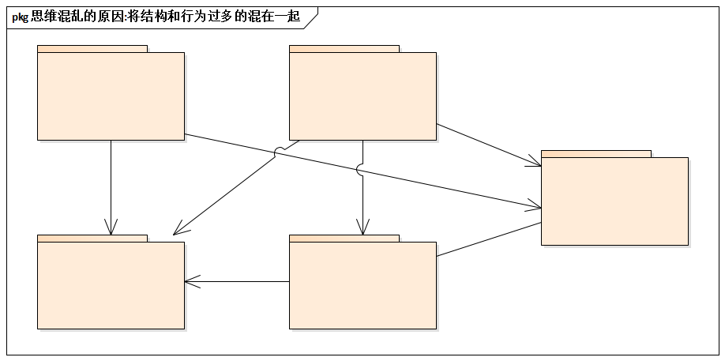

# 13.4. 更多经验总结

## 13.4.1. 逻辑架构设计的10条经验要点

我们归纳了逻辑架构设计的10条经验要点，其中，如何划分子系统，如何定义接口，如何运用质疑驱动的事物套路等已经介绍，其他几点再继续简单介绍。

1. 划分子系统：分层的细化
2. 划分子系统：分区的引入
3. 划分子系统：机制的提取
4. 接口的定义：协作决定接口
5. 选用序列图：杜绝协作图
6. 包-接口图：从结构到行为的桥
7. 灰盒包图：描述关键子系统
8. 循序渐进的螺旋思维
9. 设计模型：包内结构
10. 设计模式：包间协作

## 13.4.2. 简述：逻辑架构设计中设计模式应用

设计模式是`Class Level`的设计，它如何用于架构一级的设计呢？

基本观点是：让`Class`和`SubSystem`搭上关系。不难理解，设计模式用于架构设计主要有两种方式：

- 明确子系统内的结构
- 明确包间的协作关系

如何做呢？答案是灰盒包图。下图中说明了灰盒包图的意义，它打破了“子系统黑盒”，关系子系统中的关键类，从而可以更到位的说明子系统之间的协作关系，并成为设计模式应用的基础。

例如，我们对比一下黑盒包图和灰盒包图（背景是项目关系系统甘特图展示的问题）。后者明确了子系统之间的交互机制，还显式的说明了`Adpter`设计模式的应用--这就是灰盒包图的价值。

## 13.4.3. 简述：逻辑架构设计的建模支持

**工欲善其事，必先利其器**。在实践中必须选择最适合的模型，甚至做一些改造工作让`UML`更适合特定的实践目的。例如：灰盒包图就是一种“专门说明重要子系统设计”的`UML`图的应用。

另外，包-接口图是类图的一种特定形式，它包含“包（`package`）”和“接口（`interface`）”两种主要元素。这种图的作用很专一：说明包之间的协作需要哪些接口。逻辑架构设计中，包-接口图是从结构设计到行为设计的思维桥梁。

最后，“[逻辑架构设计的整体思维套路](13.3.md)”时已亮明了观点：逻辑架构的设计，应该使结构设计和行为设计相分离。这样才利于更有效的思维。不信？请看下面所示的“设计图”（这是很多设计者习惯的思维方式）。思维清楚吗？思维混乱的原因：将结构和行为过多的混在了一起。

推荐用时序图（它较为专注于行为设计）辅助逻辑架构设计，尽量不要用协作图（虽然在`UML 1.4`中，它和时序图等价，但从形式上它的“结构气”太重）。
