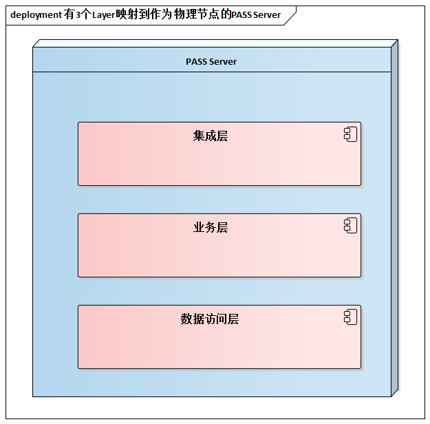
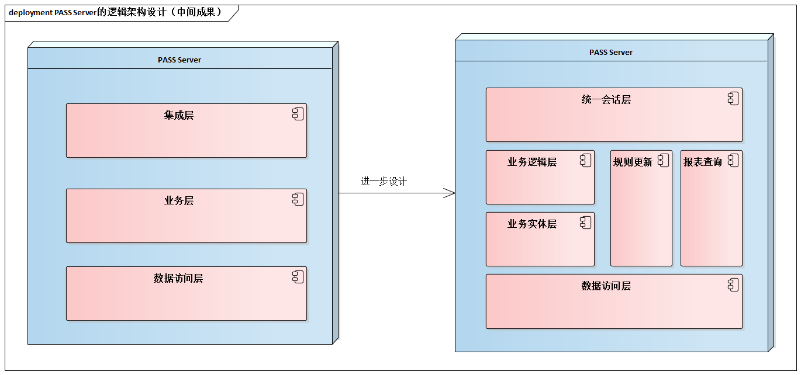
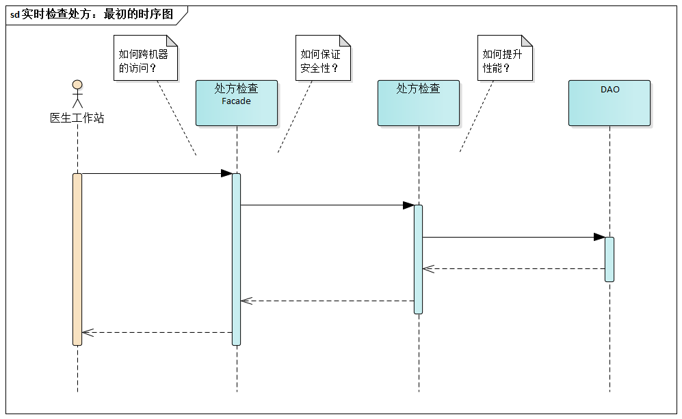
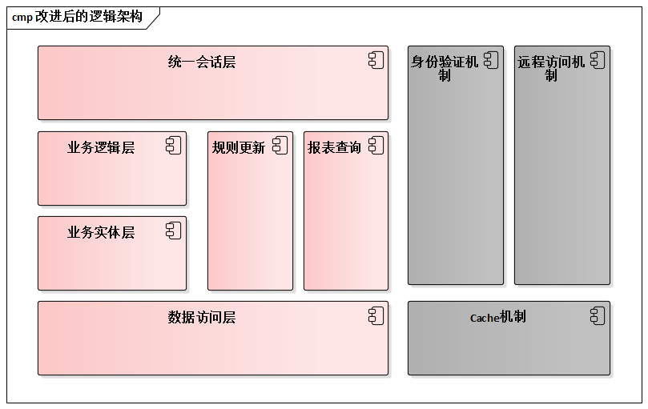

# 13.5. 贯穿案例

我们来继续贯穿案例：`PASS`系统的架构设计。首先应注意两点：

- 第一，细化架构的重要“输入”之一是概念架构设计，不应忽视，比较细化架构设计是整个架构设计过程中的一个阶段。例如，之前进行的“[基于鲁棒图的初步设计](/ch8/8.4.md)”，以及“[高层分割考虑](/ch9/9.4.md)”。

- 第二，5视图方法的运用，总体而言是5个视图的设计穿插进行的，对复杂系统而言，根本不可能将逻辑视图设计完全之后再考虑其他视图。而本案例的`PASS`系统具有很强的分布特点，所以必然较早的考虑到物理视图对逻辑设计的影响。例如，`PASS`服务器作为一个物理架构元素的“节点(`Node`)”，它之上“跑”的逻辑架构“逻辑层(`Layer`)”有哪些呢？

进入细化架构阶段的逻辑架构设计，常以初步设计为基础，借助分层细化、分层引入、机制提取等手段。对`PASS`服务器软件进行逻辑架构的结构设计。

从结构设计跳到行为设计，常用手段是画时序图。它处于逻辑架构设计的“螺旋式”整体思维讨论的起始循环，是进一步深入设计的基础。

有了不同职责单元之间具体的协作关系，就可以展开细致的“质疑”了--别忘了，架构设计是质疑驱动的。

- 处方检查服务能被医生工作站访问到吗？毕竟前者位于`PASS`服务器上......于是，设计中要进一步明确“远程调用机制”。
- 这样一个分布式的系统，访问服务之前要经过什么样的验证呢......于是，进一步考虑安全性的支持。
- 不同的医生不停的开处方，处方检查功能会不会很慢？常用药的用药规则应该常驻内存，这样才能提升性能......于是，设计要进一步明确`Cache`等提升性能的机制。
- ......

于是，自然而然地，沿着逻辑架构设计的“螺旋式”整体思维套路思考，我们就能意识到“结构设计”要继续完善和细化。基于对远程调用、安全性、高性能的质疑，改进的“结构设计”后就得到下面的逻辑架构图。

