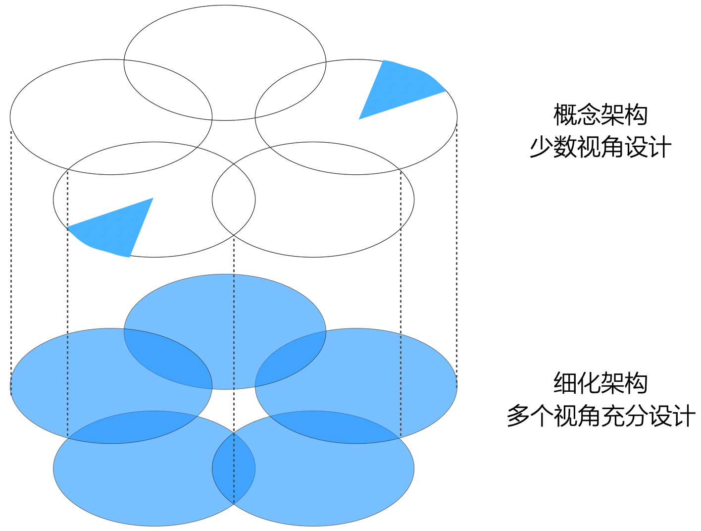
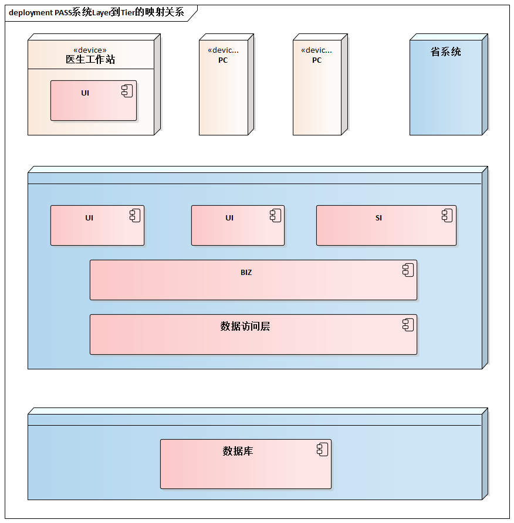
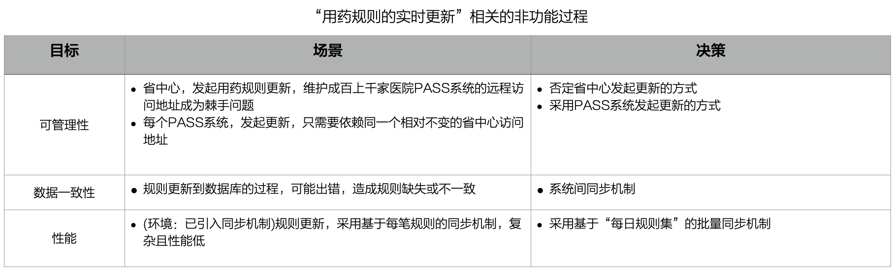
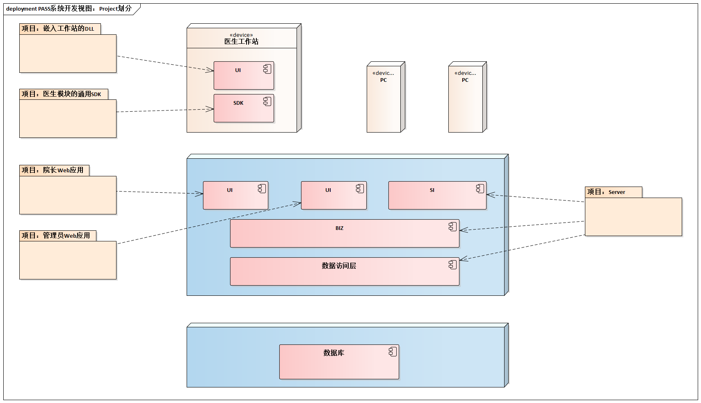
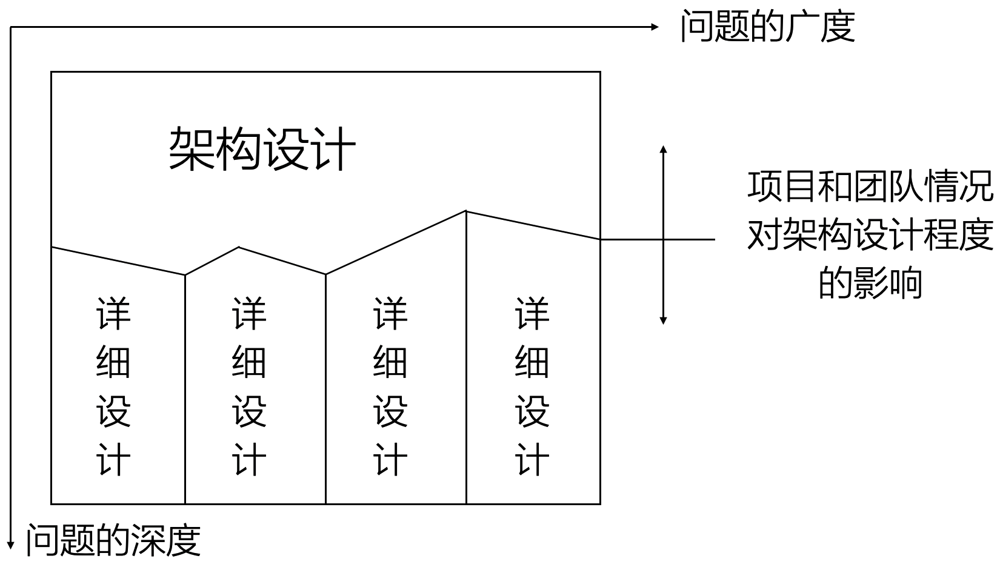

# 14.10. 贯穿案例

继续`PASS`系统的架构设计。

## 14.10.1. 物理架构

回顾之前第9章的“[贯穿案例](/ch9/9.4.md)”部分，你可能会有疑问：物理架构不是在概念架构时已设计吗？为什么又要设计？

所以，下面首先分析医学：概念架构设计和5视图方法是什么关系。

- 总体而言，概念架构所包含的高层设计决策终究不会跳出5个架构视图的范围--逻辑架构、物理架构、开发架构、数据架构或运行架构
- 只不过，概念架构设计的抽象程度比较高，设计程度也很不充分，而细分架构必须设计到可以指导开发的程度
- 例如，一个分布式系统的概念架构，最常见的做法是包含逻辑架构和物理架构2个视图的高层次的考虑
- 对于典型的嵌入式控制习题而言，概念架构设计时又经常运行架构中多条控制流的规划
  
总之，概念架构与5视图方法的区别及联系可以用两句话概况。

- 概念架构从少数视角、重点视角进行概念设计
- 细化架构从多个视角、全面视角进行充分设计

至此，我们明白了`PASS`系统的物理架构设计已经在概念架构时进行了一部分，进一步明确不同物理层(`Tier`)之间的协议类型、每一物理层是否需要部署集群、软件单元（例如`Layer`）到物理节点的映射关系等物理架构设计的内容即可。

## 14.10.2. 持续不断的考虑非功能需求

非功能需求的支持不可能是“速决战”。

> 非功能需求的考虑是“贯穿环节”，在概念架构设计阶段，以及细化架构设计阶段都应重视。

对细化架构设计阶段而言，这意味着非功能目标的考虑时刻伴随着5视图的设计。例如，为了支持“用药规则的实时更新”这一功能，会涉及不同视图的考虑，中间穿插着无数次“质疑-分析-决策”的“微过程”。

我们通过“目标-场景-决策表”来“重放”了我们的思维过程。

## 14.10.3. 开发架构

对大系统而言，开发架构设计中的“`Project`划分”是不可或缺的，因为即使一个`Project`可以“胜任”（例如没有多节点因素），我们也不推荐这样做。更何况，将一个系统组织成多个`Project`的形式进行开发，可以方便的单独控制每一个`Project`源码的保密性--这是很多软件企业都关心的一个问题。

我们将`PASS`系统划分为5个`Project`，分别为：

- 院长`Web`应用
- 管理员`Web`应用
- 嵌入式工作站的`DLL`
- 医生模块通用`SDK`
- `PASS Server`

确定了`PASS`系统划分成哪几个`Project`，就可以进一步确定每个`Project`所包含的程序单元、这些程序单元的依赖关系、源码的基本结构等问题，并为每个`Project`选定具体的技术及所用到的`Framework`。

## 14.10.4. 架构设计应进行到什么程度

最终，架构设计应进行到什么程度呢？

架构设计的程度应考虑3方面的问题。

- 应为开发人员提供足够的指导和限制
  - 标志：可支持并行的详细设计
  - 说明：所谓架构设计、概要设计、总体设计，只是含义相同的不同词汇而已。因此，“架构设计->概要设计->详细设计”的观点是不够专业的
  - 解图：图中“架构设计”和“详细设计”之间没有缝隙
- 因项目、开发团队情况的不同而变化
  - 说明：应考虑项目熟悉程度、风险高低，以及团队技能水平等
  - 解图：图中“架构设计”的“详细设计”之间的“线”上下浮动
- 业务层、通用机制应更深入设计
  - 说明：核心模型影响可扩展性，应当更深入设计；通用机制影响易解性和Bug率，应当更深入设计
  - 解图：图中“架构设计”和“详细设计”之间的“线”为深深浅浅的锯齿状

