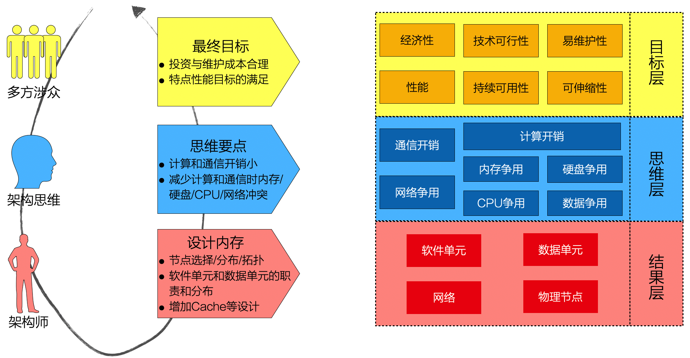

# 14.3. 探究：物理架构的设计思维

相对逻辑架构设计而言，物理架构视图的设计是不是就乏善可陈呢？不，一般架构师最缺的就是物理架构的设计思路。

从设计结果层面，决策无非围绕物理节点、网络、软件单元、数据单元等内容展开。

但是，思维当中经历了哪些思考、判断和权衡呢？

从最终目标层面，决策要兼顾多方涉众的不同利益，可从“攻”与“守”两个方面理解：

- 高性能（攻）
- 持续可用性（攻）
- 可伸缩性（攻）
- 技术可行性（守）
- 易维护性（守）
- ......

从思维要点层面，“开销”和“争用”是核心。架构师正是通过“降低开销”、“避免争用”来实现高性能、高伸缩性等最终目标。

- 如何降低物理节点“内”的计算开销？
- 如何降低物理节点“间”的通信开销？
- 如何避免物理节点“内”CPU、内存、硬盘等资源的争用？
- 如何避免物理节点“间”网络的带宽资源冲突？

这样，我们了解了物理架构设计的理性思维框架。

