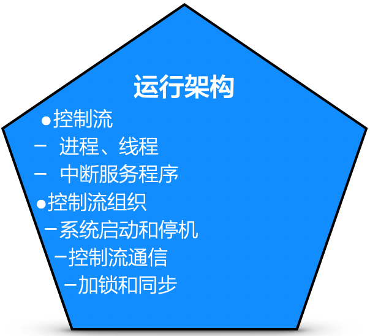

# 14.5. 运行架构设计的工作内容

## 14.5.1. 工作内容

根据具体情况不同，运行架构设计可能包括下列工作内容

- 确定引入哪些控制流
- 确定每条控制流的任务
- 处理相关问题：控制流的创建、销毁、通信机制等
- 进一步考虑：控制流之间的同步关系，若有资源争用还要引入加锁机制

控制流（`Control Flow`）是一个在处理机上顺序执行的动作系列。确定引入哪些控制流，并没有固定不变的套路，但有几点考虑是必不可少：

- 物理架构中的每个节点（`node`）之上至少有一条控制流
- 为了实现节点（`node`）之间的通信，通常做法是引入一条控制流来专门负责
- 在需求一级的描述中（例如用例规约中）就是并行或并发的，引入多条控制流
- 来自用户或外部系统的并发访问，常要求后端服务支持多控制流
- 如果控制流关系复杂，可以考虑引入对其他控制流进行协调的控制流

一旦系统中存在不止一条控制流，就产生了附近的工作量，例如控制流的创建、控制流的销毁、建立共享内存或消息等不同控制流之间的通信机制。

## 14.5.2. 控制流图是关键

控制流图显示了系统中不同控制流之间的关系。控制流的起点是“主动单元”，它会调用其他“被动单元”......如此层层调用，就形成了一个控制流。明确了系统中所有的主动单元，就抓住了每个控制流的源头，从而可以把并发执行的所有控制流梳理清楚。

> 例如：`M`和`N`两个模块可能需要加锁，因为`M`模块的“入度”等于2，而`N`是`M`的下游模块。

运行架构设计的工作看似多而杂，但其实只要把握“控制流图”，就能提供提纲擎领的开展其他相关设计。
