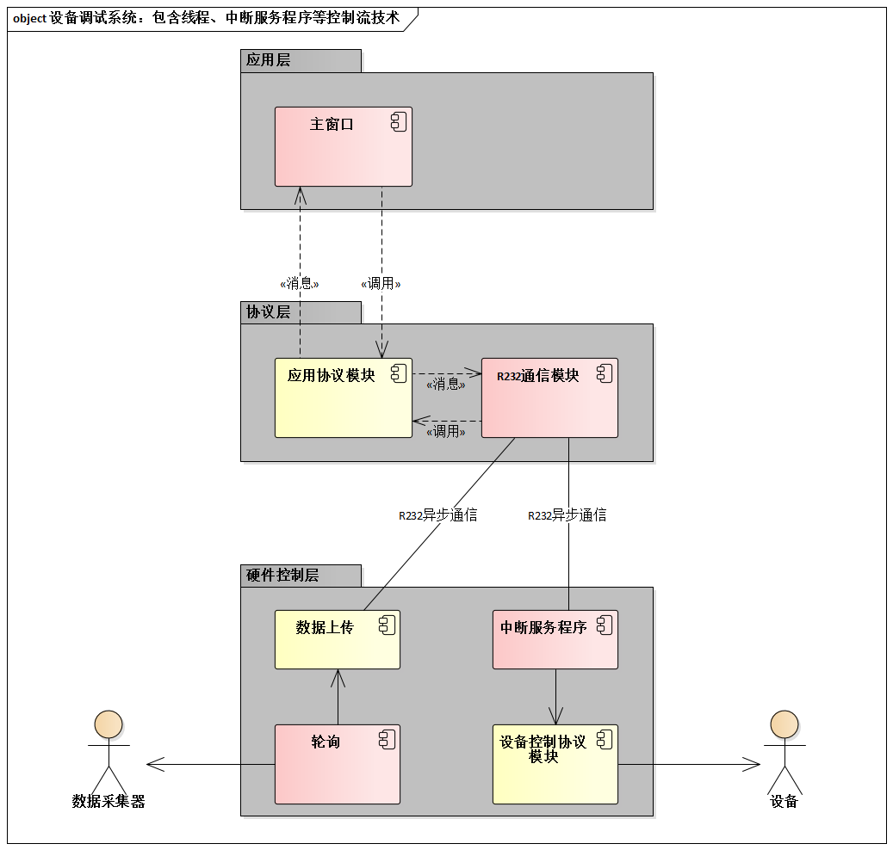

# 14.6. 实现控制流的3种常用手段

在实践中，最常用于实现控制流的手段有3种。

- 进程
- 线程
- 中断服务程序

进程（`Process`）是重量级控制流，即是处理机资源的分配单元，又有其他计算机资源的分配单位。

线程（`Thread`）是轻量级控制流，仅仅是处理机资源的分配单位。一个进程内可以包含多个线程，后者共享前者的资源：但处理机资源例外，线程是独立IDE处理机资源的分配单位。

实际上，中断服务程序（`Interupt Service Routine, ISR`）也是常见的控制流实现机制。当没有`OS`的支持却要实现并发时，它非常必要。

例如，下图所示的多条控制流设计用到了线程，以及中断服务程序的技术（背景为设备调试系统）:

- 应用层中的线程代表主程序的运行，它直接利用了`MFC`的主窗口线程。无论是用户交互，还是串口的数据到达，均采用异步事件的方式处理，杜绝了任何“忙等待”无谓的耗时，也缩短了系统响应时间。
- 协议层有独立的线程控制着“上上下下”的数据，并设置了数据缓冲区，使数据的接受和数据的处理相对独立，从而使数据接收不因暂时的处理忙碌而停滞，增加了系统吞吐量。
- 硬件控制层的设计中，分别通过时钟中断和`RS232`中断来激发相应的处理逻辑，达到轮询和收发数据的目的。
