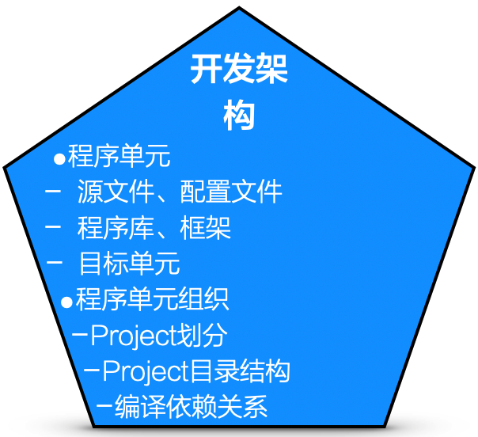
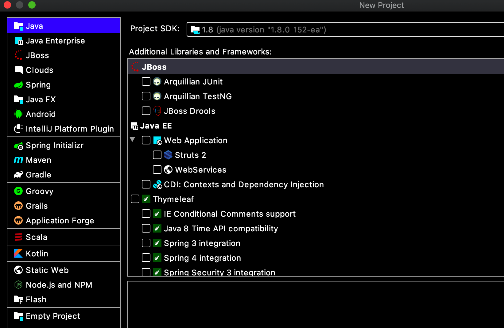

# 14.8. 开发架构设计的工作内容

一般而言，开发架构的设计应完成下列工作。

- 将“逻辑职责”映射为“程序单元”
  - 要自主编写的源程序
  - 可重用的库、框架
  - 其他方式(如`Shell`脚本、平台支持下的配置文件)
- 开发技术选型
  - 开发语言
  - 开发工具
- “程序单元”间关系
  - `Project`划分（可选）
  - `Project`目录结构
  - 编译依赖关系

值得说明的是，此处的“Project”不是指`Project Manager`管的“项目”，而是指`IDE`等开发环境所支持的“`Develop Studio Project`”类似的概念。

