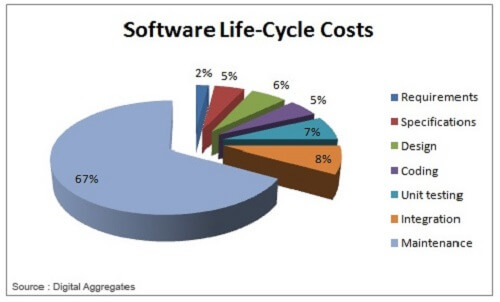
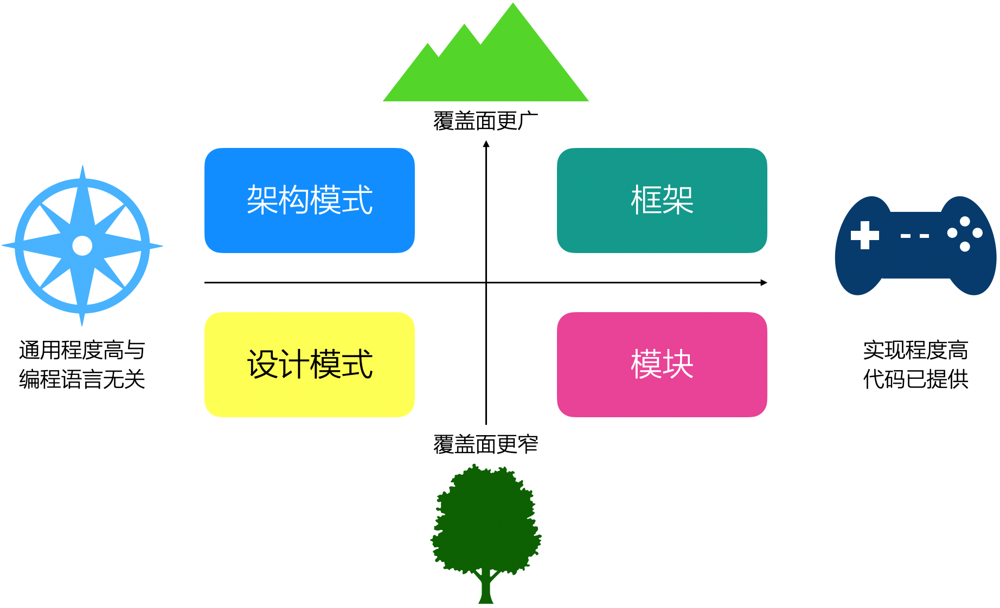

# 14.9. 观点：重用测试是关键

广大软件企业系统通过为客户提供合格的软件系统达到获取利润的目标，于是，他们非常关注“可重用性”。但从重用的现实效果来看，显然远远不能令人满意......

## 14.9.1. 探究：我们为何年复一年修改者类似的Bug

在很多企业（包括很多程序员本人）都声称“我们很重视重用”的背景之下，下面这个问题尤其值得深思：

> 国内许多程序员年复一年的写着类似的程序--更要命的是，他们年复一年的修改者类似的Bug。

事出有因。以下两个问题是根源所在。

- 第一，架构师“重交付、轻维护”。心理学告诉我们，自己的、眼下的痛苦是最大的痛苦。于是，在工期的巨大压力下，许多架构师最担心的是“项目能否按时交付”，于是就把维护问题仍在脑后。
- 第二，架构师“重视小粒度重用、忽视大粒度重用”。一个孤立的类、一个小函数，每天都能被重用，却不能解决“年复一年修改类似Bug”的问题。最终我们发现，小粒度重用是有价值的，但和大粒度重用并不矛盾，而大粒度重用才是避免“重复组装、重复改Bug”式浪费的关键。

所以，请记住这个公式：

> 重用价值 = 重用次数 x 单次价值

## 14.9.2. 观点：为了从根本上降低维护成本，重用测试是关键

不要只关心重用的次数，为了重用而重用，而是时刻关注节省成本--这才是重用的目标所在。于是，当我们想到“维护是最昂贵的环境”，当我们看到经典书籍显示维护成本占总成不的67%之巨时，会作何感想？

> 图片来源：[App Maintenance Cost Can Be Three Times Higher than Development Cost](https://www.econnectivity.se/app-maintenance-cost-can-be-three-times-higher-than-development-cost/)

想必你的结论和我一样：为了从根本上降低维护成本，重用测试是关键。这意味着大粒度重用。也就是，在重用这些代码时，并不对代码任何修改--它们的测试也被重用了。具体而言，`Framework`、`Service`、`Server`、平台、中间件都算大粒度重用技术，它们已经成为，并继续是重用技术的未来方向。

## 14.9.3. 简评：设计模式对重用的意义

最后，评论有一个有趣的现象：很多架构师一提到重用首先会想到设计模式。那么，设计moose在重用技术中占据了什么位置呢？先看看`Lethbridge`在《[面向对象软件工程](https://book.douban.com/subject/3519389/)》中的一段话：

> 下面是软件工程师实践过的一些重用类型，安装重用所节省的潜在工作量的升序排列。
>  
> - 重用专家经验
> - 重用标准的设计和算法
> - 重用类库或程序，或者重用语言和操作系统中内置的强大命令
> - 重用框架
> - 重用完整的应用程序

设计模式属于上面的“专家经验”和“标准的设计”级别的重用策略--《[面向对象软件工程](https://book.douban.com/subject/3519389/)》明白无误的告诉我们：这种“重用类型”节省的潜在工作量是比较有限的。

为什么呢？下图说明了“设计模式”和“框架”等技术在重用方面区别的根源：前者通用程度高和编程语言无关，后者实现程度高代码已提供。没有代码--无论是系统软件或平台内部的实现，还是库或者框架这种外部实现--就没有办法重用测试，就会面临较多的Bug而花费较高的维护成本。

