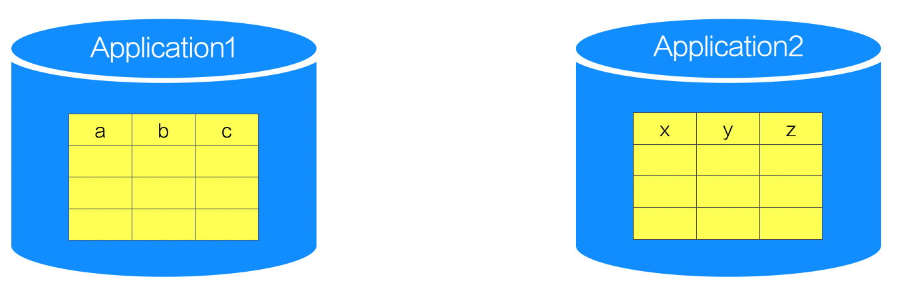
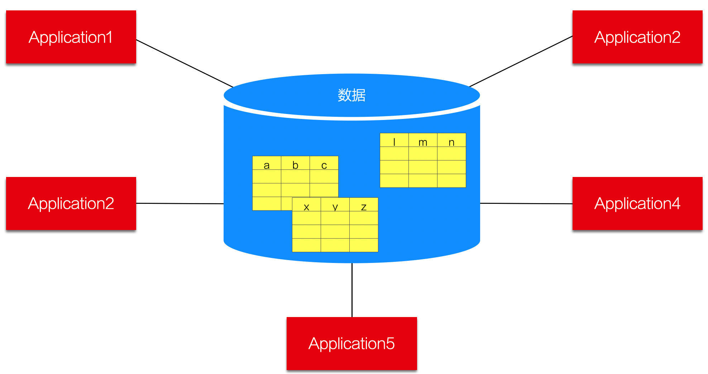
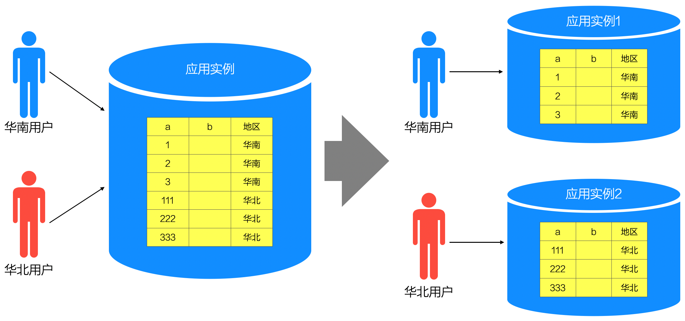
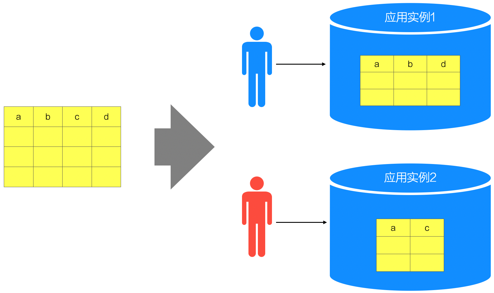
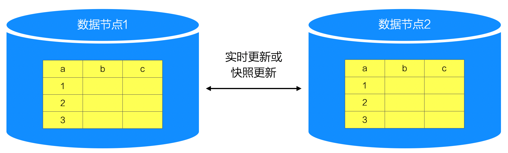
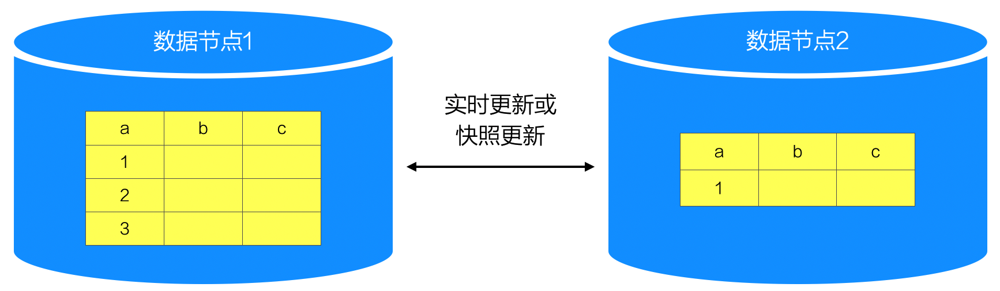
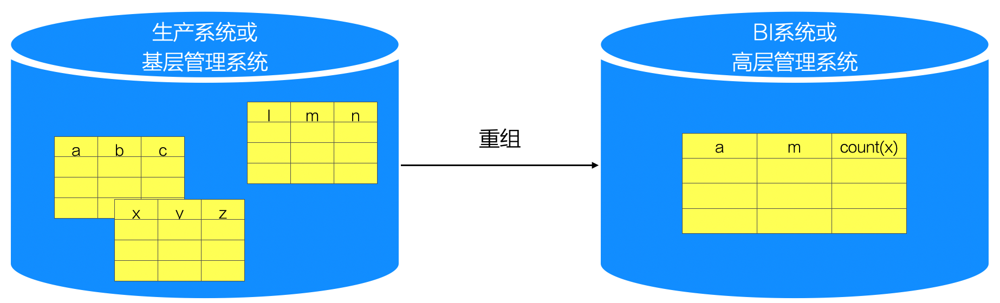

# 15.1. 数据分布的6种策略

所谓分布式系统，不单单是程序的分布，还涉及数据的分布。而且，处理数据分布内容常常更加棘手。

根据系统数据产生、使用、管理等方面的不同特点，常采用不同的数据分布式存储与处理手段。总体而言，可以归纳为以下6种策略：

- 独立`Schema`(`Separate-schema`)
- 集中(`Centralized`)
- 分区(`Partitioned`)
- 复制(`Replicated`)
- 子集(`Subset`)
- 重组(`Reorganized`)

## 15.1.1. 独立`Schema`(`Separate-schema`)

当一个大系统由相关的多个小系统组成，且不同小系统具有互不相同的数据库`Schema`定义，这种情况称为“独立`Schema`”。

独立`Schema`方式的理解要点：**“`Application`不同，`Schema`不同”**。

> 如果可以，架构师应首选此种数据分布策略，以减少系统之间无谓的相互影响，避免人为的将问题复杂化。

## 15.1.2. 集中(`Centralized`)

指一个大系统必须支持来自不同地点的访问，或者该系统由相关的多个小系统组成，而持久集中化数据进行集中化的、统一格式的存储。

该方式的特点可用 **“集中存储、分布访问”** 来概括。

## 15.1.3. 分区（`Partitioned`）

分区方式包含水平分区和垂直分区两种类型。

当系统要为“地域分布广泛的用户”提供“相同的服务”时，常常采用水平分区策略。水平分区的特点可用概括为 **“两个相同，两个不同”** -- 相同的应用程序、不同的应用部署示例(`instance`)，项目的数据模型、不同的数据值。

在实践中，水平分区的应用非常广泛，而垂直分区的作用相比之下要小很多。下图说明了垂直分区方式的特点： **不同数据解读的`Schema`会有“部分字段（`Field`）”的差异，但可以从同一套总的数据`Schema`中抽取得到**。

另外，需要特别说明的是，“分区”不是指`DBMS`支持的“分区”内部机制--后者作为一种透明的内部机制，编程开发人员感觉不到它的存在，常由`DBA`引入；而当前所讲的“分区”会影响到编程开发人员，或者应用部分工程师，一般由架构师引入。

## 15.1.4. 复制（`Replicated`）

在整个分布式系统中，数据保存多个副本，并且以某种机制（实时或快照）保持多个数据副本之间的数据一致性，这就是复制方式的数据分布策略。

## 15.1.5. 子集(`Subset`)

“子集”是“复制”的特殊方式，就是某节点因功能或非功能考虑而保存全体数据的一个相对固定的子集。

总体而言，子集方式和复制方式有着非常类似的优点：

- 通过数据“本地化”，提升了数据访问性能
- 数据的专门副本，利于有针对性的进行优化（例如：支持大量写操作的DB副本应减少`Index`，而已读为主的DB副本可设更多`Index`）
- 数据的专门副本，便于提高可管理性，加强安全控制

不过，实践中常优先考虑子集方式，因为它与复制方式相比有两大优势：

- 减少了跨机器进行数据传递的开销
- 减低了数据冗余，节省了存储成本

## 15.1.6. 重组（`Reorganized`）

业务决定功能，功能决定模型。当遇到数据模型不同时，一般能够从功能差异的角度找到答案。

重组这种数据分布策略，就是不同数据节点因要支持的功能不同，而以不同的`Schema`保存数据--但本质上这些数据是同源的。于是，重组策略需要进行数据传递，但不是数据的“原样”复制，而是以“重新组织”的格式进行传递或保存。

根据典型的应用场景，重组可以分为两种类型：

- 统计性重组
- 结构性重组

> 例如，总工时只需要掌握分公司的财务、生产等概况信息，那么就不需要把下面的数据原样复制到总公司节点，而是通过分公司应用对信息进行统计后上报，这叫“统计性重组” -- 数据的重新组织较多的借助了抽取、统计等操作，并形成了新的数据格式。

“结构性重组”的例子，最典型的就是`BI`系统。生产系统的数据被整合重组，增加各种利于查询的维度信息，并以新的数据`Schema`保存提供`BI`应用使用。
