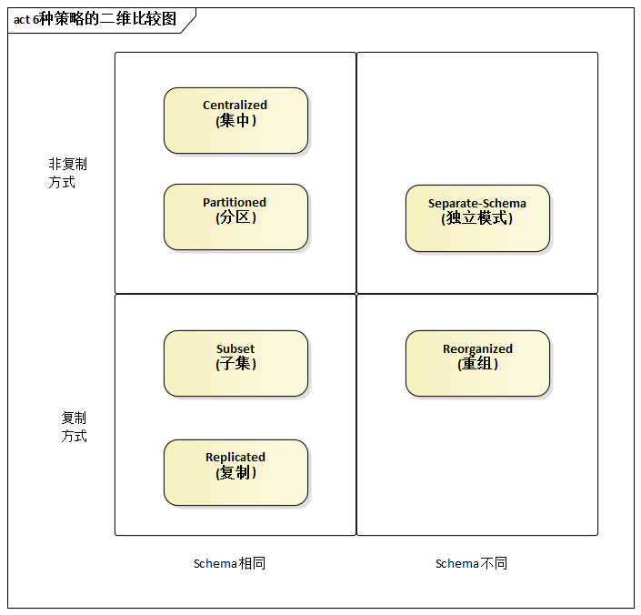
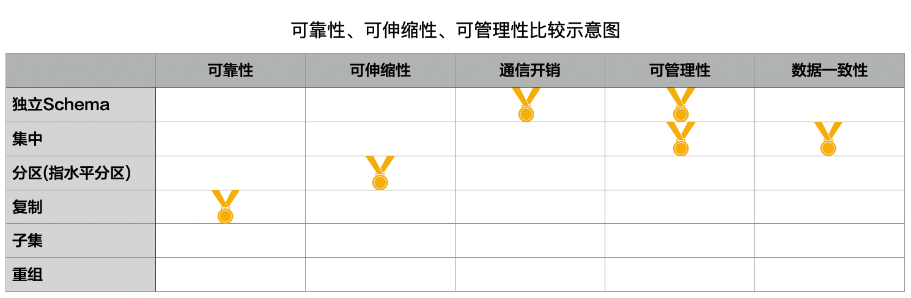

# 15.2. 数据分布策略的大局观

没有大局观，就很难理性选择数据分布的策略。因此，我们来总体对比6种数据分布策略的相同点及不同点。

## 15.2.1. 6种策略的二维比较图

一图胜千言，再次借助图来揭示“复杂背后的简单”。

根据系统的特点不同，架构师所规划的数据分布策略无非为两种方式：

- 非复制方式
- 复制方式

非复制包括3种具体策略：

- 集中
- 分区
- 独立`Schema`

复制方式也包括3种具体策略：

- 复制
- 子集
- 重组

另一个对比视角是：数据节点的`Schema`是否相同。其中，独立模式和重组两种方式，像它们的名字暗示的那样采用了不同的数据`Schema`，而集中、分区、复制、子集这4种方式统一使用了相同的数据`Schema`。

## 15.2.2. 质量属性方面的效果对比

选择数据分布策略，应特别关注它们在质量属性方面的效果。

下面来整体看看哪些策略分布在可靠性、可伸缩性、通信开销、可管理性，以及数据一致性等方面表现最佳。

**可靠性冠军：复制**。冗余不利于修改，但有利于可靠性。总体而言，复制方式的数据分布策略是可靠性的冠军。

> 其实，复制方式的可靠性和最终的“复制机制”密切相关，例如每天以快照方式来同步数据，不如实时同步的可靠性高。

**可伸缩性关键：（水平）分区**。`Scale Up`会随着服务规模的增大变得越来越昂贵，而且它是有上限的。对超大规模的系统而言，`Scale Out`是必由之路。而（水平）分区的数据分布策略非常方便支持`Scale Out`。

> 有的文献上说“复制”方式对可伸缩性的支持也非常高，这种观点只对了一半--当数据以只读式消费为主时，通过复制增加服务能力的效果才好，否则为保证数据一致性而进行的“写复制”会消耗不少资源。

**通信开销冠军：独立`Schema`**。独立`Schema`“得这个奖”是实至名归的。这很容易理解，既然独立`Schema`方式强调“将一组数据与它关心密切的功能放在一起”的高聚合原则 ，那么覆盖不同功能范围的应用之间就是松耦合的--用于传递数据的通信开销自然就小了。

**可管理性冠军：独立`Schema`**。是的，还是它！由专门的数据`Schema`分别致辞不同的应用功能，它们是相对独立的，便于进行备份、调整、优化等管理活动。

> 因此，前面提到过：[“如果可以，架构师应首选此种数据分布策略，以减少系统之间无谓的相互影响，避免人为的将问题复杂化。”](15.1.md#1511-独立schemaseparate-schema)

**可管理性冠军（并列）：集中**。为什么会存在“并列冠军”呢？因为从觉得角度评价可管理性是没有实际意义的。对采用了“数据大集中”的超大型系统而言，数据中心的管理工作依然具备挑战性，但相对于分散的存储方式而言可管理性已大有改观。可管理性应该视原始问题的复杂程度而论，是相对的，而不是绝对的。

**数据一致性冠军：集中**。所有用户面对同样的数据，免去了修改同一数据不同实例的“麻烦”，便于保证数据的一致性。
