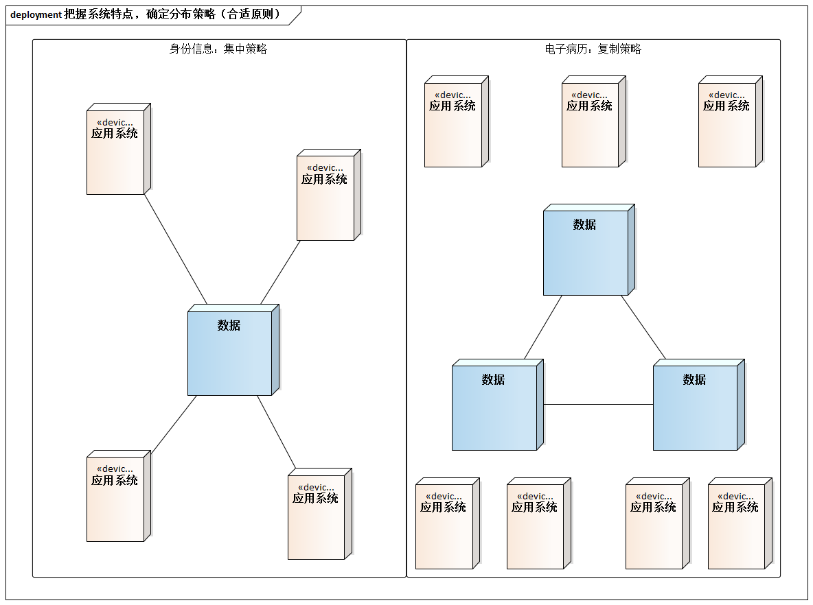
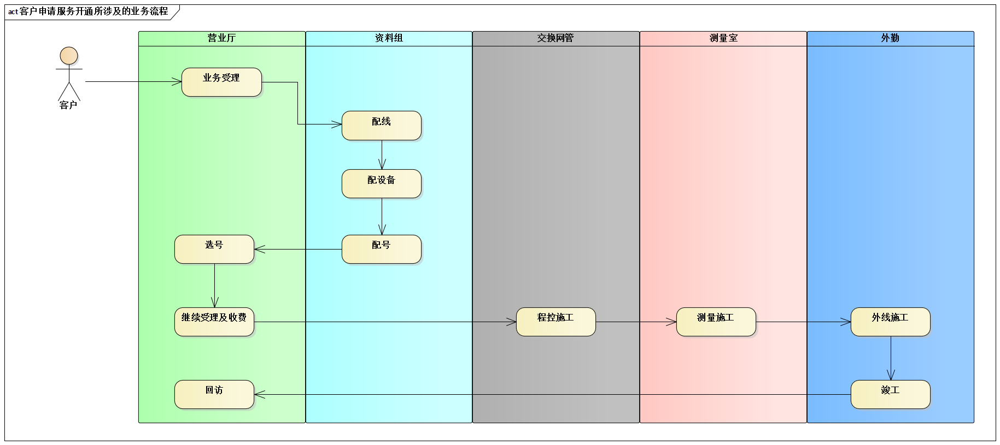
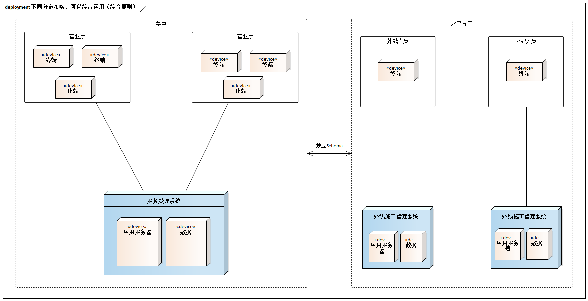
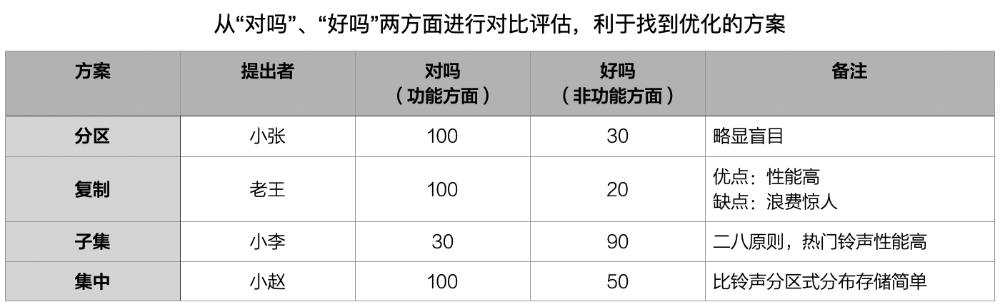
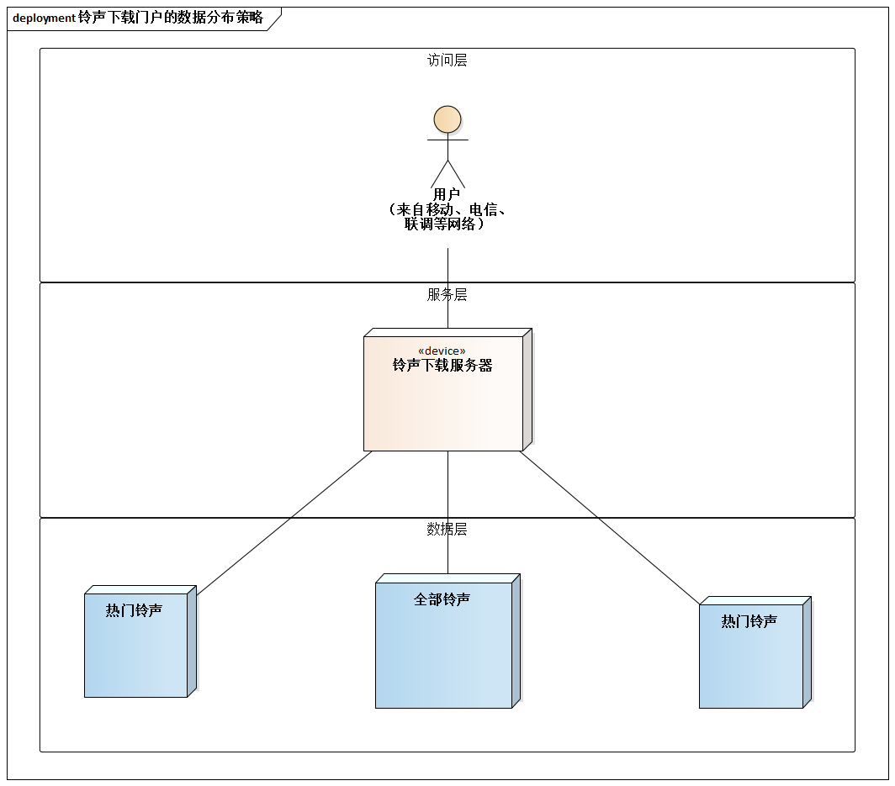

# 15.3. 数据分布策略的3条应用原则

现在，我们已经全面了解数据分布的6种策略。下面，我们借助案例介绍数据分布6大策略的3条应用原则：

- 把握系统特点，确定分布策略（合适原则）
- 不同分布策略，可以综合运用（综合原则）
- 从“对吗”、“好吗”两方面进行评估优化（优化原则）

## 15.3.1. 合适原则

> 合适的才是最好的。**“把握系统特点，确定分布策略”**，这是再明白无误的基本原则了。

医疗信息化中的电子病历可以复制，而各种系统常涉及的身份管理信息最忌讳复制。但为什么呢？

一句话，这是由系统的特点决定的。病历常作为医生诊断和治疗疾病的依据，是很有价值的资料。通过电子病历，可以将医务人员对病人患病经过和治疗所做的文字记录数字化，因此，电子冰雷的基本内容属于只读数据。为解决下列问题，电子病历可采用复制策略（例如在全网设置3个电子病历数据中心）：

- 各医院地域分布广，容易受到各种网络传输问题的干扰
- 如果不能使用专网，还要考虑“跨网络”性能差的问题
  
相反，身份管理信息不适合采用复制方式。用户信息有很强的修改特性：

- 新用户注册，意味着将有数据`Insert`操作
- 用户修改密码或其他信息时，将有`Update`操作......

这时，如果采用复制，会造成大量数据同步操作。

所以，身份管理信息要集中，电子病历可以通过复制来提升性能和可访问性。

## 15.3.2. 综合原则：服务受理系统 vs 外线施工管理系统案例

> 当系统比较复杂是，其数据产生、使用、管理等方向可能很难表现出“压倒性”的特点。此时，就需要考虑综合运用不同数据分布策略。

电信`BOSS`（业务运营支撑系统）是电信运营商的一体化支持系统，它主要由网络管理、系统管理、计费、营业、账务和客户服务等部分组成。信息资源共享是`BOSS`规划是的核心问题之一。

其中自己“服务受理系统”和“外线施工管理系统”两个系统所覆盖的业务是相对独立的，各有自己的业务数据，采用“独立`Schema`”这种数据分布策略非常合适。至于两个系统之间存在互操作的关系，通过远程服务调用等形式支持即可。

单就“S市电信服务受理系统”而言，应采用什么数据分布策略呢？考虑系统欲达成到以下目标：

- 服务受理系统，应提供跨全市各辖区的、统一的服务。这意味着，在全市任何一家营业厅，都应该可以受理任何一个小区的电话开通业务。
- 例如，一个客户在浦东区居住，但在杨浦区上班，服务受理系统必须支持该客户在杨浦区申请开通浦东区某小区的一部固定电话。
- ......

所以，数据应集中。

再考虑“外线施工管理系统”。从业务角度，外线工作还是典型的“划片分管”模式，一般由支局负责。所以，推荐外线施工管理系统“开发一套，多点部署”--数据分布策略是：**水平分区**。

总结一下，本例综合应用了3种数据分布策略

- 独立`Schema`--服务受理系统和外线施工管理系统的数据相互独立
- 数据集中--服务受理系统
- 水平分区--外线施工管理系统

## 15.3.3. 优化原则：铃声下载门户案例

> 架构设计是一个过程，合理的架构往往需求团队甚至外部的意见，因此注重优化原则很重要。一个有用的技巧是：当难以“一步到位”的做出数据分布策略的正确选择，以及还存在质疑时，应从“对吗”、“好吗”两方面进行对比、评估、优化。

关于铃声下载门户的数据存储方案，张、王、李、赵4人分别提出了4种方案：分区、复制、子集、集中，他们各不相让，几乎要吵起来了......

解决分歧、优化设计的方法是从“对吗”、“好吗”两方面进行对比评估。思维过程如下：

- 分区。在功能支持方面，没有任何问题。但是在非功能方面不好，例如没有解决性能问题。
- 复制。在功能支持方面依然没有任何问题，但是太贵，大量并不流行，甚至无人感兴趣的铃声被多次复制是无意义的。
- 子集。在非功能方面有着独有的优势，将部分流行的铃声在多点进行复制存储既促进了性能，又没有增加过多成本。但子集方式必然是一种辅助方式，因为它需要和另一种支持所有铃声保存的策略一起使用。
- 集中。用它和子集策略“搭配”，最为合适。

如此一来，总体的数据分布策略方案呈现出来：集中策略 + 子集策略。

