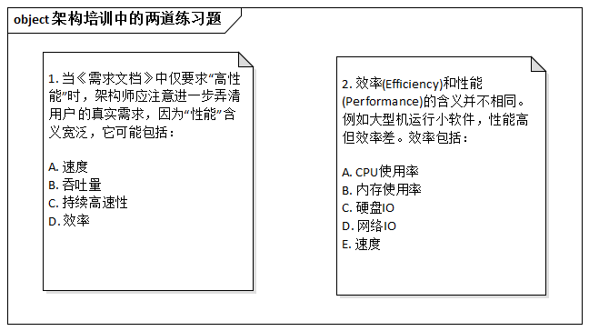
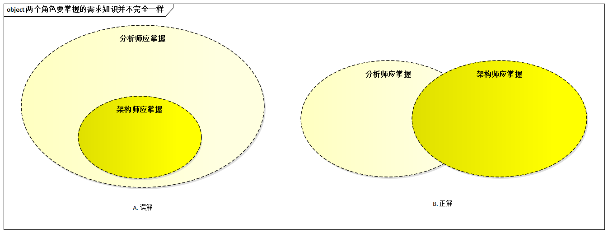

# 16.1. “拜托，架构师不是需求分析师”

## 16.1.1. 故事：小魏请教老沈

为数不少架构师都认为自己是技术人员，职责是“知道需求之后设计出架构”。比如，老沈。

老沈是资深架构师，在某公司的设计部任职。一次，他首先的小魏充满虔诚的捧着几道题目来请教他。

> 答案分别为`ABC`、`ABCD`

老沈扫了一眼，皱起了眉头，语重心长的说：“小魏，你的理想不是要当首席架构师吗，怎么研究其需求来了？小伙子不要朝三暮四哟！”

小魏的表情充满了惊讶。稍过片刻，他鼓起了十二分勇气问道：“沈老师，你的意思是架构师不必深入研究需求？”

老沈道：“拜托，懂点儿软件工程好不好，现代软件工程讲究角色分工和团队合作，架构师不是需求分析师.....”

## 16.1.2. 探究：架构师必须懂需求

其实，除非特别简单的系统，否则架构师不能“吃透”需求，必然造成最终的系统无法很好的满足需求。但业界普遍存在的现实是：许多架构师的需求功底太差，输在架构设计的“起跑线”上。当然，架构师也是一大堆“苦衷”：

> 架构师不能“吃透”需求，的确出人意料。但是既然大部分企业为架构师安排了“技术晋升路线”，既然许多架构师也把自己当“纯粹的技术人员”，既然架构师必须研究“时髦技术”否则就被程序员看不起，既然设计模式和`UML`还在“排队”，需求吗就算了，那么架构师不能“吃透”需求，也就在情理之中了。

调侃归调侃（其实不无道理），但笔者一致认为：精通需求，是对架构师最基本的要求之一，不了解需求是现在许多架构师职业发展道路上的瓶颈。

值得强调的是，需求分析师和架构师这两个角色要掌握的需求知识并不完全一样。经典的观点是认为架构师应掌握的需求知识是需求分析师的一个子集，其实不然：

- 例如，之前所讲的“[不同需求影响架构的不同原理](../ch3/3.4.md#341-不同需求影响架构的不同原理才是架构设计的基础)”，需求分析师可以不去研究。
- 再例如，[《软件工程的事实与缪误》](https://book.douban.com/subject/1723351/)中指出：“ **从需求转入设计时，因为制定方案过程的复杂性，会激增出大量的衍生需求（针对一种特定设计方案的需求）。设计需求是原始需求的50倍之多。**”

总之，架构师必须懂需求。虽然无须研究诸如需求捕获等技术，但需求类型、需求影响架构的原理、质量属性间的互相影响关系都是必须精通的。
