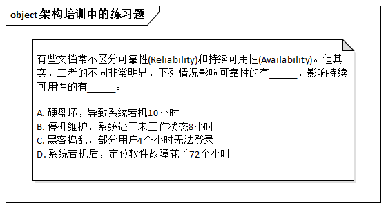

# 16.2. “敢说ISO 9126不对，真牛”

## 16.2.1. 故事：小冯与小汪的争论

小冯和小汪争得不可开交。

小冯是项目经理，他说：“不要随意扩大需求的Scope，更不要搞需求镀金，因为这些不仅意味着成本增加，还可能造成工期延误。”

“是的。可是......”小汪是架构师，他的话说了半截就被打断了。

小冯抢着说：“所以，既然客户仅要求‘高可靠性’，我们就不能把它换成‘持续可用性’，更不应该随意扩大需求的范围，把安全性、可管理都加上。别忘了，成本超了、工期误了，可都是我这个项目经理扛着。”

“像这种直接影响企业正常运营的系统，而不仅仅是‘可靠性’。”空气中已经有点火药味了，但小汪哪里肯退让，手指着培训教材上的一页继续坚持，“再请问，分布式的系统如果安全性差，可靠性怎么可能保证呢？！”

> 答案分别是：A、ABCD

“《ISO 9216》的一级质量属性里就没有‘持续可用性’，而是‘可靠性’。” 小冯说。

“国际标准就不会错吗？”小汪豪气冲天。

“敢说ISO 9126不对，真牛......”

## 16.2.2. 探究：死抱需求标准，还是务实应变

科幻故事总是轻松的，现实中的故事却或多或少让人感到压力。

作为架构师，你是否认为：架构师重视需求 = 熟悉领域知识和业务？

对，但不全面 -- 因为还要研究质量属性需求。那么，你是否又认为：懂质量需求 = 了解《ISO 9126》呢？

我们的观点：**重视标准，但在一定程度上必然要对之进行调整、扩充以适应实践要求**。例如《ISO 9126》将质量属性描述成“树”，但实际上应该是“网”，安全性影响可靠性就是一例。

