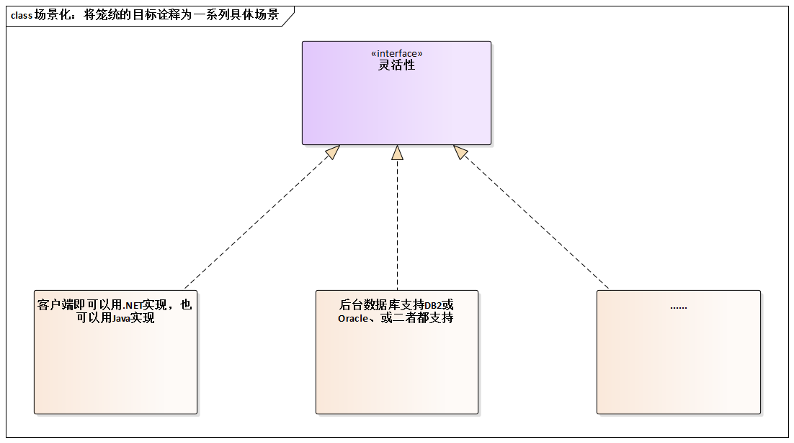

# 16.3. “我说的很清楚，架构要灵活”

## 16.3.1. 故事：狮子说清了，绵羊没搞定

拿破仑说，“一只狮子率领一群绵羊的队伍，可以打败一只绵羊带领一群狮子的部队”。听到这话，许多软件企业可能觉得很高兴--因为不少公司都大量存在“一只狮子领导一群绵羊”这样的团队。

但是有这样的一个故事，就发生在“狮子带领一群绵羊”这样的团队。

> 卢总资历深厚，水平挺高。此时公司立项研发一款新产品，卢总亲自担纲。架构设计前期，他对几个年轻的架构师一再强调，架构一定要设计的灵活。......产品很快进入开发阶段，但是几次需求变更的来临，卢总发现架构的灵活性较差。
>  
> 最后，卢总说“我的团队水平不高啊，我说的很清楚，架构要灵活，但最终还是过于僵硬。”

但真的只是团队的水平不高吗？

## 16.3.2. 探究：交流质量要求，如何做到“说的明白、听得清楚”

为什么说，卢总的分析只对了一半呢？因为卢总要求的“灵活性”这个目标过于笼统，既然年轻的架构师水平偏弱，不能讲架构灵活的要求“落地”也就不奇怪了。

那么交流质量要求，如何做到“说的清楚、听得明白”呢？使用 **“场景化”**描述。

例如，通过分析将“灵活性”更明确的诠释为“客户端既可以采用.NET实现 又可以用Java实现”等一系列具体场景，对“狮子领导的绵羊团队”有效开展架构设计工作是大有裨益的。

