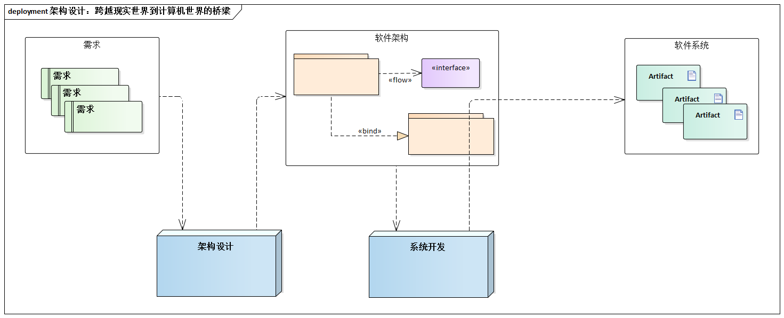

# 第16章 故事：困扰已久的非功能问题

> 非功能需求的满足程度对软件项目的成功非常关键......非功能需求分为质量属性和约束两大类。质量属性是软件系统的整体质量品质--所谓整体品质，就是往往和大多数功能都有关，而不是仅仅表现在某个功能“内部”。志宇约束性需求，它们是架构设计中必须遵循的限制，并有可能“衍生”出质量属性需求和功能需求。     -- 温昱，[《软件架构设计》](https://book.douban.com/subject/2076710/)
>  
> 那么非功能需求方面常见的问题是什么呢？......很多《需求规格说明书》中，会通过一个名为“设计原则”的小节来说明非功能需求，列出诸如高可靠性、高可用性、高扩展性等要求。但是很多开发人员根本不去看它，因为这样的定性描述是没有判断标准的，因此这种信息传递是无效的。     -- 徐峰， [《软件需求最佳实践》](https://book.douban.com/subject/3265691/)

软件架构设计为什么这么难？因为架构设计并不是简单的处理“纯粹的技术问题”，而是要面对“技术与业务的关系问题”。最终，要求架构师不仅懂业务，而且能理顺复杂的技术和业务之间的关系。

从面向业务的需求，到最终的面向技术的软件系统，要跨很大的鸿沟。软件架构设计就是要完成从面向业务到面向技术的转换，在鸿沟上架起一座桥梁。软件架构师根据各种需求进行架构设计，最终的软件架构包含了结构、协作、技术等方面的重要决策，为系统化的开发活动建立了基础。

接下来，请大家思考如下几个问题：

- 架构师是否应该懂需求？
- 功能需求、非功能需求都要懂吗？
- 生搬硬套需求标准是“懂需求”的应有表现吗？
- 应对如何传达非功能目标的具体需求？
