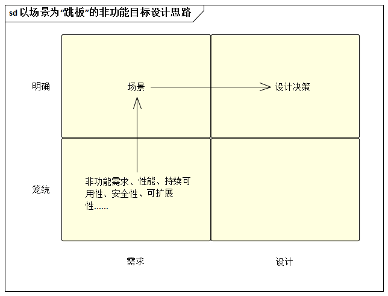

# 17.1. 非功能目标的设计环节简介

在我们当中，有不少人一厢情愿的任务：只要所开发的系统完成了用户期待的功能，项目就算成功了，但这不并不符合实际，忽视包括质量属性需求在内的非功能需求是很要命的。

为什么不少软件产品推出不久就要重新设计（美其名曰“架构重构”）？往往不是因为系统“不能用”，而是由于系统架构“太拙劣”--从难以维护、运行速度太慢 、稳定性差，甚至宕机频繁，到无法进行功能扩展、易遭受安全攻击等，不一而足。由此看来，软件的质量属性需求是不容忽视的，否则在大量的成本投入之后，很可能落得“失败”或“赔钱”的结果。

然而，软件的质量属性需求很“飘”，常常令架构师难以把握。如果缺乏足够的方法指导，即使勉强制定了设计决策也会觉得缺乏信心。

所以，解决问题的要害在于：如何使很“飘”的非功能目标“明确定义下来”。分析如下：

- 需求决定架构，架构设计的成果已属于解决方案的范畴
- 架构设计的过程是从“需求域”向“设计域”过度的过程
- 目标很飘，就意味着根据诸如“高性能”等非功能需求直接作出“设计决策”跨度过大了
- 需要一种“过度技术”来承上启下，它能笼统的非功能目标明确化，它能帮助架构师做出更有针对性的设计决策

**它就是场景技术**。

一句话，非功能目标的设计是以场景技术为核心手段、以目标-场景-决策表为思维工具，致力于支撑非功能目标的理性设计过程。
