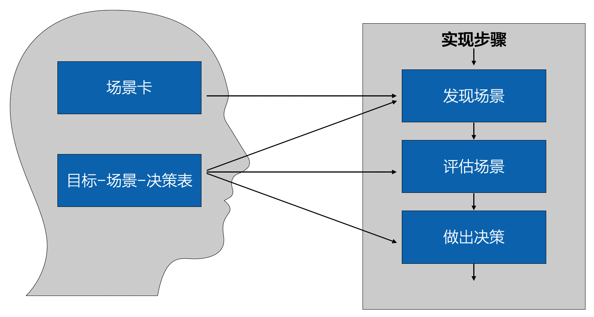

# 17.4. 实践要领

## 17.4.1. 场景思维

非功能需求支持是否到位，关键是靠场景思维的应用。归纳了场景思维在非功能目标设计中的重要性。

## 17.4.2. 纵穿环节

有著名厂商任务，架构设计的“第几步”应该是非功能考虑，这种观点是危险的。

非功能需求不可能是“速决战”，它必然是“持久战”，连编码都会影响到性能动能非功能属性，更何况概念架构设计和细化架构设计呢？所以架构师必须注意，非功能目标的考虑是纵穿架构师设计始终的环节。

