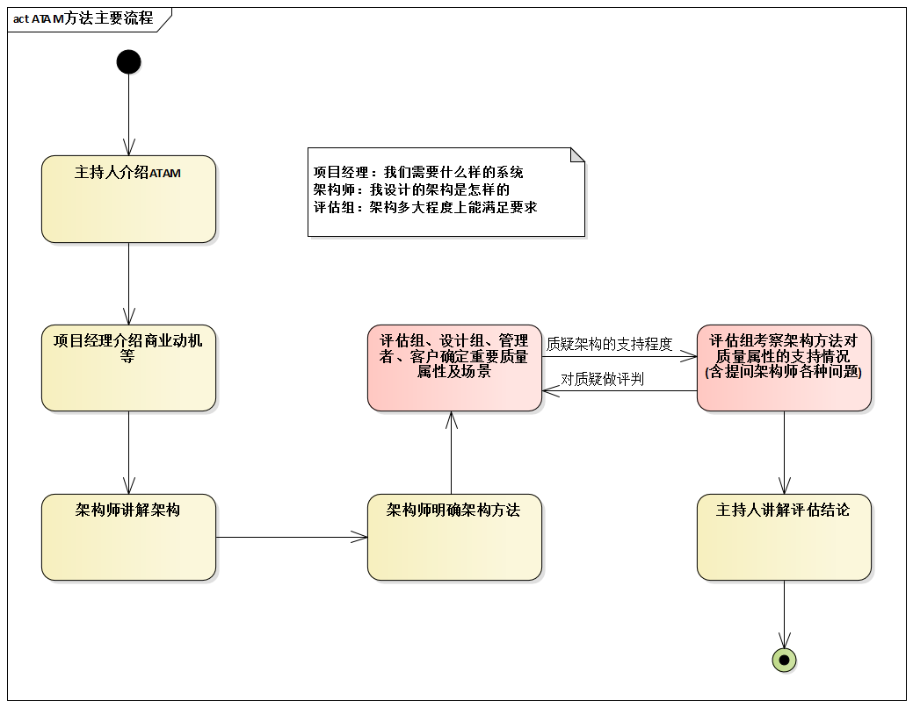
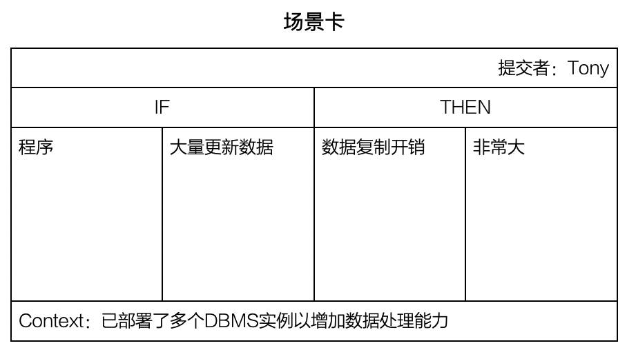

# 18.1. 场景技术

## 18.1.1. 场景技术的历史

我们来浓缩描述一下场景技术的历史。

- **诞生**
  - 二战后，美国空军场景技术想象对手会采取哪些措施，然后准备相应的战略。
- **转变**
  - 196x年，兰德公司和曾供职于美国空军的赫尔曼.卡恩，将这种军事规划方法提炼成一种商业预测工具。
- **成名**
  - 壳牌公司运用它成功预测了1973年的石油危机，而名声鹊起。（《福布斯》杂志1970年还称壳牌公司为“丑美”，但后来......）。
- **应用**
  - 据贝恩公司2004年对960家跨国公司经理的调查表明，场景技术应用超过50%。

于是，许多同行困惑的“场景技术书籍难找”的问题也有了答案--由于场景技术并不产生于计算机行业，而且如今商业领域对场景技术的重视大大超出了软件行业，所以商业书店里“场景规划”方面的数据是我们有益参考。

## 18.1.2. 软件行业汇总场景技术的应用现状与展望

在软件行业，场景技术有着广泛的应用，并且未来场景技术会更加重要。

先说用例。很多软件从业者知道场景，都是从用例开始的。值得说明的有几点：

- 有书上说，场景就是用例，此观点错误。
- 用例是能给外部角色带来可见价值的交互序列，1个用例 = N个场景。
- 用例是功能需求实际上的标准，它并不能全面涵盖系统的非功能需求。
- 场景既可以是功能场景，也可以是非功能场景。

再考虑基于场景的架构评估方法。例如`ATAM`方法，其主要流程的示意图如下。在此类方法中，场景技术作为一种质疑技术发挥作用--架构对目标的支持怎么样啊？

场景的“应用案例还有很多”，比如：

- 测试用例
- 业务需求
- ......

至此，可以得到一个重要的总体结论：

> 场景是基础技术，用例是应用技术。
>  
> 为了以结构化的方式描述“能给外部角色带来可见的交互序列”，将成功场景和各种意外场景“打包”形成了用例。
>  
> 于是不难理解，用于测试设计的“测试用例”，用于评审的“基于场景的架构评估方法”、用于支持非功能目标设计方法论的“目标-场景-决策表”......都是场景技术的具体应用。

为此，软件行业未来在需求领域必然会不断发展：

- 通过场景化，增强非功能需求的可验证性（那时候，业界公认的软件过程中描述需求分析师的工作是，会出现类似“目标-场景-决策报表”的很多工作......）
- 场景技术和“定量的需求”日渐结合，发挥两个技术各种的优点--本质上，场景和定量是正交的、相互独立的两种技术，它们的“珠联璧合”是必然趋势。

## 18.1.3. 场景的5要素与场景卡

建议场景应该包含5要素：

- **影响来源**：来自系统外部或系统内部的触发因素。
- **如何影响**：影响来源施加了什么影响。
- **受影响对象**：默认为“本系统”。
- **问题或价值**：受影响对象因此出现什么问题，或者需要体现什么价值。
- **所处环境**：此时，所处的环境或上下文为何（此要素为可选要素）。

了解了场景的5要素，场景卡就非常容易理解了；一张5要素为核心内容的需求采集卡。当需求分析师并未通过场景技术明确定义非功能需求，当架构师也深感难以到位的发现有价值的场景时，架构师可以借助场景卡来激活团队的力量--让大家提交场景卡。

