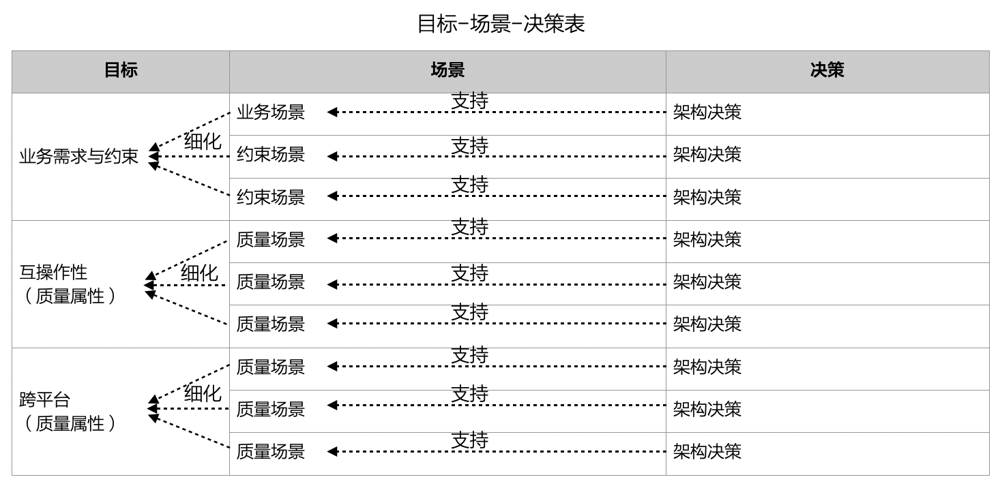
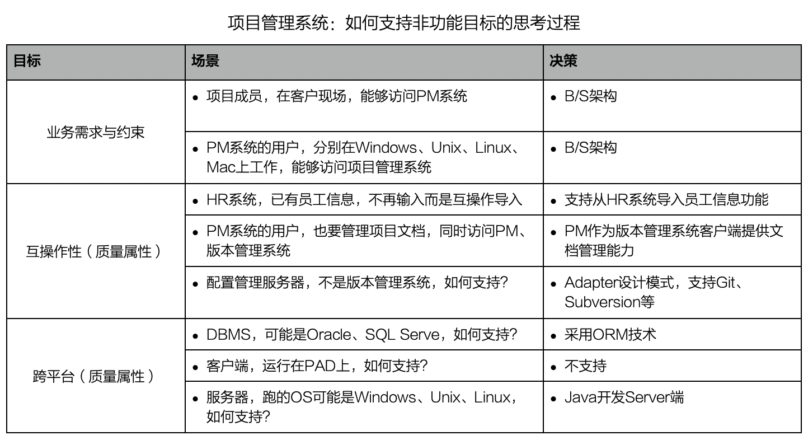

# 18.2. “目标-场景-决策”表

**软件界泰斗Edsger Dijkstra指出，“我们所使用的工具深刻的影响我们的思考习惯，从而也影响了我们的思考能力”。**

目标-场景-决策表将思考过程形象化、可视化了，能够非常务实有效的处境架构设计思维。

实践中，架构师必须对场景进行评估，以决定是否支持这个场景。架构师经常要考虑的场景评估因素包括：

- 价值大小
- 代价大小
- 开发难度高低
- 技术趋势
- 出现几率

最后，必须提醒的是“不支持某场景”恰恰是架构师的一种重要决策--如果每个场景都给予支持，理性设计就无从谈起，多度设计都在所难免了。如下面的目标-场景-决策表中，就明确决定了：不支持`PAD`作为项目管理系统的客户端。

