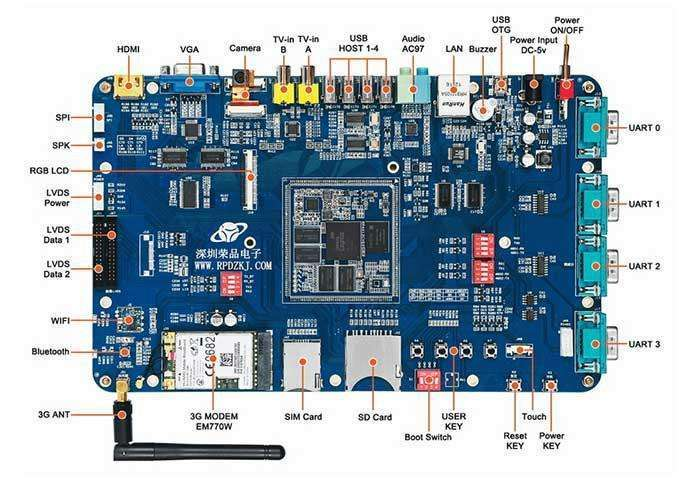

# 2.2. “必须把虚拟缓存管理裁剪掉”

## 2.2.1 故事：嵌入式OS的裁剪

系统软件研究室的新任务启动了，对`VxWorks`操作系统进行裁剪，并开发专用硬件驱动程序。

团队成员都挺提劲的......

这天，总工程师要听听进展情况，亲临研究室。当小吴开始汇报对`OS`虚拟内存管理的“深入理解”时，总工程师的标签有些不大自然。

不久，他打断了小吴，说了这么一句话：“整个系统才有多大内存可用？我们的OS占的内存越多，应用软件可用的内存就越少。所以，必须把`OS`的虚拟内存管理裁剪掉，直接访问物理内存。”

举“组”震惊，却又深表折服。

## 2.2.2. 探究：又是约束

架构设计不仅仅要考虑支持功能、满足质量要求，还要重视各种约束性需求。

这个故事中的“内存有限”，就是嵌入式系统设计中常见的约束。

**关注约束，要趁早。**

