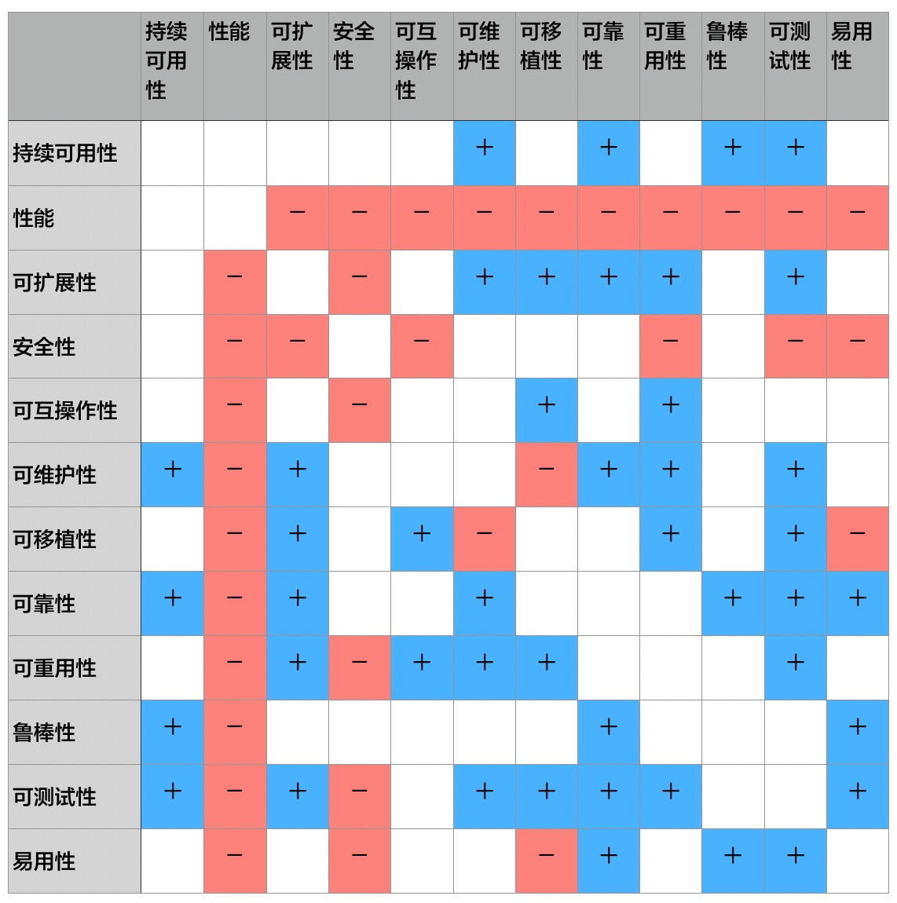

# 2.3. “都是C++的错，换C重写”

## 2.3.1. 故事：放弃C++，用C重写计费系统

老郑曾经挺开心。

老郑在某电信软件企业，负责计费系统的架构。最初，他非常重视系统的性能问题，因为他认为：电信领域用户群光，数据量大，所以性能的压力必然会很大。

后来，他们用`C++`开发的计费系统上线了，用户反映彼此，性能挺高的。

但现在，老郑很懊恼。

原因何在？原来，计费系统一直面临着功能不断改进的压力，整个团队不断致力于提高系统的可扩展性--以便于增加和修改功能。但始料未及的是，可扩展性上去了，性能下来了！

看着程序里导出都是接口和无处不在的间接、继承，老郑产生了一个危险的念头，都是`C++`的错，应该用`C`重写计费系统！

## 2.3.2. 探究：相互矛盾的质量属性

### 互动问题：

问题：某公司以`C`语言替代`C++`，重写电信计费系统，因为开发人员引入了太多抽象，导致“可扩展性上去了，性能下来了”。此法可行否？

- A. 能解决问题
- B. 于事无补，因为`C`也会过度设计
- C. 问题出在`Pre-Architecture`
- D. 架构设计中必须分析质量之间的互相影响，制定权衡取舍策略

> 正确答案：B、C、D

**高性能和灵活扩展这两个质量属性之间存在矛盾关系，这就是要害。**

上面这张图揭示了更多质量属性之间的“促进”或“矛盾”关系。

我们可以看到：性能和安全性，与其他许多质量属性都是矛盾的。

正确的做法是：

1. 在架构设计之初，就全盘考虑架构设计要重点关注关键质量目标--以老郑为例，性能和可扩展性（当然还会有其他质量属性）都重要。
2. 在第一时间就判断这些“关键质量”之间有没有冲突关系，并制定权衡取舍策略--仍以老郑为例，性能和可扩展性矛盾，性能的优先级更高，谨慎评审提高可扩展性的设计对性能的影响后决定是否采用。
