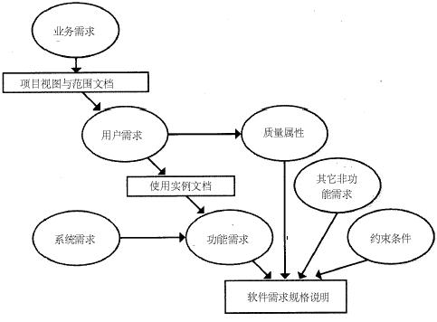
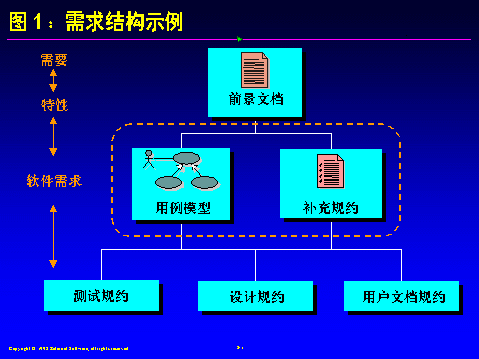
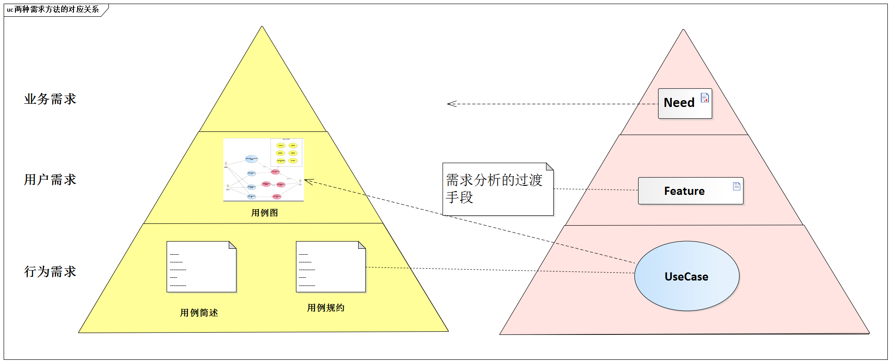

# 3.3. 业界现状

既然`Pre-architecture`阶段如此重要，业界现状如何呢？

很遗憾，业界对`Pre-architecture`阶段普遍不够重视。相反“架构设计唯靠经验”、“架构设计目标不变”等错误观点比较常见。

我们头脑中的“位置”是有限的，如果错误的认知占据了主导位置会导致实践偏差，必须防止。

## 3.3.1. “唯经验论”

和“架构师不必懂需求”的误解相比，“唯经验论”已经有所进步了。这种观点认为，架构师纯粹凭借经验，发现需求的遗漏、权衡需求之间的矛盾、确定架构设计的重点目标。

必须承认，经验对架构设计很重要，但“唯经验论”依然是错误的。

因此，世界上并不存在两个完全相同的想，不同的项目在功能需求、质量属性，以及约束这3方面必然存在差异。

于是，架构师不仅应具有一定经验，还必须掌握超越具体项目的、更具有意义的方法和技能。

## 3.3.2. “目标不变论”

架构设计的目标不是一成不变的，基于此认识，`ADMEMS`方法在`Pre-architecture`阶段的“确定关键质量”环境提供了专门的指导。

“架构设计目标不变论”是错误的。

例如，有人认为：

> 我们必须牢记架构设计的总体目标，可概况为以下几点。
> 1. 最大化的重用......
> 2. 尽可能的简单明了......
> 3. 最灵活的扩展性......

首先，若架构设计的目标真能概括为不变的“几点”，那可算是架构师的福音了。

但实际上，架构设计的目标必然会随着领域不同（如航天航空、电信、电子政务）、规模不同（如项目、产品、平台）、条件不同（如工期、预算、标准）而变化。

其次，为重用、简单、可扩展都加了“最”（而不是权衡折中），不符合架构设计的现实，更何况“灵活”和“简单”之间常常存在矛盾。

## 3.3.3. 需求分类法的现状

软件行业处在不断发展变化中，软件需求分类法就是一例。当前，业界影响最为广泛的需求分类法将需求分为3个层次。

> 图片来源：《软件需求》

这种需求分类法的最大好处是明确了不同层次之间的跟踪关系--业务需求->用户需求->功能需求。从而建立了需求分析的主要脉络，非常有意义。

但是对以架构师来说，这种需求分类法中的“约束条件”太过狭义了，没有反应“**架构设计必须面对来自业务环节、使用环境、构建环境、技术环境的4大类约束**”这一现实情况。

再例如，`RUP`提倡的需求分类法也包含3个层次：需要（`Need`）、特性（`Feature`）、软件需求。

这类分类法也是主要为需求分析工作服务的，它除了非常倚重用例技术之外，还有一个明显特点--`Feature`。

以特性（`Feature`）技术作为从需要（`Need`）想软件需求过过渡的跳板，是解决需求分析中“从需求想软件需求跨度过大”问题不错的选择，这一点已经受到很多实践者的认同。

但是，这个方法中用例的地位过分突出了，又由于“用例涉及但不涵盖非功能需求”的性质，不少实践者遗漏非功能需求的常见问题也就不难解释了。

最后，顺便指明上述两种“需求层次论”的对应关系，此问题令不少实践者困惑。

## 3.3.4. 需求决定架构的原理还需继续归纳

不懂不同需求分布如何影响架构，就难以进行理性的架构设计，难免“拍脑袋”决策，关于需求决定架构原理，业界当前的认知状况如下：

- 功能影响架构原理，研究的最透彻
- 质量影响架构的原理，也有基本共识
- 约束影响架构的原理在很大成图上被忽视了。