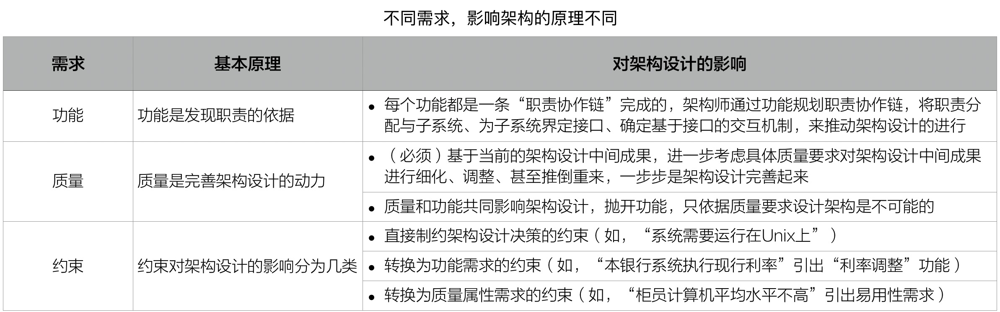
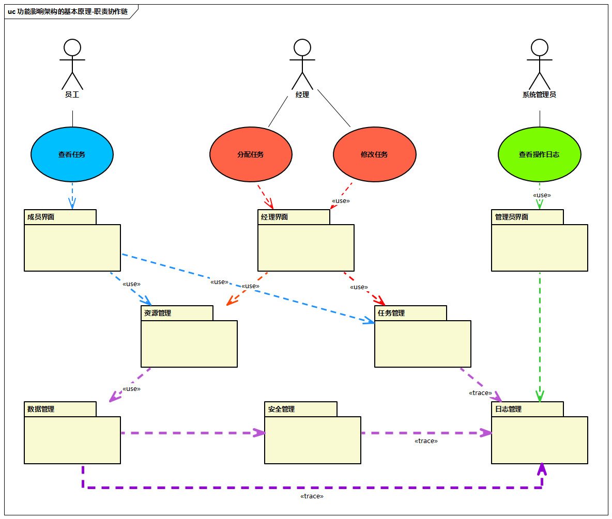
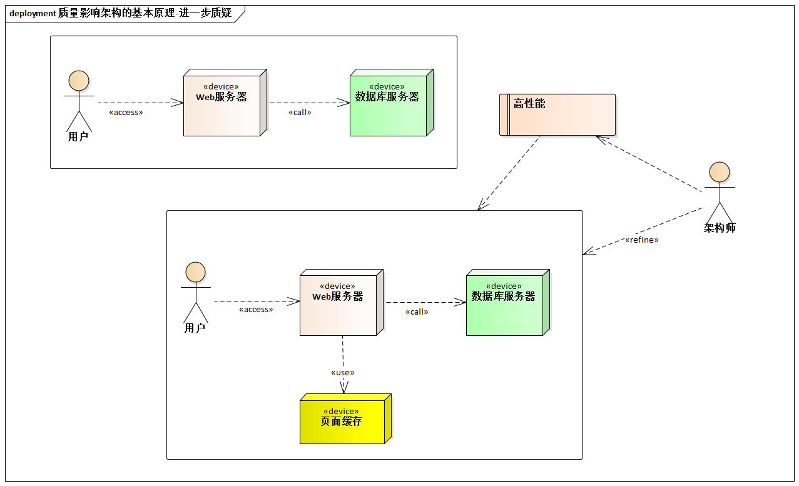
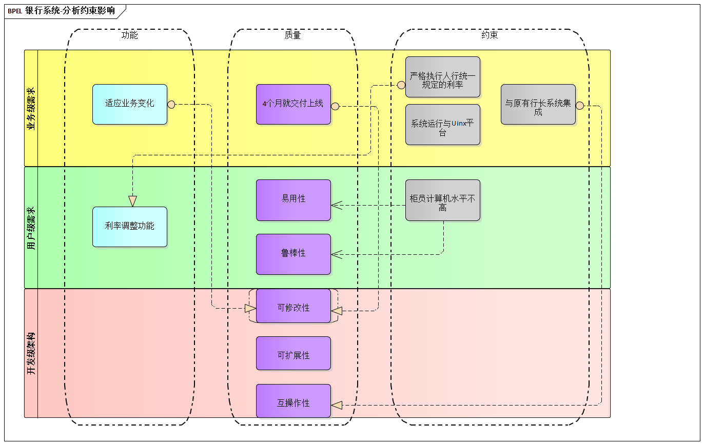
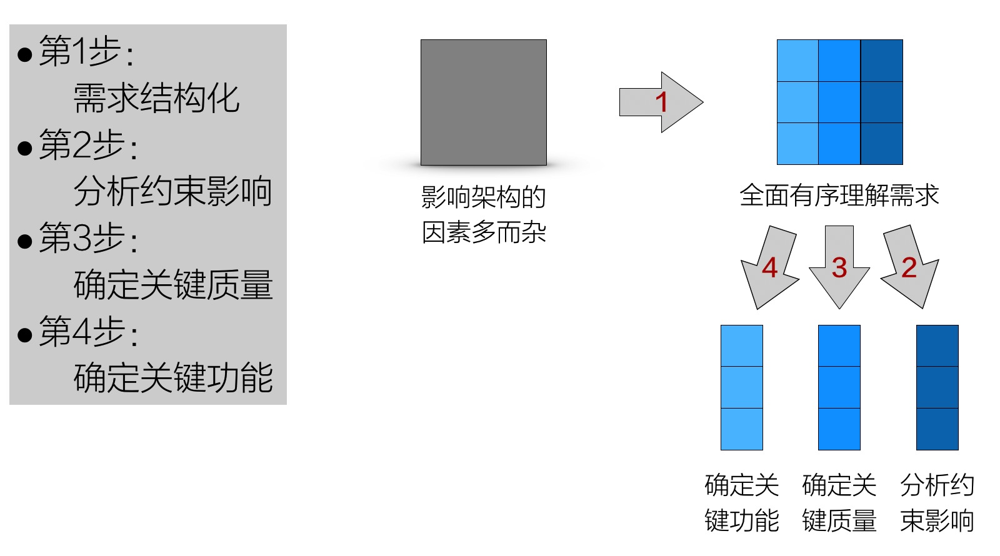

# 3.4. 实践要领

**问题是方法之父。不怕有问题，就怕发现不了问题。**

## 3.4.1. 不同需求影响架构的不同原理，才是架构设计的基础

当前业界，大多数架构师都认同“需求决定架构”，但对需求“如何决定”架构还知之不深。

请各位架构师问自己这样一个问题：**需求决定架构，真的是这么简单吗？**

> 如果真的这么简单，为何“我”常常对需求已“心知肚明”，却依然对架构设计“一筹莫展”呢？

答案是：“需求决定架构”是对的，但**不同需求影响架构的不同原理，才是架构设计思维的基础**。

> “人类知识和人力权利归于以：因为凡是不知原因时，即不能产生结果。......而凡是在思辨中为原因者在动作中则为法则。” -- 哲学家培根

任何一项功能都是有一条特定的“职责协作链”完成的。

作为完整的软件系统，它在支持每一个具体功能时，都必然涉及软件不同“部分”之间的相互配置。系统控制权在这些不同的“部分”之间的来回传递，形成一条“职责协作链”，可以完成非常复杂的功能。

而质量，是完善架构设计的驱动力，**不考虑质量的系统是无法走出实验室的**。

基于中间设计成果进一步质疑是其中基本的“思维方式”

> 例如：如果只考虑功能，“页面缓存”的设计就永远不会被引入，它是质疑性能、调整设计的结果。

至于约束，则有不同的具体方式影响着架构设计

- **直接制约设计决策的约束**。例如，“系统运行与Unix平台之上”作为一条约束，**架构师直接遵守即可**。
- **转化为功能需求的约束**。例如，“本银行系统必须严格执行人民银行统一规定的利率”是一条约束，但分析后发现，正是它引出了一条功能需求：即**必须提供调整利率设置的实用功能**。
- **转化为质量属性需求的约束**。例如，有经验的系统分析员发现了一条重要约束：“任职于各储蓄所和分理处的柜员，计算机水平普遍不高”。由此，**未来的系统必须具有很高的易用性（否则不会用）和鲁棒性（否则可能会把系统搞瘫痪了）就非常必要了**。

## 3.4.2. 二维需求观

**观念是行为的向导，有什么样的观念存在，就有怎样的行为方式产生--突破拙劣观念的意义就在于此。**

作为架构师，如果在你的观念中，需求是一个散乱无序的“列表”，面对复杂系统时就会非常被动。需求列表这种贴着“简单”这个“招人待见”标签的方法以及影响、并正在继续影响着许多一线架构师。

## 3.4.3. 关键需求决定架构，其他需求验证架构

有经验的架构师，懂得在实践中运用“**关键需求决定架构**”的理念。

- **功能需求做减法**。在所有功能中挑选一个“关键功能子集”，作为“架构设计驱动力”的第一部分。
- **质量需求做减法**。根据系统所在领域特点及系统规模等因素，确定架构设计重点支持哪些质量属性，作为“架构设计驱动力”的第二部分。
- **约束需求做加法**。充分考虑需求方及业务环境因素、用户群及使用环境因素、开发方及构建环境因素、业界当前技术环境因素等“**4类约束**”，将之作为“架构设计驱动力”的第三部分。

## 3.4.4. Pre-architecture阶段的4个步骤

`Pre-architecture`阶段对整个架构设计工作非常重要，它担负着建立需求大局观、把握需求特点、确定架构设计驱动力的责任。

首先，将多而杂的架构影响因素梳理脉络、建立全面有序的理解。

然后，分别针对约束、质量、功能这3类需求开展相应工作。

1. 分析约束影响，识别隐含需求
2. 确定关键质量，明确关键质量之间的优先级
3. 确定关键功能，便于更有针对性的分配有限的架构设计时间

