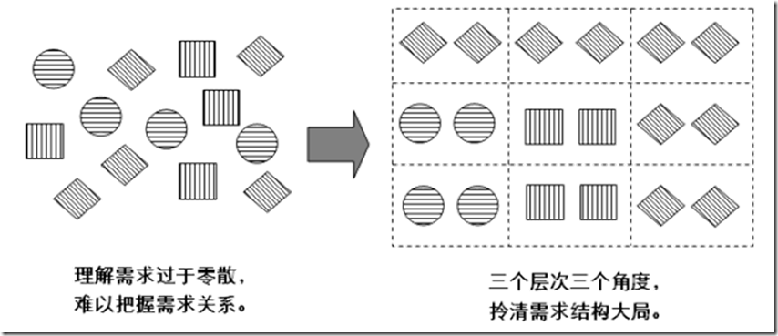

# 4.1. 为什么必须进行需求结构化

**需求是有结构的。**

许多实践者不懂这一点，更不知道如何“主动运用”这一点。在他们眼中，架构设计要应对的需求往往是又多又乱的，而且遗漏了关键需求也发现不了......

相反，有经验的架构师懂得运用需求的结构。他们能够将复杂的需求集合梳理得紧紧有条，为进一步分析不同需求之间的联系（作为权衡折中的依据）、识别遗漏的重要需求打下坚实基础。

`Pre-architecture`阶段要求进行需求结构化，这代表着`ADMEMS`方法更贴近一线架构设计的真实实践。

通过形象的“物体归类”的隐喻可以嘉盛对需求结构化工作的理解。

