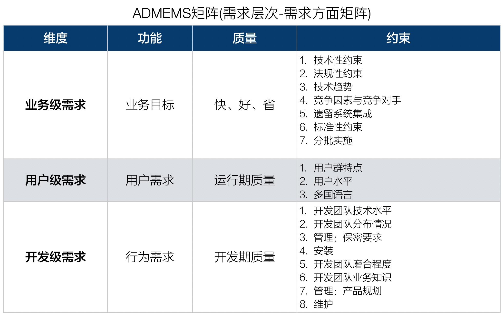

# 4.2. 用ADMEMS矩阵方法进行需求结构化

那么，需求结构化要怎么做呢？

1. 决不能认为《软件需求规格说明书》就是需求的全部
2. 运用`ADMEMS`矩阵方法

## 4.2.1. 范围：超越《软件需求规格说明书》

首先，需求文档常常不够全面，所有有经验的架构师都重视需求文档，但不应该“唯需求文档论”。

其次，需求变更经常发生，“依赖且仅依赖需求文档”不够聪明，使架构设计工作非常被动。

既然架构师必须“对需求进行理性的、有针对性的权衡、取舍、补充”，那么“作为架构设计驱动力的需求因素”和“供甲方确认的《软件需求规格说明书》”之间就必然不能“划等号”。

所以，**架构师要通过需求结构化真正全面的“鸟瞰”需求大局**，就必须超越《软件需求规格说明书》

还有一个重大意义在于，只有摆脱了对《软件需求规格说明书》的“呆板依赖”，才有可能尽早开始架构设计（参见[3.2.3. 尽早开始架构设计](/ch3/3.2.md#323-尽早开始架构设计)）。

## 4.2.2. 工具：ADMEMS矩阵

**矩阵，是很多著名方法的核心。**

> 例如：制定公司层战略的方法之一是“波士顿矩阵”，“波士顿矩阵”又称为“市场增长率-相对市场份额矩阵”。

“ADMEMS矩阵”，也称为“需求层次-需求方面矩阵”。

### 需求层次分析和解释

- **业务级需求**：包含客户或出资者要达到的业务目标、预期投资、工期要求、以及要符合哪些标准、对哪些遗留系统进行整合等约束条件
- **用户级需求**：用户使用系统来辅助完成哪些工作？对质量有什么要求？用户群及所处的使用环境有什么特殊要求?
- **开发级需求**：开发人员需要实现什么？开发期间、维护期间有什么质量考虑？开发团队的哪些情况会反过来影响架构？

需求的三个层次，是站在“**不同层次的涉众提出需求所站的立场不同的角度**”，将需求划分为三种类型。

另外，需求还需要从不同的方面进行考虑。

> 例如，一个网上书店系统的功能需求可能包括“浏览书目”、“下订单”、“跟踪订单状态”、“为书籍打分”等，质量属性要求包括“互操作性”和“安全性”等，而“必须运行在Linux平台之上”属于约束性需求。

**忽视质量属性和约束性需求，常常导致架构师设计最终失败**。

从“需求定义了直接目标还是间接限制”的角度，把需求划分为3中类型，这就是需求的3个方面：

- 功能需求：更多体现**各级直接目标要求**
- 质量属性：**运行期质量 + 开发期质量**
- 约束需求：**业务环境因素 + 使用环境因素 + 构建环境因素 + 技术环境因素**

一句话，**需求是有结构的**。而且，需求的结构绝不是“List”，而应该是“**二维数组**”。

