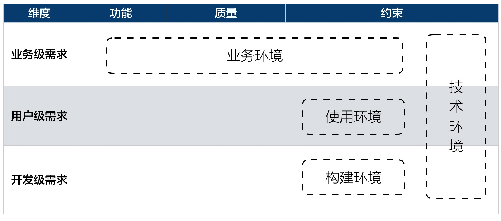

# 4.4. ADMEMS方法的“约束分类理论”

分析约束影响应该怎么做？

我们先看看这些约束来自“哪些涉众”？

4类约束在`ADMEMS`矩阵中的位置清楚表明：业务环节、使用环境、构建环境应分别考虑客户、用户、开发者3类涉众，而技术环境与上述3类涉众都有关系

> ADMEMS矩阵参见[4.2.2 用ADMEMS矩阵方法进行需求结构化-工具：ADMEMS矩阵](/ch4/4.2.md#422-工具：admems矩阵)

只有把握住涉众来源，才便于发现并归纳涵盖广泛的约束因素，也有利于针对性地进行交流，还可跟踪对约束的支持是否令涉众满意。

## 第一，来自客户或出资方的约束性需求

- 架构师必须充分考虑客户对上线时间的要求、预算限制，以及集成需要等非功能需求。
- 客户所处的业务领域是什么？有什么业务规划和业务限制。
- 是否需要关注相应的法律法规，专利限制？
- ......

## 第二，来做用户的约束性需求

- 软件将提供给何阶层用户？
- 用户的年龄段？使用偏好？
- 用户是否遍布多个国家？
- 使用期间的环境有电磁干扰、车船移动等因素吗？
- ......

## 第三，来自开发者和升级维护人员的约束性需求

- 如果开发团队的技术水平有限（有些软件企业甚至希望通过招聘便宜的程序员来降低成本）、磨合程度不高、分布在不同的陈那个是，会又和影响？
- 开发管理方面、源代码保密方面，是否需要涉及？
- ......

## 第四，也不能遗忘，业界当前技术环境本身也是约束性需求

- 技术平台、中间件、编程语言等的流行性认同度、优缺点等。
- 技术发展的趋势如何？
- ......

**架构师应当直接或（通过需求分析员）间接的了解和掌握上述需求和约束，并深刻理解它们对架构的影响，只有这样才能设计出合适的软件架构。**

> 例如，如果客户是一家小型超市，软件和硬件采购的预算内都是很有限，那么你就不宜采用依赖太多昂贵中间件的软件架构设计方案。
