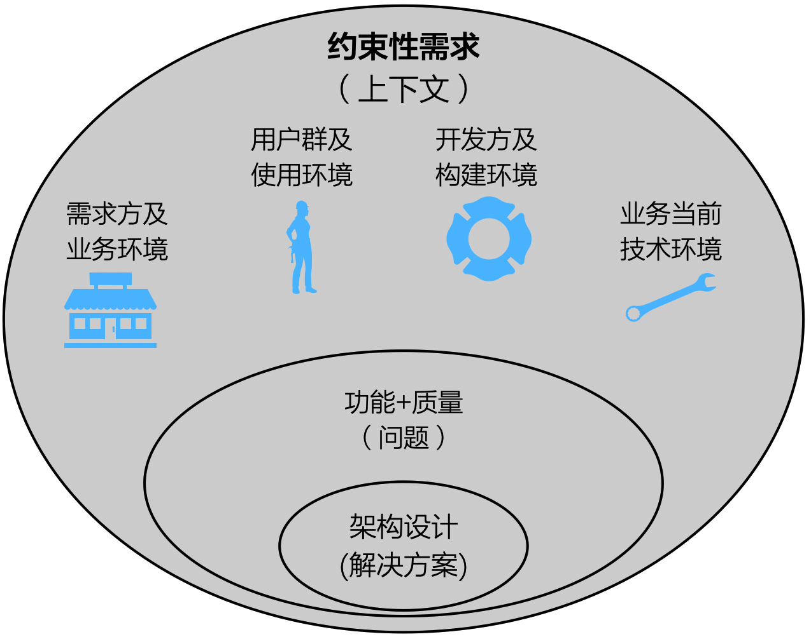
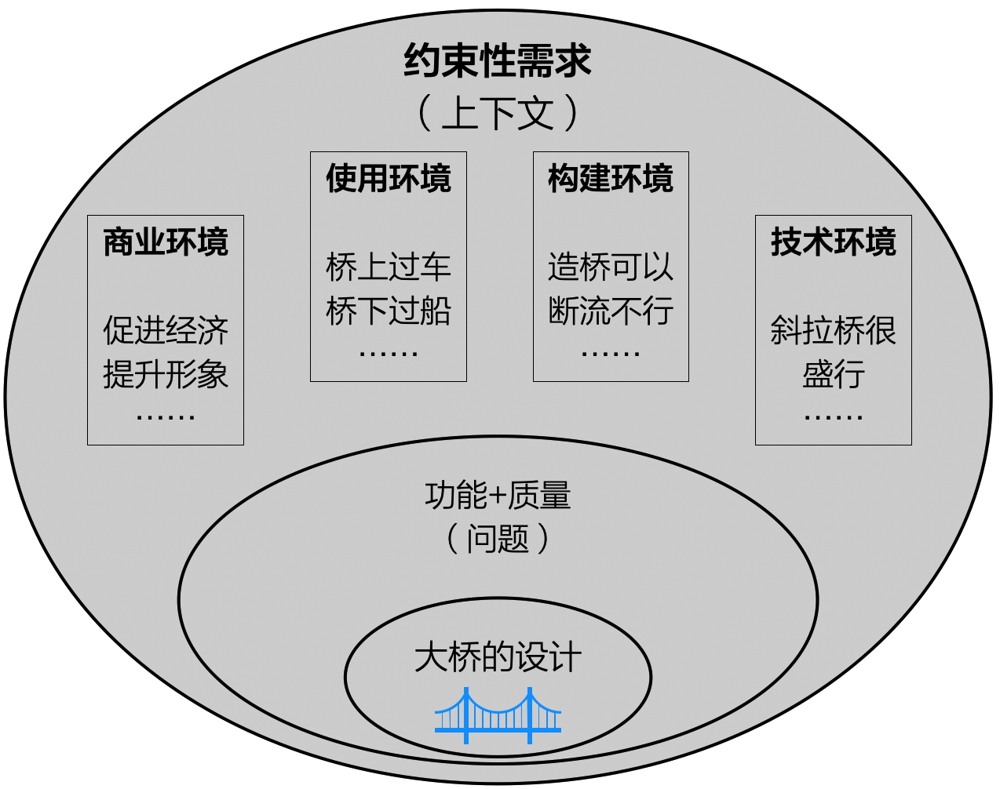

# 4.5. Big Picture:架构师应该这样理解约束

另外，还有一个重要的基础问题，太多的架构师对约束的理解都过于零散，影响了系统化思维。

**一句话：约束是架构设计的上下文。**

**没有全局观念就不可能成为架构师，”约束是架构设计要解决的问题的上下文“是一个犀利的理解**，揭示了 **”软件需求 = 功能需求 + 质量 + 约束“**背后更深层层次的规律。

**如果忽视了上下文对架构设计的限制，最终的架构设计就是不合理的，甚至是不可行的。**

举个生活中的例子--设计大桥。建筑师必须关注以下4类约束的影响，合理规划大桥的设计方案。

- **考虑商业环境因素**：以促进两岸的经济交往为主（这会影响大桥的选址），同时也希望大桥在建设在一定程度上起到提升城市形象的作用。
- **考虑使用环境因素**：水上交通繁忙，二期常有大吨位船只通过，大桥建成投入使用期间不能对此造成影响。
- **考虑构建环境因素**：这是一条很大的河流，水深江阔，为造桥而断流几个月是绝对不可行的。
- **考虑技术环境因素**：斜拉桥因其跨度大等优点，当前广为流传，并且技术也相当成熟......

