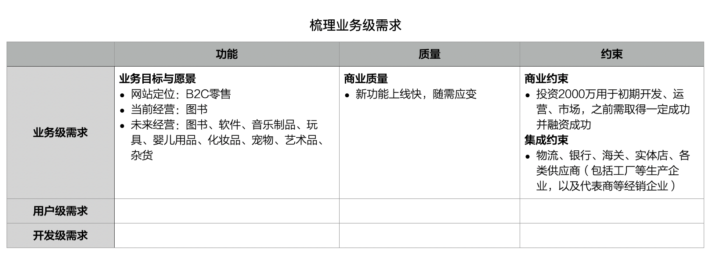
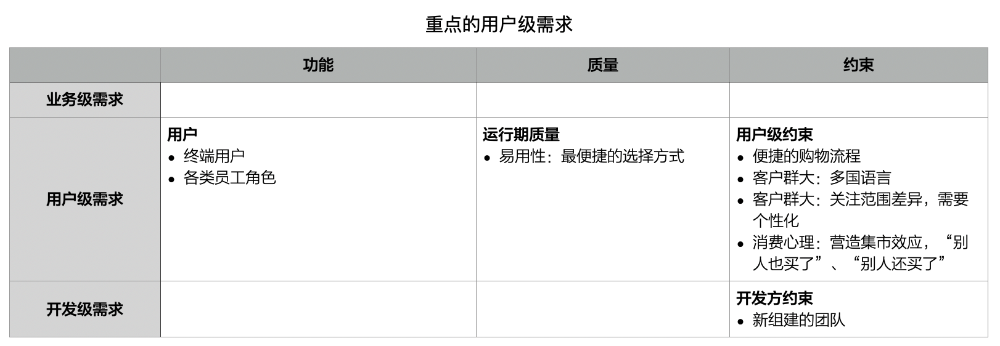
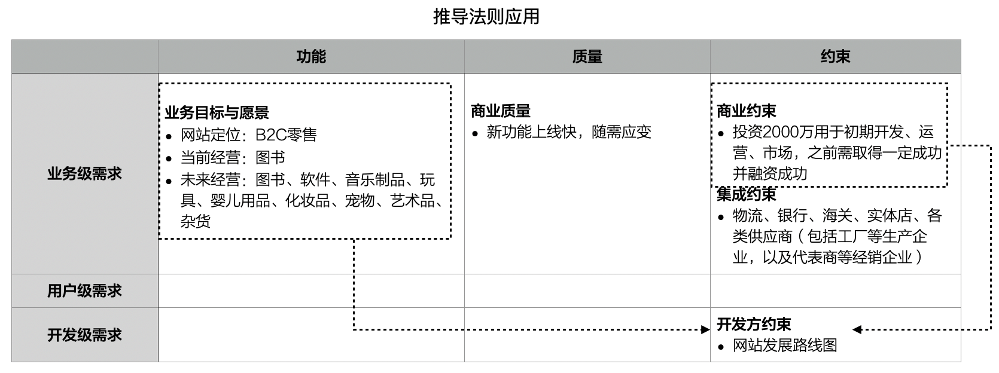
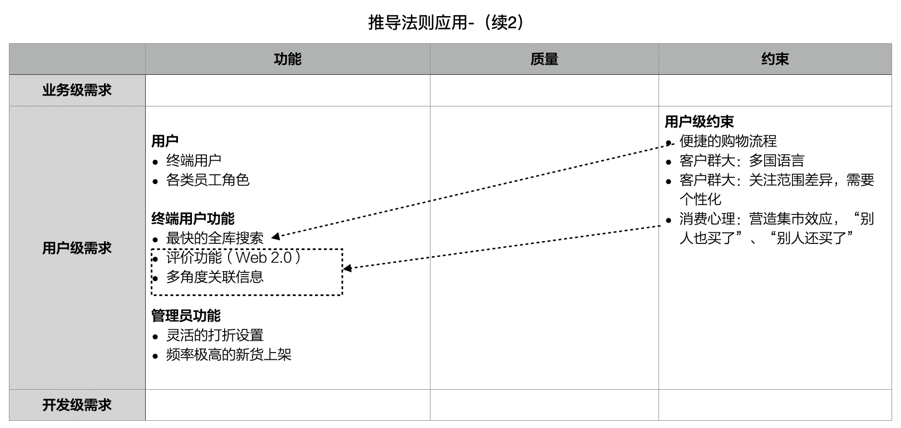
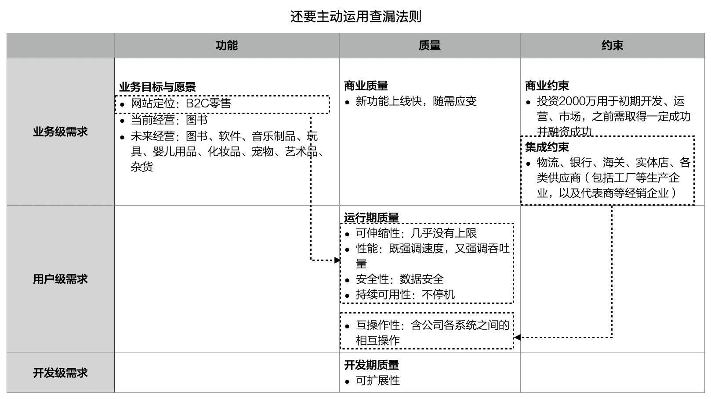

# 4.7. 大型B2C网站案例：需求结构化与分析约束影响

像`Amazon`这样大型的`B2C`网站，架构的起步阶段应如何规划呢？下面看看`ADMEMS`方法的“表现”。

## 4.7.1. 需求结构化

通过`ADMEMS`矩阵（需求层次-需求方面矩阵），有助于高屋建瓴的把握复杂系统的需求大局。

先来梳理一下业务级的需求。

用户级需求，要特别注意挖掘来自“用户及使用环境”的约束，也别忘了开发方的因素。

## 4.7.2. 分析约束影响（推导法则应用）

接下来分析约束影响。

基于`ADMEMS`矩阵应用推导法则规律十分明显：隐含需求（或遗漏需求）是通过 **“从上到下”** 或 **“从右到左”** 的脉络被发现的。考虑到公司的中远期法则（`B2C`业务从图书扩展到各类商品），以及近期商业策略（投入资金2000万）的限制，必须制定“网站发展路线图”--而这对架构而言属于“开发级约束”。

接下来，我们利用类似的思维来理解不同需求之间的联系，这样你不会再觉得需求是“一盘散沙”了。

## 4.7.3. 分析约束影响（查漏法则应用）

另外，还要主动运用查漏法则。例如，我们发现至今对质量的重视还不够（实践一线经常出现此情况），于是开始“查漏”：方方面面的约束背后藏着哪些必须强调的质量属性要求呢？

例如，如此多的质量要求，比如要提高系统的互操作性......

