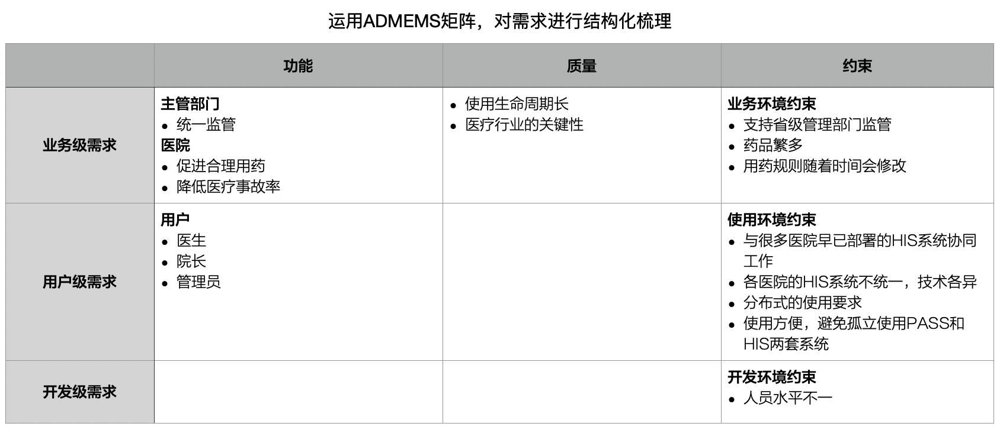
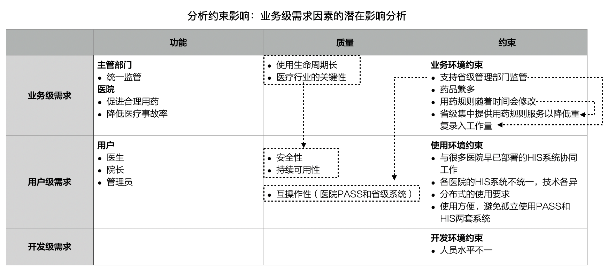

# 4.8. 贯穿用例

## 4.8.1. `PASS`系统背景介绍

`PASS`系统的全称是：合理用药监测系统（`Presription Automactic Screening System`）。通过全面部署`PASS`系统可以促进医院的用药合理化、规范化、降低医院的医疗事故率，还有利于管理部门高效全面的掌握医疗一线的用药情况，及早发现问题域解决问题。

`PASS`系统的主要功能:

- 医生
  - 用药及时监测
  - 注意事项打印
- 管理员
  - 身份管理
  - 用药规则数据的更新
- 管理者（如院长）
  - 多种方式的信息查询
  - 多张报表
- 外部系统的整合
  - 药政部分的信息上报
  - 用药规则数据库的自动更新
- ......

## 4.8.2. 需求结构化

将“功能列表”等同于“全部需求”根本不是架构师的应有做法。相反，为了全方位、多角度的把握需求，应当重视并运用“需求的结构”。

## 4.8.3. 分析约束影响

下面逐一分析约束因素的潜在影响。

首先是业务级需求因素的影响分析。例如，既然药品的种类繁多、用药规则的数量也很大，就应该设法避免每家医院都重复用药规则--于是决定“省级集中提供用药规则的定义和更新支持”（这其实是业务流程一级的一项需求）。

