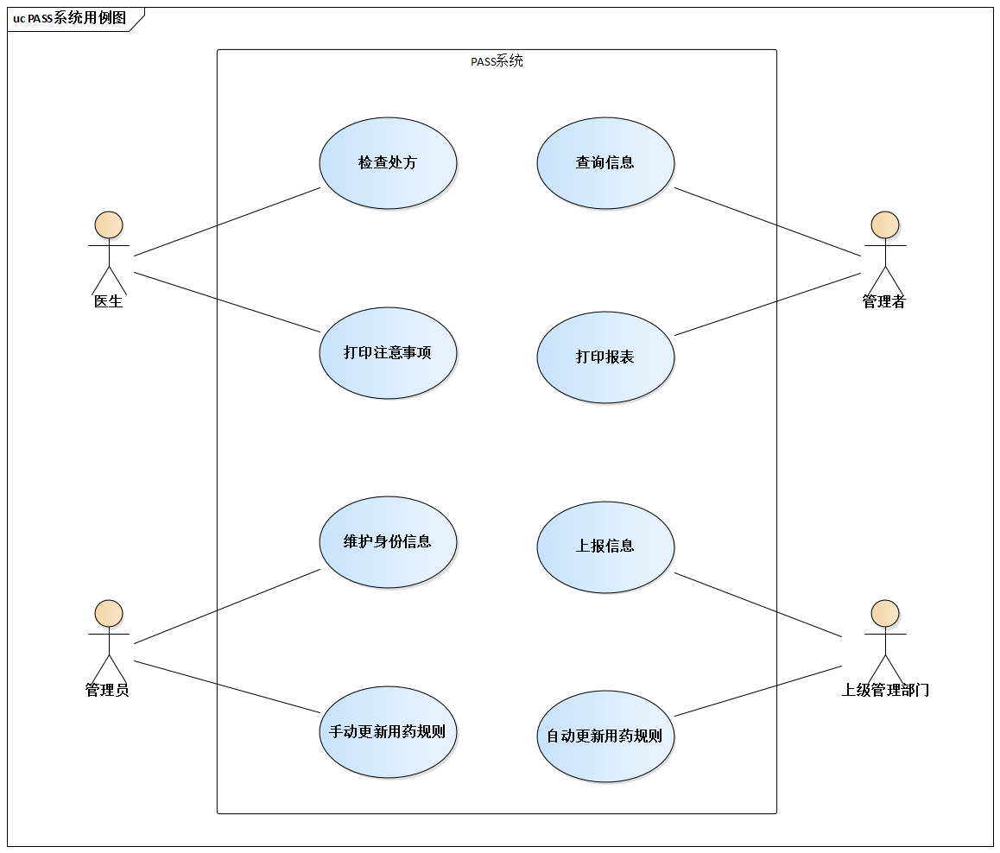
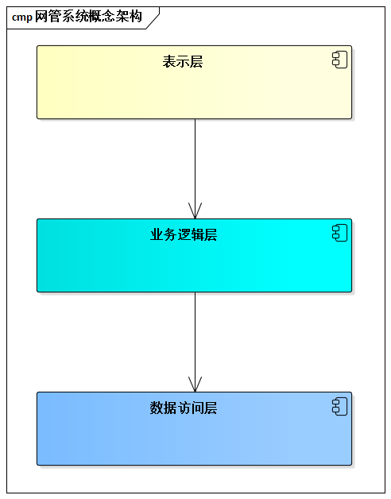

# 6.1. 一筹莫展

日落西山，夜幕徐徐降临，遍布这个城市各个角落的写字楼陆续亮起了灯......

灯下，有我们这些软件从业者加班的身影。小张，还有老王，就是故事的主角。

## 6.1.1. 小张，以及他负责的产品

- 加班人： 小张

- 职业概况： 28岁，某医疗软件公司的程序高手，这不，公司刚刚提拔他作了架构师。

- 加班缘由： 他正负责一个名为“合理用药监测系统（`Prescription Automatic Screening System, PASS`）”的软件的架构设计。由于以前没有做过类似的产品，小张压力很大。按说，压力大对软件行业的人来说早已是家常便饭了，但要命的是，小张有点不知所措了.....

晚上7点，小张坐在桌前。

在心中，小张对架构的理解可以概况成一个公式：“架构 = 模块 + 接口”。

成为架构师伊始，他还专门用“接口”和“架构”作为关键词在网上搜了一把，看看别人的观点是否和他相同。结果让他非常满意，网上的一些观点和他的观点惊人的像是。例如网上有观点认为：

> “当你发现可以越来越灵活的使用接口时，那么你就从程序员升级成架构师了。
> 
> 在一些大型项目或大型公司里，都有架构师编写出系统接口，具体的实现类交给程序员编写。公司越大，这种情况月明显，所以在这些公司里做开发，我们可能都不知道编写出的系统是个什么样子，每天的工作可能就是做‘填空题’了”

但是，小张注定要在这个加班的夜晚，悄然开始重新认识“架构 = 模块 + 接口”这句话了。

一方面，小张已在“模块 + 接口”一级做了些设计努力。另一方面，小张也感觉到问题所在了：这个`PASS`系统未来不可能仅仅包含一个可执行单元！相反，医生需要的功能要嵌入医院信息管理系统（`HIS`系统）的医生工作站中，管理员的功能需要其他方式，`Server`要独立出来......

小张当下的感觉，应了一句小品台词--“有点乱了”。是呀，连PASS系统到底将包含几个”可执行单元”都没有搞清楚，就考虑“模块 + 接口”一级的设计，的确有些武断了。

晚9点，思路不畅的小张开始上网搜资料。

在网上搜资料时，小张总是相当有耐心。他深知，虽然网上的资料非常多，但真正能启发思路的资料往往只在最后时刻出现。

小张移动鼠标，右击任务栏上的“浏览器”按钮，点击了“关闭组”菜单，者表示小张任务查到的资料启发不大，准备重头来过--在今晚已经是第3次了。

他若有所思，在搜索框中输入了3个关键词：”架构“、”大局“、”不拘小节“。一篇博文引起了他的注意：

> 概念性架构就是对系统设计的最初构想，就是把最关键的设计要素和交互的机制确定下来，然后考虑具体技术的运用，设计出实际架构。
> 
> 概念性架构应该抓大局、不拘小节。
> 
> 虽然概念性架构都跳不出”架构 = 组件 + 交互“的基本定义，但它们描述架构的具体方式还是有比较大的差异：有的重视逻辑层，有的重视物理层，有的通过隐喻表明机制，有的看起来似乎就是一些设计元素的组合。不同的概念性架构图中，“连接”代表的含义千差万别：有的是依赖方向，有的是控制方向，有的是数据流向，一次，必须根据具体情况而定。

小张仔细的揣摩每句话的意思。

不知不觉，时钟指向了11点，小张坐不住了。

他在办公室来来回回的踱步，表情时而郁闷，时而欣喜......

最后，小张把文章打印了一份，塞在包里，离开了办公室。

## 6.1.2. 老王，后天见客户

- 加班人： 老王
- 职业概况： 35岁，某电信软件企业网管软件事业部的售前工程师。老王从事软件行业有10年了，一直做软件开发，一年前开始做售前相关工作。
- 加班缘由： 后天，他要到客户单位，做网管软件新产品的介绍。这个客户非常重要，二期公司对这一单志在必得，老王不敢懈怠。

老王看着公司草草拼凑出来的售前PPT有点发愁，架构方面的描述主要就是一个概念架构图，如图所示，这种架构描述根本没有体现产品特点，叫做售前的如何说服客户呢？

“我要不说明，谁看了这个概念架构能知道它是个网管系统，而不是电子商务或其他什么系统？”老王愤愤的想。
