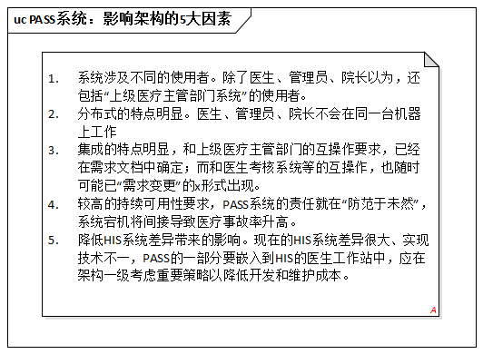

# 6.2. 制定方针

小张，还有老王，昨天都加班到很晚，但今天他们依然按时来到单位。

每天的太阳都是新的。对开朗的人来说，昨天的烦恼不算什么，根本不会影响他们今天工作的热情和创造力。

## 6.2.1. 小张：我必须先进行概念架构的设计

小张在座位上坐定，破例没有查收邮件，更没有上网看新闻。他做的第一件事是，拿一张干净的A4纸铺在桌上，开始逐条例举`PASS`系统需求中对架构产生最关键影响的“5大因素”。

“我作为架构师应该做什么呢？”小张脑中快速的思考着，“是一层不变的继续‘模块 + 接口’一级的设计，还是先针对主要风险确定架构大局，而后在进一步考虑它呢？”

经过一系列的反思，小张认为对`PASS`系统直接进行“模块 + 接口“一级直接进行合计存在以下两个严重的问题：

1. 针对”单独的可执行单元“形式的系统，或许可以直接按”模块 + 接口“方式展开架构设计，而现在的`PASS`系统显然不是。
2. 如何通过模块切分和接口定义来支持团队开发，还算不上当前的主要矛盾；上面分析的”5大因素“才是当前的主要矛盾。

主要矛盾决定事态发展。想清楚了架构设计的主要影响因素，小张微微有些高兴。他认真的把他的决定写在笔记本上（还特意加了一句注解说明），生怕忘了似的：

> 首先根据对架构产生最关键影响的”5大因素“进行概念设计。
> 
> 注：概念架构不关心明确的接口定义。

此时的小张俨然像是在战场上做出了重大战略决策的将军。