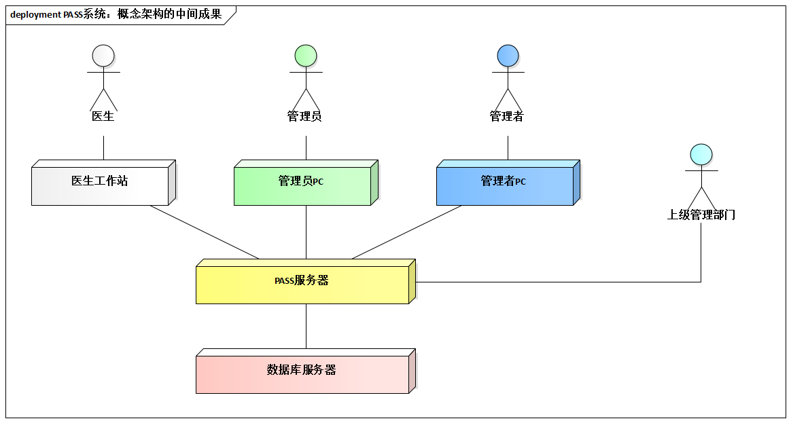
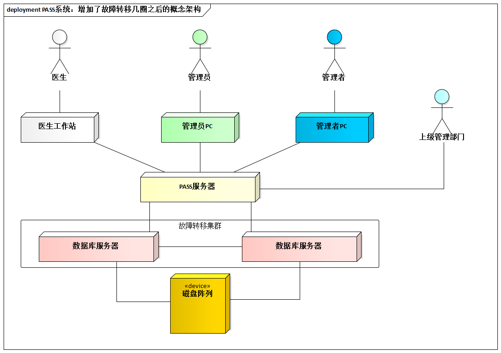
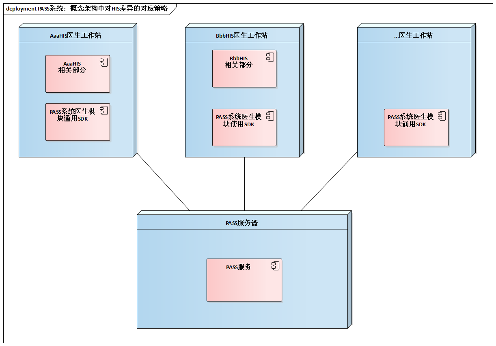
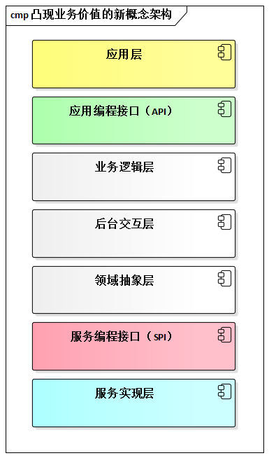

# 6.3. 柳暗花明

行必果，小张和老王忙开了。

有人说，”**行动果断是一种美德。**“，其实，他们都觉得”行动果断“算不上什么美德，毕竟，老板是要看结果的--不行动，就永远没有成功的可能。

## 6.3.1. 小张：重大需求塑造概念架构

小张将”分析需求特点“所归纳出来”5大因素“作为概念架构设计的目标。

考虑设计目标中的1、2和3这三点，小张得到了概念架构中间结果。

接下来，小张继续深入概念架构的设计。他想：上述设计目标中的第4点和第5点还没有相应的对策，这无疑意味着具体的风险，因为从现在的设计来看根本无法做到“较高的持续可用性”。而对于”降低HIS系统差异带来的影响“也没有任何针对性的设计决定。

经过一番考虑之后（具体思考过程请参考”[目标-场景-决策表](../ch1/1.3.4.md)“方法的讲解），小张做出了下面的概念架构设计决定。为了提高持续可用性，在设计中引入了**故障转移集群**。

针对”现行HIS系统差异很大、实现技术不统一“的约束性需求，重点考虑了如何提高重用性以降低开发及维护成本。采用的策略是：引入独立于具体HIS意思工作组的”PASS系统医生模块通用SDK“，它包括了”嵌入到医生工作站的软件模块“的所有特定HIS系统无关部分，使支持HIS的工作量降到最低。

## 6.3.2. 老王：概念架构体现重大需求

首先，老王通过一些途径了解了客户对网管软件采购的具体要求，例如可升级性、可方便支持新设备等。

接下来，老王从公司的服务器上下载了新的网管产品的各种文档，开始快速浏览。他在找售前材料商遗漏的，却至关重要的产品特色。他敏感的发现，有如下几点比较重要：

- 强大的API支持，便于二次开发。
- 基于SPI（服务编程接口）的可扩展设计。

最终，老王利用[FAB分析法](https://baike.baidu.com/item/FAB%E5%88%86%E6%9E%90%E6%B3%95)，轻车熟路的绘制了更能体现新网管产品价值的概念架构。此架构对客户关系的”可升级性、可方便支持新设备“等要求有着较明确的支持。

