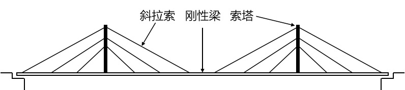

# 7.1. 什么是概念架构

下面是宏伟的金门大桥，这么复杂的架构，桥梁架构师是怎么“开始设计”的呢？

答案是：概念架构（`Conceptual Architecture`）。下图展示了斜拉桥的概念架构示意图。由此图可以看出，概念架构高屋建瓴的给出高层解决方案：索塔负责承重，斜拉索吊起刚性梁。

下面，来看看软件行业（来自Dana Bredemeyer等专家）中概念架构的定义：

> 概念性架构界定系统的高层组件，以及它们之间的关系。概念性架构意在对系统进行适当分解，而不陷入细节。借此，可以与管理人员、市场人员、用户等非技术人员交流架构。概念性架构规定了每个组件的非正规约及架构图，但不涉及接口细节。(The Conceptual Architecture identifies the high-level components of the system, and the relatiooonships among them. Its purpose is to direct attention at an appropriate decomposition of the system without delving into details. Moreover, it proovides a useful vehicle for coommunicating the architecture to non-technical audiences, such as management, marketing, and users. It consists oof the Architecutre Diagram (without interface detail) and an informal component specification for each component.)

根据定义，我们注意到如下几点：

- 概念架构满足“架构 = 组件 + 交互”的基本定义，只不过概念架构仅关注高层组件(`high-level components`)。
- 概念架构对高层组件的“**职责**”进行笼统的界定（`informal specification`），并给出了高层组件之间的相互关系(`Architecture Diagram`)。
- 概念架构不应涉及接口细节(`withouot iinterface detaiil`)。
