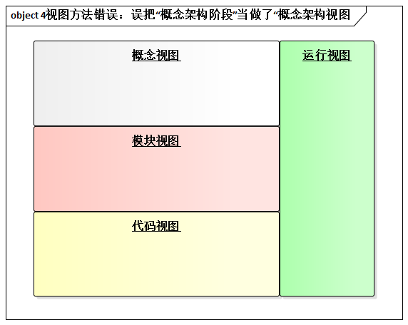

# 7.3. 业界现状

## 7.3.1. 误将“概念架构”等同于“理想架构”

主动思考以下两种说法是否正确：

1. 架构设计是功能需求驱动的，对吗？
2. 架构设计是用例驱动的，对吗？

说法1，错误。因为，架构设计的驱动力 = 功能 + 质量 + 约束。

说法2，同样错误。用例技术是功能需求实际上的标准，用例技术涉及，但无法全面涵盖非功能需求。所以，说法2和说法1并无本质区别。

因此，“用例驱动的架构设计”的做法颇值得商榷。纵观业界，有不少书持“用例驱动的架构设计”的观点。比如《Rational 统一过程：实践者之间》一书中有一节名为“是用哪个架构重要用例来驱动架构设计”，其中写道：

> 对架构重要的用例驱动了架构设计。对于大多数系统而言你通过选择仅仅20%至30%的用例，然后设计、实现并测试每个用例的一两个场景，就能降低大部分技术风险，并驱动欧诺个架构的实现。为了实现某个特定用例，你要识别出那些支持用例的软件元素。

实际上，**实践者误认为概念架构就是只考虑功能设而设计出来的理想化架构，其实，这是关于概念架构的最大误解，在实践中应当注意避免**。

## 7.3.2. 误把“阶段”当做“视图”

“视图”是架构领域的热门词汇，但很不幸，“视图是个筐，什么都往里面装” -- 我们的同行经常犯这种错误。例如，《编程匠义 -- 编写卓越代码》一书中错误的认为：

> 概念视图，有时候也称为 “逻辑视图”，这种视图显示了系统的主要部分以及它们之间的相互关系。

再例如，一种称为“4视图法”的架构设计方法在业界有一定影响，该方法也误把“概念架构”当成了“概念架构视图”。

其实，视图与视图之间必须是并列的关系，是一种并行思维关系。概念架构不可能与“模块 + 接口”一级的设计并列。概念架构不是一个“架构设计视图”。

正确的做法是，概念架构是一个“架构设计阶段”，必须在细化架构阶段之前，针对重大需求、特殊需求、高风险需求，形成稳定的高层架构设计成果。

阶段之于方法的意义和视图大不相同：

- 阶段是先后关系，视图是并列关系，这其中有本质区别。
- 不同阶段解决不同层次的问题--概念架构确定架构设计的大方针。
- 阶段应该与明确的里程碑想对应--概念架构确定的是高层分割方案及其他重要决策是否合理？
