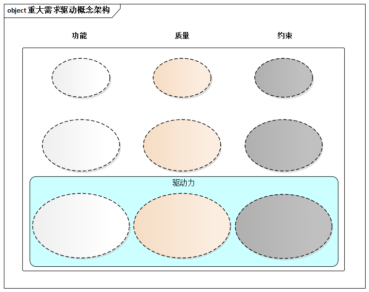
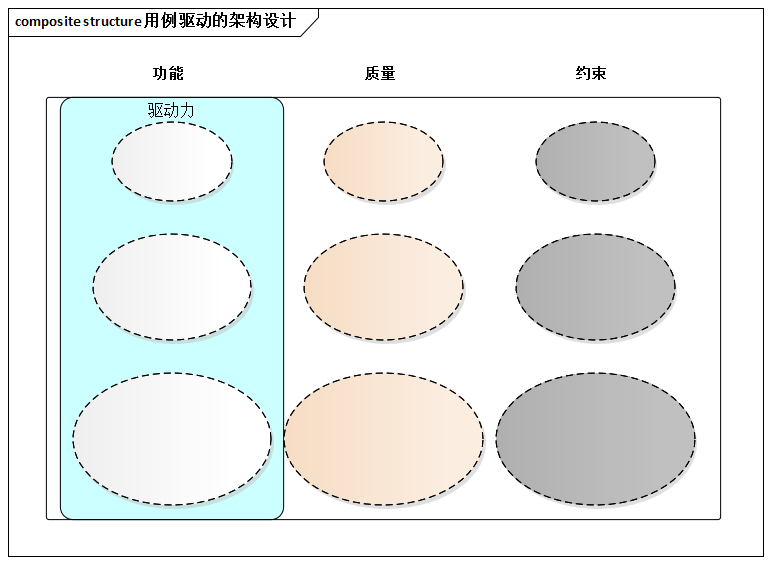
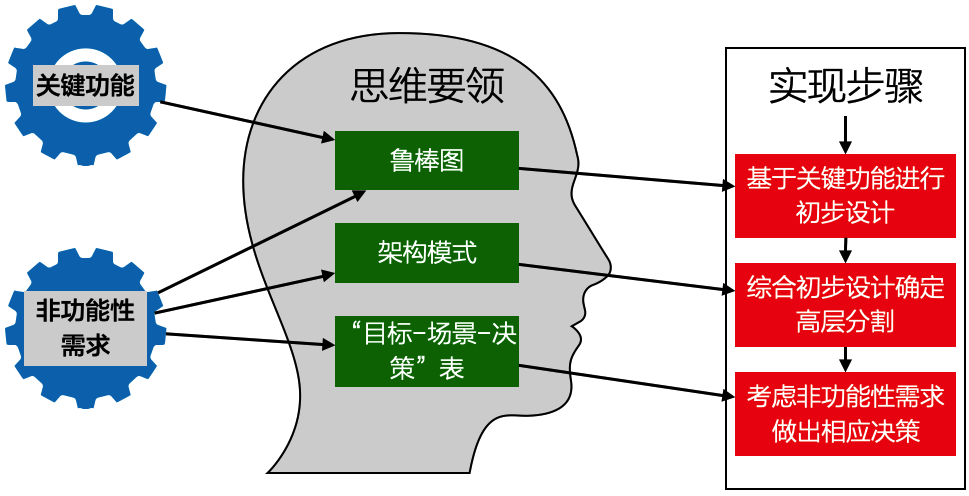

# 7.4. 实践要领

很多有经验的架构师已经意识到概念架构的重要性，却缺乏理性方法的指导。我们来讲讲`ADMEMS`方法`Conceptual Arch`阶段的核心理念和3个步骤。

## 7.4.1. 重大需求塑造概念架构

`ADMEMS`方法`Conceptual Arch`阶段的核心理念： 重大需求塑造概念架构，这里的“重大需求”应涵盖功能需求、质量及约束3来需求中的关键部分。

> 概念架构针对重大需求、特色需求、高风险需求，给出高层次解决方案

> 问题1： 过于理想化
> 
> 问题2： 未来修改很大

如果只考虑“功能需求”来设计概念架构，将导致概念架构沦为“理想化架构”，这个脆弱的架构不久就会面临“大改”的压力，甚至直接导致投标等工作失败。

## 7.4.2. 概念架构阶段的3个步骤

概念架构设计分为3个步骤：

1. **初步设计**：基于关键功能，借助鲁棒图进行**以发现职责为目的**的初步设计。这一步并不总是需要，但对于架构师而言，是“新系统”就必须重视这一步。
2. **高层分割**：对系统这个黑盒子**进行高层切分**，例如切分复杂系统为多个二级系统，或者直接切分系统为具体子系统。
3. **考虑非功能需求**：**概念架构 ≠ 理想化架构**，所以不仅要考虑功能，也必须考虑非功能。

