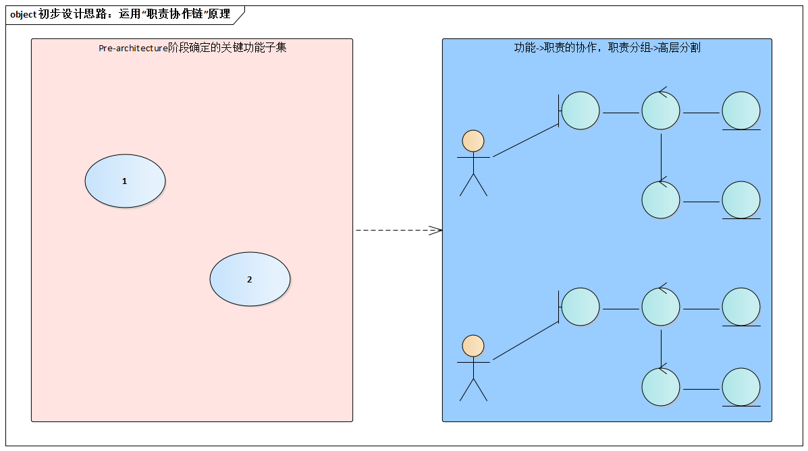

# 8.1. 初步设计对复杂系统的意义

初步设计并不总是必须的 -- 架构师只有在设计复杂系统时才需要它。

另外，“复杂”与否还和“熟悉”程度有关系。一个“很小”的系统涉及你未接触的领域，你会觉得它复杂的；一个“较大”的系统，但你有很具体的经验，你依然会觉得它“Just so so”。

**初步设计的目标简单而明确：那就是发现职责**。初步设计无须展开架构设计细节，否则就背上了“包袱”，这是复杂系统架构设计起步时的大忌。正如“初步设计”这个名字所暗示的，它只是狭义的架构设计的“第一枪”--之前的`Pre-Architecture`阶段并未对“系统”做任何“切分”。

“初步设计”这个名字还暗示我们，**后续的架构设计工作必须以之为基础**。具体而言，初步设计识别出了职责，后续的高层分割方案才能有依据，因为每个“高层分割单元”都是职责的承载体，而分割的目的也恰恰在于规划高层职责模型。

ADMEMS方法强调“关键需求决定架构”的策略，“基于关键功能，进行初步设计”就是一个具体体现。

> 系统的每个功能都是由一条“职责协作链”来完成的；而初步设计的具体思路正是“通过为功能规划职责协作链来发现职责”。
