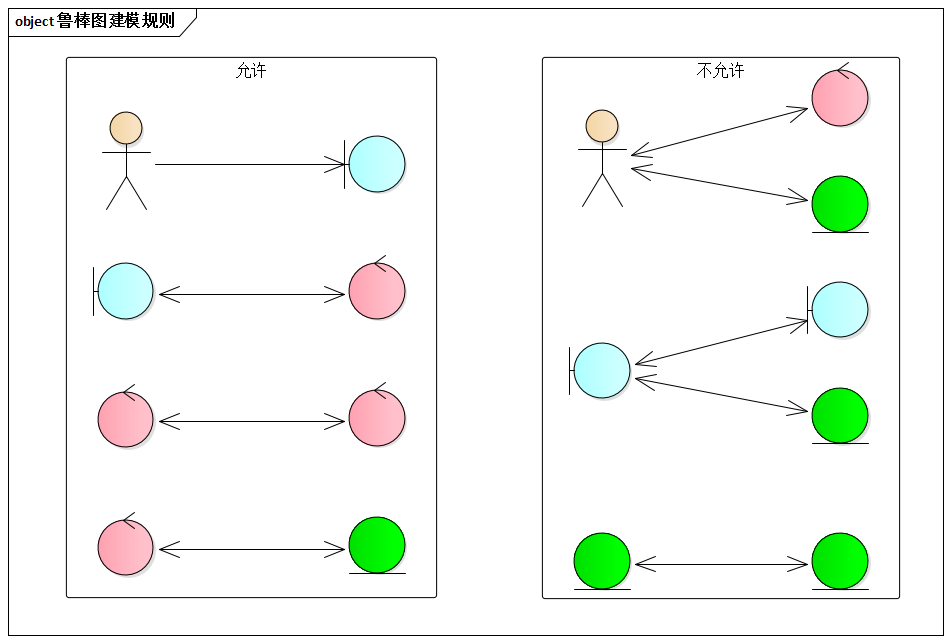
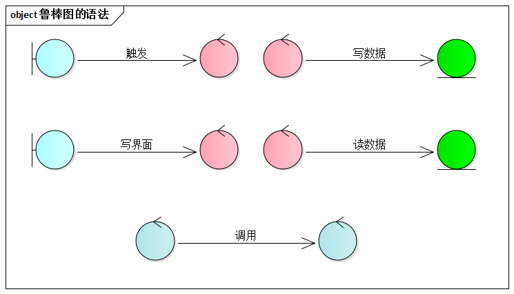
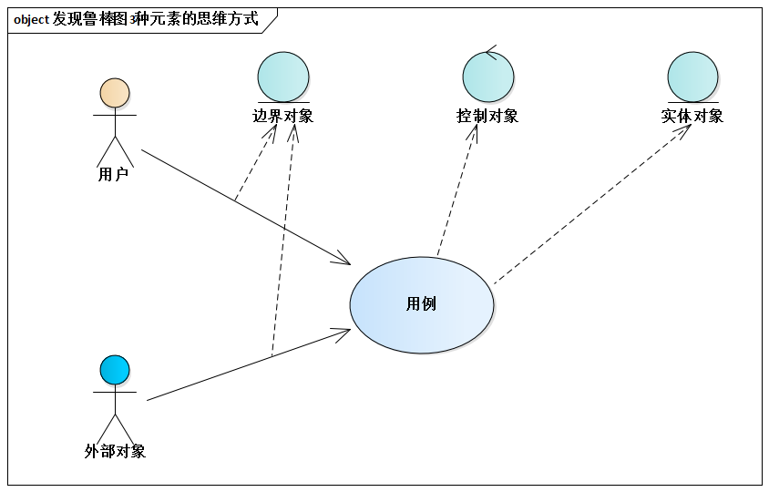
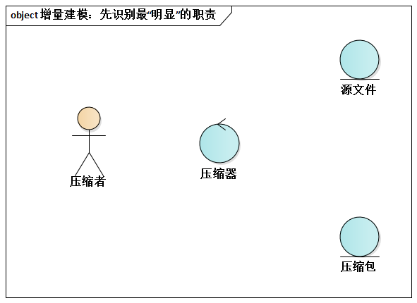
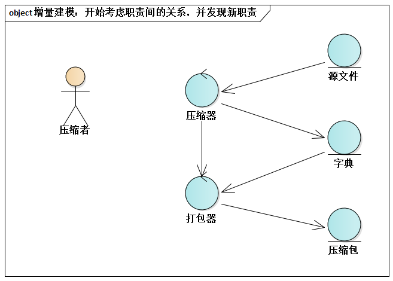
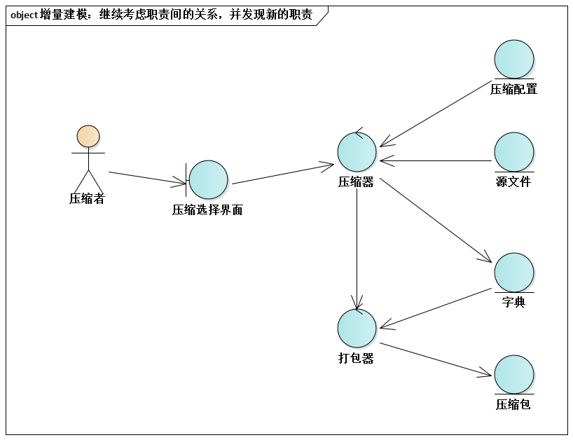
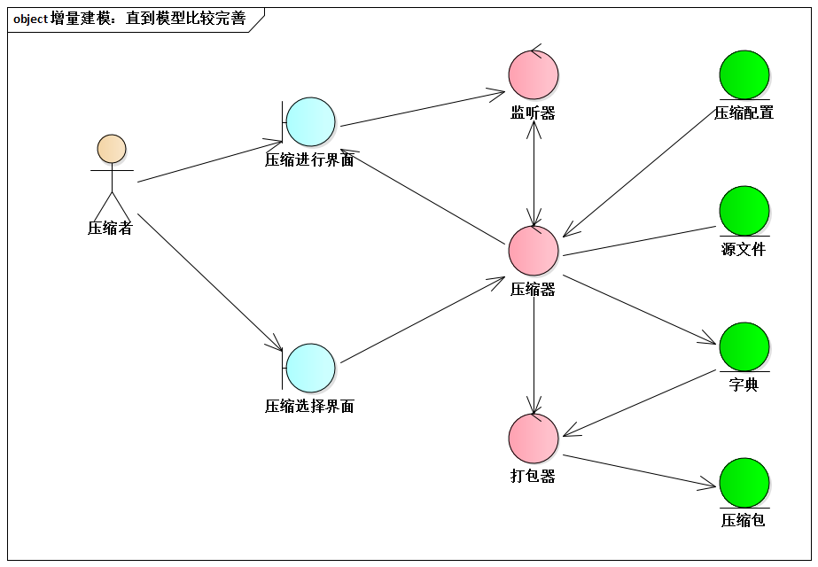
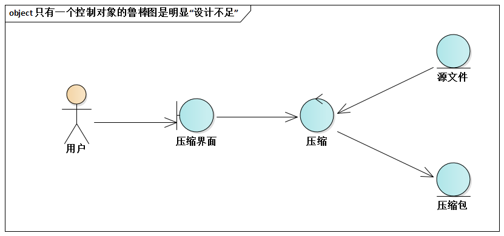
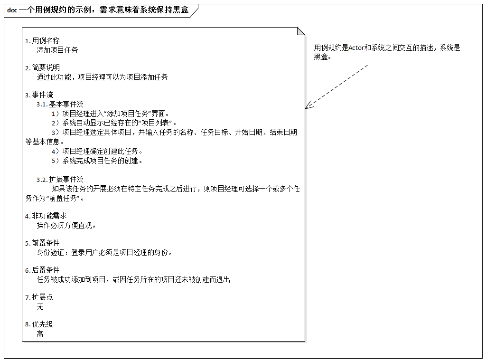

# 8.3. 基于鲁棒图进行初步设计的10条经验

ADMEMS方法归纳了鲁棒图建模的10条经验要点，分别覆盖了语法、思维、技巧、注意事项等4个方面。

**语法**

- 遵循建模规则
- 简化建模语言

**思维**

- 遵循3种元素的发现思路
- 增量建模
- 实体对象 ≠ 持久化对象

**技巧**

- 只对关键功能（用例）画鲁棒图
- 每个鲁棒图有2~5个控制对象

**注意**

- 勿关注细节
- 勿过分关注UI，除非辅助或验证UI设计
- 鲁棒图 ≠ 用例规约的可视化

## 8.3.1. 遵循建模规则

Doug Rosenberg在[《UML用例驱动对象建模》](https://book.douban.com/subject/1125856/)中写道：

> 通过以下4条语言，可以理解该图的本质：
>
> 1. 参与者只能与边界对象交谈。
> 2. 边界对象只能与控制对象和参与者交谈。
> 3. 实体对象也只能与控制对象交谈。
> 4. 控制对象既能与边界对象交谈，也能与控制对象交谈，但不能与参与者交谈。

## 8.3.2. 简化建模语法

在实践中，简化的鲁棒图语法将有利于你集中精力进行初步设计，而不是关注细节。

> 例如，鲁棒图根本不关心“IF语言”怎么建模。

值得注意的是，业界有些观点（包括一些书）认为鲁棒图是协作图。因此造成了鲁棒图的语法非常复杂，不利于专注于初步设计。

其实，鲁棒图是一种非常特殊的类图。

## 8.3.3. 遵循3种元素的发现思路

用例（`Use Case`） = N个场景（`Scenario`）。每个场景的实现都是一连串的职责进行协作的结果。所以，初步设计可以通过“研究用例执行的不同场景，发现场景背后应该有哪些不同的职责”来完成。

## 8.3.4. 增量建模

“建模难”，有些人常如此感叹。例如，在画鲁棒图时，许多人以上来就卡在了“搞不清应该有几个界面”的问题上，就会发出“建模难”的感叹。

下面演示“增量建模”这种技巧。从小处讲，增量建模能解决鲁棒图建模卡壳的问题；从大处将，这种方式适合所有种类的UML图建模实践。

> 例如，类似WinZip、WinRar这样的压缩工具大家都用过。请一起来为其中的“压缩”功能进行基于鲁棒图的初步设计。

首先，识别最明显的职责。对就是你自己认为最显著的几个职责--不要任务设计和建模有严格的标准答案。

- 源文件
- 压缩包
- 压缩器（负责压缩处理）

接下来，开始考虑职责间的关系，并发现新职责。压缩器读取源文件，最终生成压缩包。

这里将打包器独立出来，它是受了压缩器的委托而工作的。还有字典......

继续同样的思维方式，又引入了压缩配置，它影响着压缩器的工作方式，例如加密压缩、分卷压缩或其他。

压缩功能还要显示压缩进度，以及随时取消进行一半的压缩工作。所以，你又识别出了压缩进行界面和监听器等职责。

模型之于人，就像马匹之于人一样--它是工具。如果你不知道怎样真正将“模型”为自己所用，反而为“建模”所累（经典的“人骑马、马骑人”的问题），请问自己一个问题：

- 我是不是被太多的假设限制了思维？，或许，工具本身根本没有这样的限制我！

## 8.3.5. 实体对象 ≠ 持久化对象

实体对象涵盖的更广泛，它可以是持久化对象，也可以是内存中的任何对象。

一方面，在实践中，有些系统需要在内存中创建数据的“暂存体”以保持中间状态，当然可以被建模成实体对象。另一方面，有的系统没有持久化数据，但是基于鲁棒图的设计依然可以用，此时难道鲁棒图不包含实体对象吗？显然不对。

因此，实体对象 ≠ 持久化对象，这个正确认识将有助于你的实践。

## 8.3.6. 只对关键功能（用例）画鲁棒图

基于“关键需求决定架构”的历练，功能需求作为需求的一种类型，在架构设计时不必针对每个功能都画出鲁棒图。

## 8.3.7. 每个鲁棒图有2~5个控制对象

既然是初步设计，鲁棒图建模时，针对关键功能的每个鲁棒图中的控制对象不必太多太细，5个是常见的上限值。

相反，若实现某个功能的鲁棒图只包含一个控制对象，则是明显的“设计不足”--这个控制对象的名字必然和功能的名词相同，这意味着没有对职责进行真正的切分。

> 例如，WinZip的压缩功能设计成下面的鲁棒图，几乎没有任何意义。

## 8.3.8. 勿关注细节

初步设计不应该关注细节。例如，回顾前面所示的[“销户”的鲁棒图](8.2.md#822-鲁棒性一例)：

- 对每个对象只标识对象名，都未识别其属性和方法。
- “活期账户销户界面”，具体可能是对话框、Web页面、字符终端界面，但鲁棒图中没有关心这些细节问题。
- “客户资料”等实体对象必须要持久化吗？不关心，更不关心用`Table`还是`File`或其他方式持久化。
- 没有标识控制流的严格顺序。

## 8.3.9. 勿过分关注UI，除非辅助或验证UI设计

过分关系UI，会陷入诸如有几个窗口，是不是有一个专门的结果显示页面等诸多细节之中，初步设计就没法做了。

别忘了，初步设计的目标是发现职责。初步设计无需展开架构设计细节，否则就背上了“包袱”，这是复杂系统设计起步时的大忌。

## 8.3.10. 鲁棒图 ≠ 用例规约的可视化

鲁棒图时设计，“系统”已经别切分成不同的职责单元。而用例规约是需求，其中出现的“系统”必定是黑河。所以，两者有本质区别。

