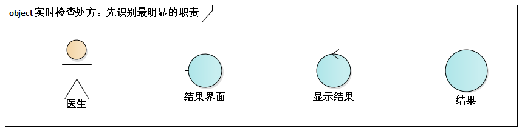
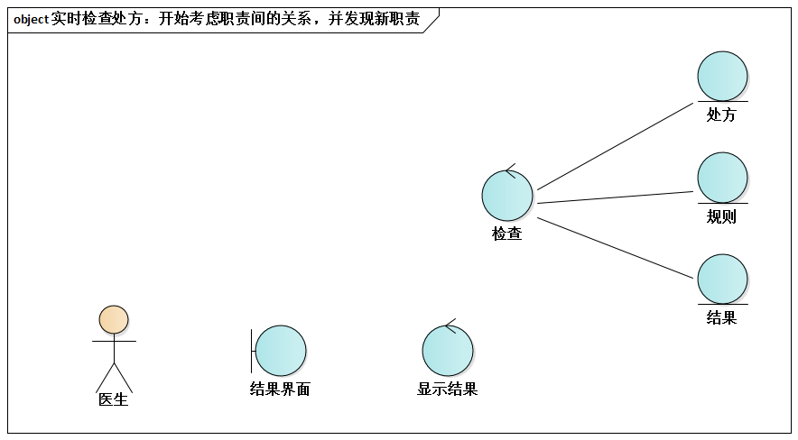
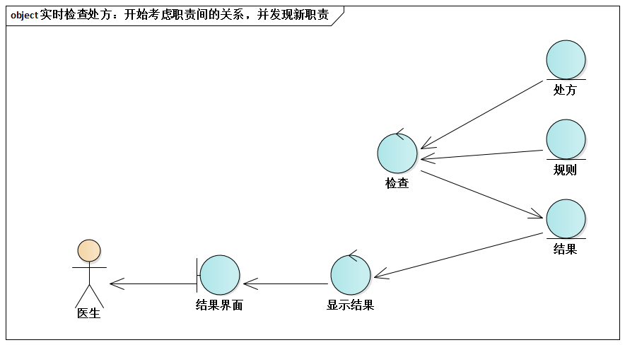
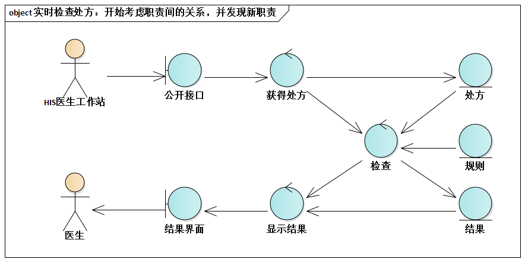
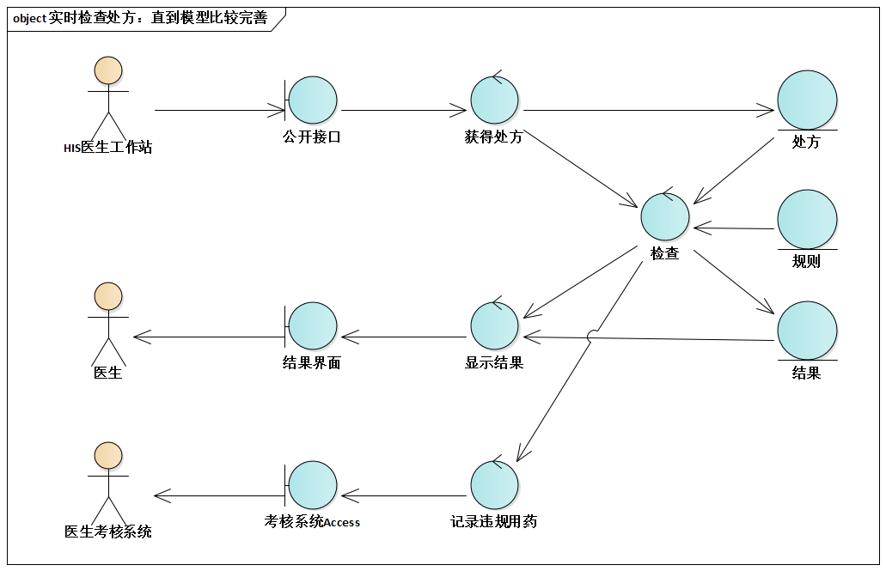
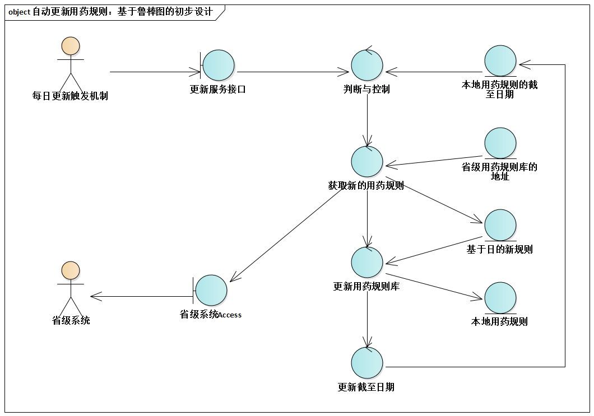

# 8.4. 贯穿案例

接下来考虑贯穿案例`PASS`系统，如何借助鲁棒图进行初步设计呢？

再次明确一下几点：

- 初步设计的目标是发现职责，为高层切分奠定基础
- 初步设计不是必须，但待设计的系统对架构师而言并无太多直接经验时，强烈建议进行初步设计
- 基于关键功能（而不是所有功能），借助鲁棒图（而不是时序图）进行初步设计

下面，我们一起思考如何针对“实时检查处方”功能进行初步设计--重点体会“增量建模”的自然和强大。

首先，**识别最明显的职责**。先识别出最不可或缺的、体现整个功能价值所在的、与“处方检查结果”相关的几个职责。

接下来开始考虑职责间的关系，并发现新职责。检查结果是如何产生的呢？检查这个控制对象，读取处方和用户规则信息，最终生成处方检查结果。

OK，如此一来，解决了“结果是怎么来的这个问题”。

继续以同样的思维方式解决问题。PASS系统自动检查处方，是由HIS系统中意识工作站的调用触发的，处方信息也是通过某种方式（例如参数或XML文件）从HIS医生工作站获得的。

实时检查处方最终的鲁棒图又进一步考虑了“记录违规用药”这一具体功能场景的支持。

概念架构设计时推荐只对关键功能进行鲁棒图建模。例如，另一关键功能“自动更新用药规则”的鲁棒图设计如下：

