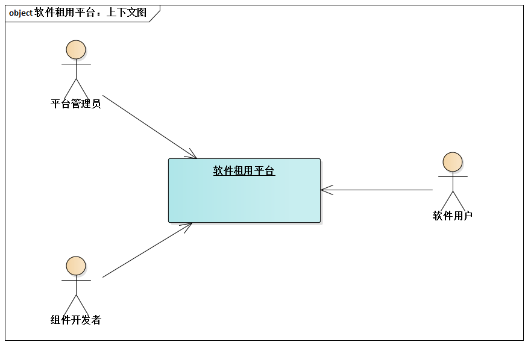
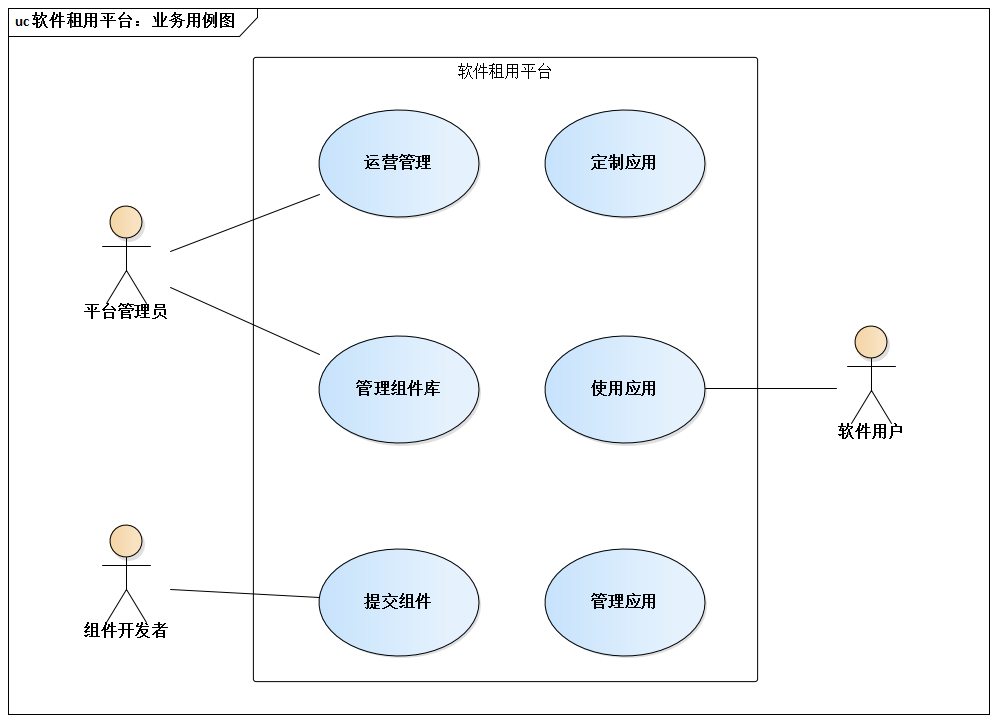
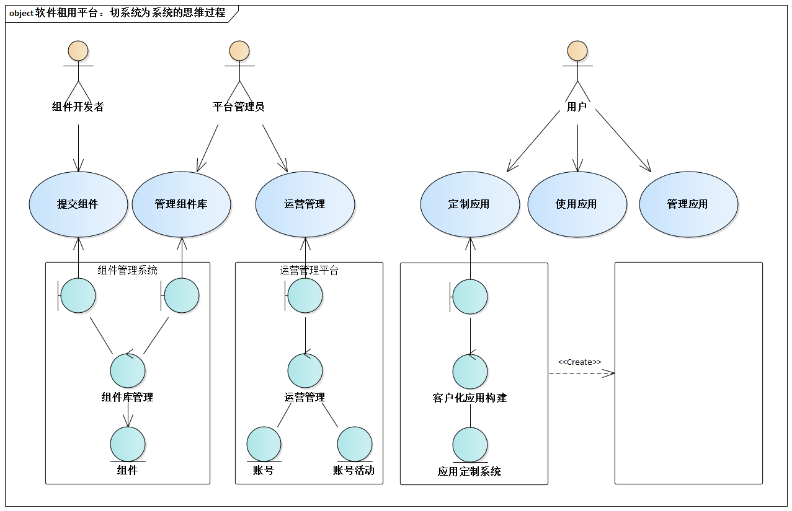
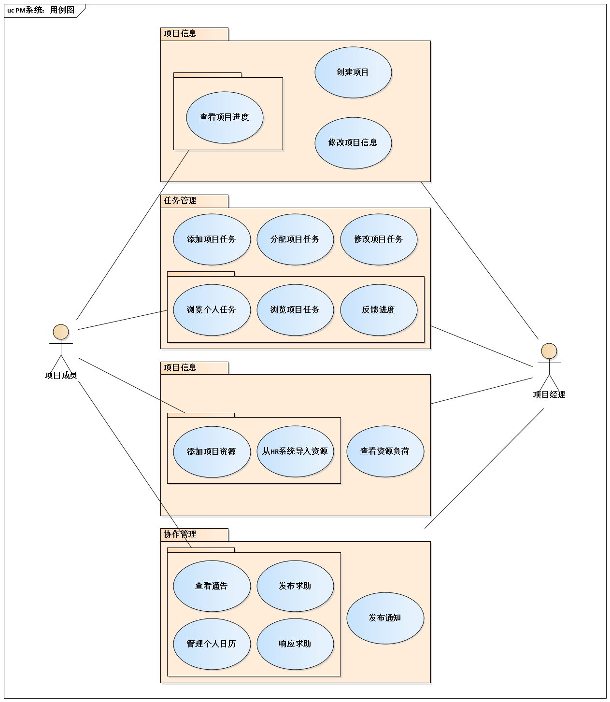
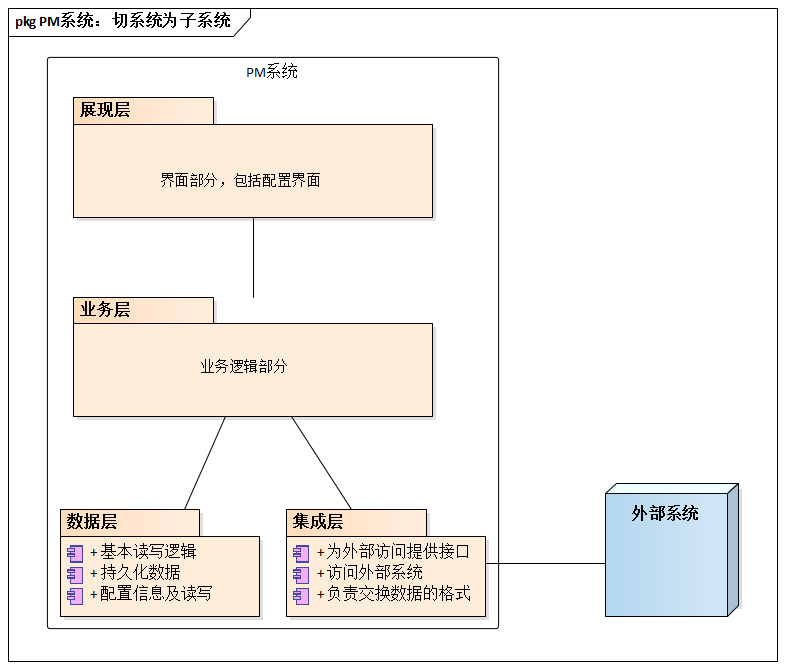

# 9.1. 高层分割的两种实践套路

- 切系统为系统
- 切系统为子系统

在实践中，经常出现这两种方式。虽然从理论上，设计是层层嵌套展开的--即“每一级的子系统”对“下一级的子系统”而言都是系统，都可以单独定义需求和进行设计。但这里更强调“两种套路”的思维。

也就是说：

- 要么告诉自己：我面对的是1个“系统的系统(`System of Systems`)”
- 要么告诉自己：我要把这个“原子系统”切成若干子系统

## 9.1.1. 切系统为系统

“切系统为系统”是一种缩略的说法，具体是指：

- 系统比较复杂，需要进行两级高层切分。
- 首先，把系统切成更小一级的系统，每个更小一级都可以有单独的需求、设计、实现......
- 之后，针对每个“更小一级的系统”进行“切系统为子系统”......

这样做的现实意义是巨大的。

> 面临比较复杂的软件系统，很多企业都有“这个项目要设几个架构师”的困惑。以电信或广电领域的BOSS系统为背景。

在实践中，当面临如下两种情况时，你需要考虑“切系统为系统”：

- 当系统覆盖的功能范围比较广泛

> 例如，BOSS系统设计的需求范围广泛--涵盖网络管理、服务开通、计费、客户关系管理等，于是按照“切系统为系统”的做法分为网管系统、服务受理系统、计费系统、客户关系管理系统等。

- 当系统需要部署在比较复杂的硬件环境中

> 很多城市基础服务行业、大型机构、大型企业，都很重视“一卡通”的应用。例如，如一卡通系统要无缝支持HR管理、出入控制、后勤保障等方面的功能，就必须充分考虑复杂的硬件环境给架构带来的冲击--硬件的种类设计考勤机、通道机、闸机、自助查询机、PC机、服务器等，于是应当合理规划组成整个一卡通系统的嵌入式应用、桌面应用及Web应用等。

## 9.1.2. 案例：SAAS模式的软件租用平台架构设计

再举一例，来说明如何进行“切系统为系统”式的高层分割。

### 案例背景

`SAAS`风潮又起（以前叫`ASP`），“软件租用平台”为用户提供统一的软件租用服务。如上下文图

软件租用平台提供的高层功能描述，如业务用例图。

### 高层分割的思维

业界有数据表明，**需求的复杂程度没增加25%，解决方案的复杂程度就增加100%**。那么，我如果应该把“软件租用平台”切成三四个相对独立的系统而没切，就意味着人为的制造灾难--太多问题相互杂糅在一起，造成解决方案的复杂程度陡增。

借助鲁棒图，初步识别功能背后的职责，就可以规划高层切分的具体方式。

#### 具体思维过程如下：

结果呢？1个系统被切为3个系统--组件管理系统、运营管理系统、应用定制系统。

分别设计和开发这3个单独的系统，比直接把软件租用平台当成1个System开发的可控性高多了。复杂性是根本问题（《人月神话》语），虽然无法降低，但是可以控制。

## 9.1.3. 切系统为子系统

这种方式相当经典，无需太多铺垫。实践中，最常见的就是分层。

### 案例背景

使用用例图来描述PM系统的功能

### 高层分割

`PM`系统的高层分割，采用了经典的4层架构方式。

